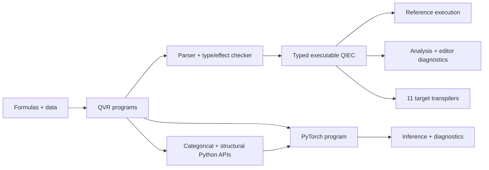

<h1 align="center">Quivers</h1>

<p align="center">
  <em>A typed functional probabilistic programming language for PyTorch.</em>
</p>

<p align="center">
  <a href="https://github.com/FACTSlab/quivers/actions/workflows/ci.yml"></a>
  <a href="https://FACTSlab.github.io/quivers"></a>
  <a href="https://pypi.org/project/quivers/"></a>
  <a href="https://www.python.org/downloads/"></a>
  <a href="LICENSE"></a>
</p>

<p align="center">
  <a href="https://FACTSlab.github.io/quivers/getting-started/quickstart/"><strong>Quickstart</strong></a>
  ·
  <a href="https://FACTSlab.github.io/quivers/tutorials/"><strong>Tutorials</strong></a>
  ·
  <a href="https://FACTSlab.github.io/quivers/examples/"><strong>Examples</strong></a>
  ·
  <a href="https://FACTSlab.github.io/quivers/reference/qvr/"><strong>Language reference</strong></a>
  ·
  <a href="https://FACTSlab.github.io/quivers/api/"><strong>Python API</strong></a>
</p>

---

Quivers is a typed functional probabilistic programming language and compiler
with a PyTorch runtime. It includes the QVR source language, a compiler to the
Quivers Indexed Effect Core (QIEC), inference and diagnostics, a mixed-effects
formula interface, eleven transpilers, and editor and notebook tooling. Its
Python API also exposes categorical, deduction, and structural modeling
primitives.

## What Quivers includes

| Area | What it provides |
| --- | --- |
| **QVR language and compiler** | Typed probabilistic programs with indexed families, lexical effect instances, row-polymorphic computations, and authored handlers. The language includes discrete marginalization and collection operators such as `map`, `fold`, and `traverse`. |
| **Execution and inference** | A PyTorch runtime with automatic differentiation and more than forty distribution families. Inference includes SVI with automatic and flow-based guides, HMC, NUTS, and hybrid samplers. |
| **Formulas and data** | A brms-style mixed-effects interface for pandas, Polars, and other Narwhals-compatible dataframes. The generated QVR can be saved and edited. |
| **Diagnostics and analysis** | ArviZ export, ESS and R-hat, PSIS-LOO, posterior-predictive checks, LOO-PIT, static program summaries, source maps, and algebra-aware initialization advice. |
| **Composition and structure** | A typed V-enriched categorical API and algebra-parametric semantics. QVR adds weighted chart deduction and declarations for structural signatures, encoders, decoders, and losses. |
| **Transpilation** | Capability-checked output for BUGS, Church, Edward2, Gen, JAGS, NumPyro, PyMC, Pyro, Stan, Turing, and WebPPL. Unsupported target features are reported before code generation. |
| **Developer tooling** | A command-line interface, interactive REPL, Jupyter kernel, language server, Pygments and tree-sitter grammars, and first-party extensions for VS Code, Cursor, and Zed. |

## Installation

Quivers requires Python 3.14 or later. Install the base package with:

```bash
python -m pip install quivers
```

Optional features are distributed as extras:

```bash
python -m pip install 'quivers[formulas,diagnostics,repl,lsp,targets]'
```

The user-facing extras are `formulas`, `data`, `diagnostics`, `repl`, `lsp`,
and `targets`. The `dev` and `docs` extras are for work on Quivers itself.
Some transpilation targets require their own runtime or compiler. The
[installation guide](https://FACTSlab.github.io/quivers/getting-started/installation/)
covers editor setup and target-specific dependencies.

## Quick start

This QVR file defines a stochastic GRU language model:

<!-- GitHub Linguist fallback: QVR currently uses the R lexer. -->
```R
object Token : FinSet 256
object Resp : FinSet 32
object Embedded : Real 64
object Hidden : Real 128

morphism tok_embed : Token -> Embedded [role=embed]
morphism gate_z, gate_r : Embedded * Hidden -> Hidden ~ LogitNormal
morphism lm_head : Hidden -> Token ~ Categorical

program gru_cell(x_t, h_prev) : Embedded * Hidden -> Hidden
    sample z <- gate_z(x_t, h_prev)
    sample r <- gate_r(x_t, h_prev)

    let reset_hidden = r * h_prev

    sample h_cand <- Normal(reset_hidden, 0.5)

    let z_complement = 1.0 - z
    let h_new = z_complement * h_prev + z * h_cand
    return h_new

define backbone = tok_embed >> scan(gru_cell)

program gru_lm : Token -> Token
    sample h <- backbone

    observe next_token : Resp <- lm_head(h)
    return next_token

export gru_lm
```

Download the example and check it:

```bash
curl -LO https://raw.githubusercontent.com/FACTSlab/quivers/main/docs/examples/source/gru_lm.qvr
qvr check gru_lm.qvr
```

The [QVR tutorial](https://FACTSlab.github.io/quivers/tutorials/qvr/01-first-model/)
develops the language and inference workflow from a first model. The
[examples gallery](https://FACTSlab.github.io/quivers/examples/) covers
hierarchical and state-space models, mixture models, neural language models,
formal grammars, and structural autoencoders.

## Typical workflows

Check, inspect, and run a QVR file from the command line:

```bash
qvr check model.qvr
qvr run model.qvr --list
qvr run model.qvr my_program
```

Check whether a model is supported by a target before emitting code:

```bash
qvr check --target pyro model.qvr
qvr transpile --to pyro model.qvr -o model.py
qvr transpile --to-all model.qvr --out-dir generated
```

Fit a mixed-effects model from a dataframe, then save the QVR produced by the
formula compiler:

```python
from quivers.formulas import fit

result = fit(
    "response ~ predictor + (1 + predictor | participant)",
    data=df,
    family="gaussian",
    method="nuts",
)
result.dump_qvr("model.qvr")
```

For language work, `qvr repl` opens the interactive environment,
`qvr-kernel install` registers the Jupyter kernel, and `qvr-lsp` starts the
language server. The repository contains extensions for
[VS Code and Cursor](https://github.com/FACTSlab/quivers/tree/main/editors/vscode-qvr)
and [Zed](https://github.com/FACTSlab/quivers/tree/main/editors/zed-extension-qvr).

## How the pieces fit together



## Documentation

| Resource | Use it for |
| --- | --- |
| [Getting started](https://FACTSlab.github.io/quivers/getting-started/quickstart/) | Installation and a first working model. |
| [QVR tutorials](https://FACTSlab.github.io/quivers/tutorials/qvr/01-first-model/) | Guided lessons from core syntax through indexed effects, handlers, inference, and release checks. |
| [Python tutorials](https://FACTSlab.github.io/quivers/tutorials/python/01-first-quiver/) | The typed categorical library and its composition rules. |
| [Examples](https://FACTSlab.github.io/quivers/examples/) | Complete models organized by statistical family and language feature. |
| [Language reference](https://FACTSlab.github.io/quivers/reference/qvr/) | QVR syntax, types, effects, execution, and tooling behavior. |
| [Guides](https://FACTSlab.github.io/quivers/guides/) | Inference, formulas and data, transpilation, the REPL, the LSP, and extension points. |
| [Python API](https://FACTSlab.github.io/quivers/api/) | Public classes, functions, and modules. |
| [Semantics](https://FACTSlab.github.io/quivers/semantics/) | Formal denotations for well-typed programs. |
| [QIEC internals](https://FACTSlab.github.io/quivers/developer/qiec/) | The stable core, serialization format, and runtime ABI. |

## Project status

Quivers is alpha software. Language and API changes are recorded in the
[changelog](CHANGELOG.md), and published releases are available from
[PyPI](https://pypi.org/project/quivers/) and
[GitHub Releases](https://github.com/FACTSlab/quivers/releases).

## Support

Use [GitHub Issues](https://github.com/FACTSlab/quivers/issues) for bug reports,
feature requests, and documentation problems. Include a minimal `.qvr` file,
the command you ran, and the complete diagnostic when reporting compiler or
runtime behavior.

## Contributing

See [CONTRIBUTING.md](CONTRIBUTING.md) for the development setup, tests,
contribution workflow, and commit conventions.

## Acknowledgments

This project was developed by [Aaron Steven White](https://aaronstevenwhite.io/)
at the University of Rochester with support from the National Science
Foundation (NSF-BCS-2237175 *CAREER: Logical Form Induction*,
NSF-BCS-2040831 *Computational Modeling of the Internal Structure of Events*).
It was architected and implemented with the assistance of Claude Code.

## License

Quivers is released under the [MIT License](LICENSE).
