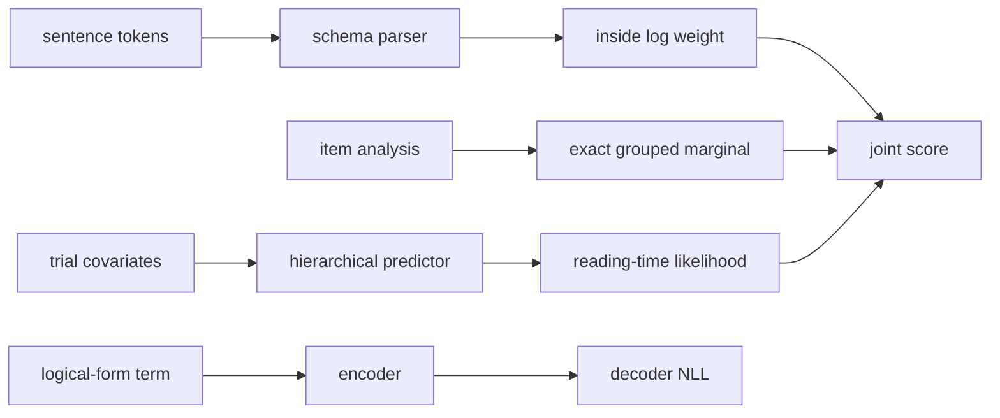

# Amortized Bayesian Semantics

## Overview

This example joins four views of a psycholinguistic experiment in one checked
module. A schema-backed categorial parser marginalizes over derivations; a
structural autoencoder learns codes for logical forms; an indexed family
separates observed from missing outcomes under a contamination measure; and a
hierarchical response-time program marginalizes an item-level analysis while
partially pooling participant and item effects.

The resulting **amortized Bayesian semantics model (ABSM)** is intentionally a
mixed module. Its point is not that one inference algorithm should fit every
component at once. Its point is that each component has a typed entry, their
calls form one inspected graph, and an unsupported deployment target must name
the exact boundary it cannot preserve.

[Open the complete QVR source](qiec/amortized-bayesian-semantics.qvr).

## Statistical structure

The response model is

\[
\log y_n \sim \operatorname{Normal}(\mu_n, \sigma),
\qquad
\mu_n = \tfrac{1}{2}\alpha +
        \tau_p u_{p[n]} +
        \tau_i v_{i[n]}.
\]

Participant and item effects use non-centered parameterizations. Each item
also has a two-state latent analysis with a learned simplex, and
`marginalize` integrates that discrete variable exactly before the outer
program proceeds. The parser's inside log weight contributes a sentence-level
factor. Thus syntactic uncertainty and experimental variation remain separate
terms of one joint score.

The module's principal data flow is:



## Indexed missingness

The `Measurement` family makes observation status part of the type:

<!-- compile: qiec -->
```qvr
index Availability = Observed | Missing

family Measurement(s : Availability) : Type
    constructor Present : Real -> Measurement(Observed)
    constructor Absent : Measurement(Missing)

instance random : Random
instance score : Score

define contamination(location : Real, scale : Real) : Sampleable[Real] !{} =
    return Mixture([0.95, 0.05], [Normal(location, scale), StudentT(3.0, location, scale)])

define complete[s : Availability](measurement : Measurement(s), location : Real, scale : Real) : Real !{random, score} =
    let likelihood <- contamination(location, scale)
    case measurement motive (t : Availability) => Real
        Present(value) =>
            perform score.add(log_prob(likelihood, value))
            return value
        Absent =>
            let value <- perform random.sample[Real](site("held_out_reading_time"), likelihood)
            return value
```

The observed branch scores a supplied value. The missing branch draws a
posterior predictive value. `contamination` uses the measure algebra to mix a
95% Normal component with a 5% heavy-tailed Student-t component without
introducing a sampled mixture label. A caller cannot construct `Present` at
the `Missing` index or reach the wrong branch through a runtime flag.

## Authored robustification

The model calls `robustify(grand_mean)` before it adds random effects. Its
handler is ordinary QVR code:

<!-- compile: qiec -->
```qvr
effect Robust
    shrink : Real -> Real

instance robust : Robust

handler half_weight for Robust : Real -> Real [coverage=total, forwards=none, implementation=authored]
    return x =>
        return x
    shrink(x : Real) resumes 1 =>
        resume(0.5 * x)

define robustify(x : Real) : Real !{} =
    handle robust with half_weight in
        let adjusted <- perform robust.shrink(x)
        return adjusted
```

`robustify` is pure after handling, though the trace still records the request,
clause, and resumption. Replacing the policy with a winsorizing handler or a
foreign robust-estimation provider would not change callers of the request.

## Parser and structural heads

The parser instantiates application and harmonic-permutation schemas over a
depth-one free residuated category inventory. Its checked search entry sums
over bounded derivations under a `Weight[LogWeight]` handler. The structural
head, by contrast, lowers `Enc`, `Dec`, and `Dec__nll` to typed `Compute`
requests, with `reconstruct` as their composed loss.

These entries use different runtime capabilities. The core provider can run
the authored handler and parser search. The structural loss also needs the
compiled PyTorch attachments. A transpiler must preserve the capability of
every entry the selected program can reach.

## Grouped exact marginalization

The response model gives each item its own probability over two analyses:

<!-- compile: false -->
```qvr
sample analysis_prob : Item <- Dirichlet(concentration) [over=Analysis, iid_over=Item]

marginalize analysis : Analysis <- Categorical(analysis_prob) [over=Item, reduction=logsumexp]
    observe ambiguity_rating : Trial <- Normal(analysis_shift[analysis], residual_scale) [via=item_idx]
```

`item_idx` maps trials to items. The runtime first sums trial log likelihoods
within each item-analysis cell, then reduces over the analysis atoms with
`logsumexp`. This order differs from marginalizing every trial independently;
the item shares one latent analysis across its trials.

## Try it

Compile the mixed module, inspect its entries, and run the authored handler:

```python
from quivers.dsl import load

model = load("docs/examples/qiec/amortized-bayesian-semantics.qvr")
entries = {entry.name: entry for entry in model.entry_points()}

assert entries["semantic_parser__run"].kind == "computation"
assert entries["reconstruct"].kind == "computation"
assert entries["reading_times"].kind == "program"
assert entries["complete"].statics == ("s",)
assert entries["contamination"].result == "Sampleable[Real]"

run = model.run("robustify", 8.0)
assert run.value == 4.0
assert run.result.runtime == "core+structural"
print(run.value, len(run.result.trace), "trace events")
```

The runtime label includes `structural` because the compiled module owns the
encoder and decoder attachments, even though this particular entry does not
call them. The trace should contain one handled operation and one resumption.

Check target boundaries before choosing a backend:

```bash
qvr check docs/examples/qiec/amortized-bayesian-semantics.qvr
qvr check --target pyro docs/examples/qiec/amortized-bayesian-semantics.qvr
qvr run docs/examples/qiec/amortized-bayesian-semantics.qvr --list
```

The target check is expected to report the search and neural-attachment
requirements it cannot preserve. Those diagnostics are part of the example:
the mixed module demonstrates how Quivers retains a complete graph while
letting each deployment select only a supported entry and provider set.

## What to vary

First, replace `half_weight` with a handler whose `shrink` clause resumes with
`tanh(x)` and confirm that only the robustification trace changes. Second,
replace the item-level `logsumexp` with `mean` and state the different
estimand. Third, add a product group over item and experimental list; the
corresponding `via=[item_idx, list_idx]` should make the shared latent explicit.
Finally, change the logical-form signature by adding negation and check which
encoder and decoder parameters appear in the checkpoint.

## See also

- [QVR language reference](../reference/qvr/index.md)
- [Parsing as an effectful computation](../tutorials/qvr/11-parsing-and-search.md)
- [Structural autoencoders](../tutorials/qvr/12-structural-autoencoders.md)
- [Mixtures and discrete latents](../tutorials/qvr/04-marginalize.md)
- [Transpilation support](../transpile-support.md)
