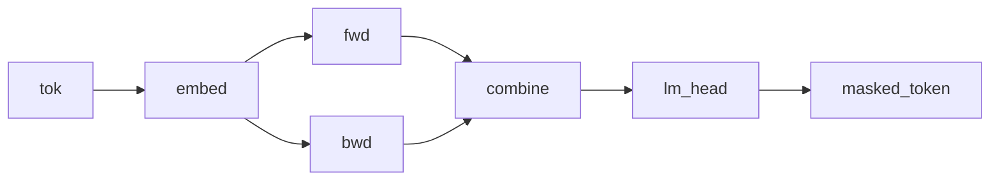

# Dual-RNN masked-token model

## Overview

Two independently parameterized recurrent cells scan the same token sequence, and a `combine` morphism merges their outputs before a Categorical masked-token score. Both `scan` calls run left to right on the supplied input. The source does not reverse the second sequence, so it does not provide right-context conditioning unless the caller constructs a reversed branch separately.

## QVR source

```qvr
# Dual-RNN Masked-Token Model
#
# Two independently parameterized cells scan the same token
# sequence from left to right. A combine morphism merges their
# summaries, and a Categorical lm_head over Token scores a
# masked-token target. The second path is named backward_path
# for contrast, but the source does not reverse its input; a
# caller must supply a reversed branch to obtain right context.
#
# Generative structure:
#
#   h_fwd    ~ scan(fwd_cell)(tok_embed(x))    forward hidden states
#   h_alt    ~ scan(bwd_cell)(tok_embed(x))    second left-to-right summary
#   h        ~ combine(h_fwd, h_bwd)           merged representation
#   masked_t ~ Categorical(lm_head(h))         observed masked token
#
# Resp is the plate: it indexes the 32 scored rows of the corpus,
# one masked-token target per context window. Token is the
# vocabulary, so it is the value space of what lm_head draws and of
# what the program returns.
#
# The fan-out fan(forward_path, backward_path) runs the two
# paths in parallel over the same token sequence in the
# Kleisli category; the backbone is
# fan(forward_path, backward_path) >> combine.

object Token : FinSet 256
object Resp : FinSet 32
object Embedded, FwdHidden, BwdHidden : Real 64
object Combined : Real 128

morphism tok_embed : Token -> Embedded [role=embed]
morphism fwd_cell : Embedded * FwdHidden -> FwdHidden [param_source=mlp] ~ Normal
morphism bwd_cell : Embedded * BwdHidden -> BwdHidden [param_source=mlp] ~ Normal
morphism combine : Combined -> Combined [param_source=mlp] ~ Normal
morphism lm_head : Combined -> Token ~ Categorical

define forward_path = tok_embed >> scan(fwd_cell)
define backward_path = tok_embed >> scan(bwd_cell)
define backbone = fan(forward_path, backward_path) >> combine

program bidirectional_rnn_lm : Token -> Token
    sample h <- backbone

    observe masked_token : Resp <- lm_head(h)
    return masked_token

export bidirectional_rnn_lm
```

## Walkthrough

### Two independent scans

`forward_path = tok_embed >> scan(fwd_cell)` and `backward_path = tok_embed >> scan(bwd_cell)` are two independent Kleisli morphisms, `Token -> FwdHidden` and `Token -> BwdHidden`. Both thread state left to right over the same token sequence with the same `scan` machinery; what distinguishes the two paths is their cells, which carry independent parameters and thus learn separate summaries of the sequence.

### Parallel composition

`fan(forward_path, backward_path) >> combine` runs the two paths in parallel via the `fan` combinator, the Kleisli fan-out that feeds the same input to two morphisms and pairs their outputs in the [Giry monad](https://doi.org/10.1007/BFb0092872)'s Kleisli category. The result lives in `FwdHidden * BwdHidden`, which by the type aliases above has total dimension 128, matching `Combined`. The `combine` Bayesian morphism is the merge that mixes the two streams into a single combined representation.

### Masked LM head

The Categorical `lm_head : Combined -> Token` scores a masked-token target from the two learned summaries. In the current source, both summaries use the same input order; the name `backward_path` does not itself reverse data.

The two `FinSet` objects play different roles. `Resp : FinSet 32` sits in the observe step's index slot, so it is the plate: 32 scored rows, one masked-token target per context window. `Token : FinSet 256` sits in `lm_head`'s codomain and in the program's own codomain, so it is the value space the draw ranges over.



## Try it

> The short fits below demonstrate the API. Assess convergence with multiple chains and diagnostics before interpreting a posterior.


### Generating synthetic data

Trace the two fixed left-to-right branches once to obtain their merged `h` and target. Reuse `true_h` in `observations` so later likelihood evaluations score that same realization; otherwise each evaluation resamples `h`. Each `Resp` row contains an int64 context of length `seq_len` and one masked-token label.

```python
import torch
from quivers.dsl import load
from quivers.inference.trace import trace

torch.manual_seed(0)
prog = load("docs/examples/source/bidirectional_rnn_lm.qvr")
model = prog.morphism

# Fix the model's kernel parameters to chosen values, then run one
# forward trace so the captured hidden state and the masked-token target it
# generated are jointly consistent under the same weights.
for _, p in model.named_parameters():
    p.data.copy_(torch.randn_like(p) * 0.3)

rows, seq_len, vocab = 32, 8, 256
contexts = torch.randint(0, vocab, (rows, seq_len))
with torch.no_grad():
    forward = trace(model, contexts)
true_h = forward.sites["h"].value.detach()
masked_token = forward.sites["masked_token"].value.detach()

x_in = contexts
observations = {"masked_token": masked_token, "h": true_h}
print("contexts:", contexts.shape, contexts.dtype)
print("true_h:", true_h.shape)
print("masked_token:", masked_token.shape, masked_token.dtype)
```

### SVI fit

Reinitialize `tok_embed`, `fwd_cell`, `bwd_cell`, `combine`, and `lm_head`, then fit their latent parameters with an [`AutoNormalGuide`](../api/inference/guide.md) and [`SVI`](../api/inference/svi.md). The [`ELBO`](../api/inference/elbo.md) scores the Categorical `masked_token` site for each context.

```python
import torch
from quivers.dsl import load
from quivers.inference import AutoNormalGuide, ELBO, SVI

torch.manual_seed(0)
prog = load("docs/examples/source/bidirectional_rnn_lm.qvr")
model = prog.morphism

for _, p in model.named_parameters():
    p.data.copy_(torch.randn_like(p) * 0.3)
rows, seq_len, vocab = 32, 8, 256
contexts = torch.randint(0, vocab, (rows, seq_len))
targets = model.rsample(contexts)
observations = {"masked_token": targets}

torch.manual_seed(1)
for _, p in model.named_parameters():
    p.data.copy_(torch.randn_like(p) * 0.3)

guide = AutoNormalGuide(model, observed_names={"masked_token"})
optim = torch.optim.Adam(
    list(model.parameters()) + list(guide.parameters()), lr=1e-2,
)
svi = SVI(model, guide, optim, ELBO(num_particles=1))

losses = [svi.step(contexts, observations)]
for _ in range(40):
    losses.append(svi.step(contexts, observations))

print(f"initial loss: {losses[0]:.2f}")
print(f"final loss:   {losses[-1]:.2f}")
```

### NUTS posterior

The forward / backward cells and the combine morphism are kernel Bayesian morphisms whose weights live as `nn.Parameter`s inside the program. [`bayesian_lift_parameters`](../api/inference/lifts.md#quivers.inference.lifts.bayesian_lift_parameters) lifts those parameters into Normal-prior sample sites so [`NUTSKernel`](../api/inference/mcmc.md#quivers.inference.mcmc.NUTSKernel) has a continuous unconstrained state space. The likelihood scores the masked-token target via the Categorical [`lm_head`](../api/continuous/families.md) applied to a forward sample of the merged hidden state.

```python
import torch
from quivers.dsl import load
from quivers.inference import MCMC, NUTSKernel, bayesian_lift_parameters

torch.manual_seed(0)
prog = load("docs/examples/source/bidirectional_rnn_lm.qvr")
model = prog.morphism
for _, p in model.named_parameters():
    p.data.copy_(torch.randn_like(p) * 0.3)
rows, seq_len, vocab = 32, 8, 256
contexts = torch.randint(0, vocab, (rows, seq_len))
targets = model.rsample(contexts)
observations = {"masked_token": targets}

h_shape = tuple(model._step_h.rsample(contexts).shape)
lifted, lx, lobs = bayesian_lift_parameters(
    model, contexts, observations,
    prior_scale=1.0,
    additional_latents={"h": h_shape},
)
kernel = NUTSKernel(step_size=0.005, max_tree_depth=3, target_accept=0.8)
mc     = MCMC(kernel, num_warmup=10, num_samples=10, num_chains=1)
result = mc.run(lifted, lx, lobs)

print(f"acceptance:  {float(result.acceptance_rates.mean()):.2f}")
print(f"divergences: {int(result.divergence_counts.sum())}")
```


## Categorical perspective

The model denotes a Kleisli morphism $\mathrm{Token} \to \mathcal{G}(\mathrm{Token})$ assembled by `fan`-composing two independent scan-folds and following with a merge. The `fan` combinator is the diagonal-pair construction $(f \times g) \circ \Delta$ in the Kleisli category that delivers a common input to both branches, landing in $\mathrm{FwdHidden} \times \mathrm{BwdHidden}$. Because that product carries the same 128 dimensions as $\mathrm{Combined}$, the Normal-kernel morphism `combine` $: \mathrm{Combined} \to \mathcal{G}(\mathrm{Combined})$ consumes the paired streams directly and mixes them into a single object. The Categorical head closes with the masked-token likelihood as a sub-probability kernel.


## References

- Michèle Giry. 1982. A categorical approach to probability theory. In Bernhard Banaschewski, editor, *Categorical Aspects of Topology and Analysis*, volume 915 of *Lecture Notes in Mathematics*, pages 68–85. Springer, Berlin, Heidelberg.
