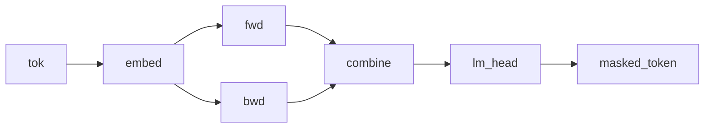

# Bidirectional RNN Masked Language Model

## Overview

A bidirectional RNN used as a masked language model in the spirit of [BERT](https://doi.org/10.18653/v1/N19-1423). Two independently-parameterized recurrent cells each scan the token sequence; the `fan` combinator copies the shared input to the two [Kleisli morphisms](https://ncatlab.org/nlab/show/Kleisli+category) and pairs their outputs, and a `combine` morphism merges the paired streams into a single 128-dimensional `Combined` representation. The Categorical `lm_head` scores the masked-token target from the bidirectional context.

## QVR Source

```qvr
object Token : FinSet 256
object Embedded, FwdHidden, BwdHidden : Real 64
object Combined : Real 128

morphism tok_embed : Token -> Embedded [role=embed]
morphism fwd_cell : Embedded * FwdHidden -> FwdHidden [scale=0.1] ~ Normal
morphism bwd_cell : Embedded * BwdHidden -> BwdHidden [scale=0.1] ~ Normal
morphism combine : Combined -> Combined [scale=0.1] ~ Normal
morphism lm_head : Combined -> Token ~ Categorical

define forward_path = tok_embed >> scan(fwd_cell)
define backward_path = tok_embed >> scan(bwd_cell)
define backbone = fan(forward_path, backward_path) >> combine

program bidirectional_rnn_lm : Token -> Token
    sample h <- backbone

    observe masked_token : Token <- lm_head(h)
    return masked_token

export bidirectional_rnn_lm
```

## Walkthrough

### Two independent scans

`forward_path = tok_embed >> scan(fwd_cell)` and `backward_path = tok_embed >> scan(bwd_cell)` are two independent Kleisli morphisms, `Token -> FwdHidden` and `Token -> BwdHidden`. Both thread state left to right over the same token sequence with the same `scan` machinery; what distinguishes the two paths is their cells, which carry independent parameters and thus learn separate summaries of the sequence.

### Parallel composition

`fan(forward_path, backward_path) >> combine` runs the two paths in parallel via the `fan` combinator, the Kleisli fan-out that feeds the same input to two morphisms and pairs their outputs in the [Giry monad](https://doi.org/10.1007/BFb0092872)'s Kleisli category. The result lives in `FwdHidden * BwdHidden`, which by the type aliases above has total dimension 128, matching `Combined`. The `combine` Bayesian morphism is the merge that mixes the two streams into a single combined representation.

### Masked LM head

The Categorical `lm_head : Combined -> Token` scores a masked-token target conditional on bidirectional context: at any position the prediction is conditioned on both the left and the right context, so this is an encoder rather than a causal LM.



## Try it

> The SVI step counts and NUTS warmup, sample, and chain budgets in the snippets below are illustrative: each block is sized to run in tens of seconds and demonstrate the API surface. Production fits typically need 10x to 100x more SVI steps, longer NUTS warmup, and multiple chains to actually converge to the data-generating parameters.


### Generating synthetic data

Initialise the model's stochastic-weight parameters under a fixed seed (these stand in for the ground-truth generative weights), then forward-sample a corpus of token sequences by drawing random masked-context windows and reading off the masked-token target through [`rsample`](../api/continuous/programs.md). The corpus is a `(batch, seq_len)` int64 context tensor paired with a `(batch,)` masked-token target.

```python
import torch
from quivers.dsl import load

torch.manual_seed(0)
prog = load("docs/examples/source/bidirectional_rnn_lm.qvr")
model = prog.morphism

for _, p in model.named_parameters():
    p.data.copy_(torch.randn_like(p) * 0.3)

batch, seq_len, vocab = 4, 8, 256
contexts = torch.randint(0, vocab, (batch, seq_len))
targets = model.rsample(contexts)
print("contexts:", contexts.shape, contexts.dtype)
print("targets: ", targets.shape, targets.dtype)
```

### SVI fit

Re-initialise the parameters and recover the masked-token weights from the synthetic corpus with [`AutoNormalGuide`](../api/inference/guide.md) + [`ELBO`](../api/inference/elbo.md) + [`SVI`](../api/inference/svi.md). The loss is the negative ELBO under a Categorical likelihood on the `masked_token` site.

```python
import torch
from quivers.dsl import load
from quivers.inference import AutoNormalGuide, ELBO, SVI

torch.manual_seed(0)
prog = load("docs/examples/source/bidirectional_rnn_lm.qvr")
model = prog.morphism

for _, p in model.named_parameters():
    p.data.copy_(torch.randn_like(p) * 0.3)
batch, seq_len, vocab = 4, 8, 256
contexts = torch.randint(0, vocab, (batch, seq_len))
targets = model.rsample(contexts)
observations = {"masked_token": targets}

torch.manual_seed(1)
for _, p in model.named_parameters():
    p.data.copy_(torch.randn_like(p) * 0.3)

guide = AutoNormalGuide(model, observed_names={"masked_token"})
optim = torch.optim.Adam(
    list(model.parameters()) + list(guide.parameters()), lr=1e-2,
)
svi = SVI(model, guide, optim, ELBO(num_particles=1))

losses = [svi.step(contexts, observations)]
for _ in range(40):
    losses.append(svi.step(contexts, observations))

print(f"initial loss: {losses[0]:.2f}")
print(f"final loss:   {losses[-1]:.2f}")
```

### NUTS posterior

The forward / backward cells and the combine morphism are kernel Bayesian morphisms whose weights live as `nn.Parameter`s inside the program. [`bayesian_lift_parameters`](../api/inference/lifts.md#quivers.inference.lifts.bayesian_lift_parameters) lifts those parameters into Normal-prior sample sites so [`NUTSKernel`](../api/inference/mcmc.md#quivers.inference.mcmc.NUTSKernel) has a continuous unconstrained state space. The likelihood scores the masked-token target via the Categorical [`lm_head`](../api/continuous/families.md) applied to a forward sample of the merged hidden state.

```python
import torch
from quivers.dsl import load
from quivers.inference import MCMC, NUTSKernel, bayesian_lift_parameters

torch.manual_seed(0)
prog = load("docs/examples/source/bidirectional_rnn_lm.qvr")
model = prog.morphism
for _, p in model.named_parameters():
    p.data.copy_(torch.randn_like(p) * 0.3)
batch, seq_len, vocab = 4, 8, 256
contexts = torch.randint(0, vocab, (batch, seq_len))
targets = model.rsample(contexts)
observations = {"masked_token": targets}

h_shape = tuple(model._step_h.rsample(contexts).shape)
lifted, lx, lobs = bayesian_lift_parameters(
    model, contexts, observations,
    prior_scale=1.0,
    additional_latents={"h": h_shape},
)
kernel = NUTSKernel(step_size=0.005, max_tree_depth=3, target_accept=0.8)
mc     = MCMC(kernel, num_warmup=10, num_samples=10, num_chains=1)
result = mc.run(lifted, lx, lobs)

print(f"acceptance:  {float(result.acceptance_rates.mean()):.2f}")
print(f"divergences: {int(result.divergence_counts.sum())}")
```


## Categorical Perspective

The model denotes a Kleisli morphism $\mathrm{Token} \to \mathcal{G}(\mathrm{Token})$ assembled by `fan`-composing two independent scan-folds and following with a merge. The `fan` combinator is the diagonal-pair construction $(f \times g) \circ \Delta$ in the Kleisli category that delivers a common input to both branches, landing in $\mathrm{FwdHidden} \times \mathrm{BwdHidden}$. Because that product carries the same 128 dimensions as $\mathrm{Combined}$, the Normal-kernel morphism `combine` $: \mathrm{Combined} \to \mathcal{G}(\mathrm{Combined})$ consumes the paired streams directly and mixes them into a single object. The Categorical head closes with the masked-token likelihood as a sub-probability kernel.


## References

- Jacob Devlin, Ming-Wei Chang, Kenton Lee, and Kristina Toutanova. 2019. BERT: Pre-training of deep bidirectional transformers for language understanding. In *Proceedings of the 2019 Conference of the North American Chapter of the Association for Computational Linguistics: Human Language Technologies (NAACL-HLT)*, pages 4171–4186. ACL.
- Michèle Giry. 1982. A categorical approach to probability theory. In Bernhard Banaschewski, editor, *Categorical Aspects of Topology and Analysis*, volume 915 of *Lecture Notes in Mathematics*, pages 68–85. Springer, Berlin, Heidelberg.
