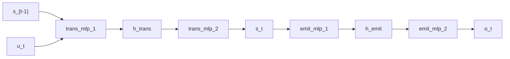

# Deep Markov Model

## Overview

The [deep Markov model](https://doi.org/10.1609/aaai.v31i1.10779) of Krishnan, Shalit, and Sontag (2017) is a state-space model with nonlinear, neural-network-parameterized transition and emission kernels:

$$
s_t = f_\theta(s_{t-1}) + \varepsilon_t, \quad \varepsilon_t \sim \mathcal{N}(0, \sigma_s^2 I)
$$
$$
o_t = g_\phi(s_t) + \eta_t, \quad \eta_t \sim \mathcal{N}(0, \sigma_o^2 I)
$$

The transition and emission means are MLPs; per-step Normal noise gives a tractable density. The companion recognition network `q_\phi(o_t, s_{t-1}) -> s_t` carries the variational posterior and is threaded across the sequence by `scan` to amortize the posterior over the latent trajectory. The combinator surface mirrors the [linear-Gaussian SSM](linear-gaussian-ssm.md): only the per-step cells change.

## QVR Source

```qvr
object Driver : Real 4
object Hidden : Real 32
object State : Real 8
object Obs : Real 4

morphism trans_mlp_1 : Driver * State -> Hidden [param_source=mlp] ~ Normal
morphism trans_mlp_2 : Hidden -> State [param_source=mlp] ~ Normal
morphism emit_mlp_1 : State -> Hidden [param_source=mlp] ~ Normal
morphism emit_mlp_2 : Hidden -> Obs [param_source=mlp] ~ Normal
morphism infer_cell : Obs * State -> State [param_source=mlp] ~ Normal

define transition_cell = trans_mlp_1 >> trans_mlp_2
define emission = emit_mlp_1 >> emit_mlp_2
define generate = scan(transition_cell) >> emission
define recognize = scan(infer_cell)

program generative_step : Driver * State -> State
    sample s_new <- transition_cell

    observe o <- emission(s_new)
    return s_new

export generative_step
```

## Walkthrough

The transition stack `trans_mlp_1 >> trans_mlp_2` is a two-layer MLP that maps `(u_t, s_{t-1})` through a hidden width of 32 down to the 8-d state; the emission stack `emit_mlp_1 >> emit_mlp_2` is the symmetric decoder back to the 4-d observation. Both stacks are Kleisli compositions of Gaussian kernels, so the joint per-step kernel is a [normalizing-flow](https://doi.org/10.1145/3422622)-like reparameterisable Gaussian whose mean is the network output.

`scan(transition_cell) >> emission` is the generative pipeline; `scan(infer_cell)` is the [variational autoencoder](https://doi.org/10.48550/arXiv.1312.6114)-style recognition network that threads the previous belief and the new observation through `infer_cell` to produce the next belief. The choice of `Driver` width controls the exogenous input; a non-driven model uses `Driver = Euclidean 1` and feeds a zero vector.

## Try it

> The SVI step counts and NUTS warmup, sample, and chain budgets in the snippets below are illustrative: each block is sized to run in tens of seconds and demonstrate the API surface. Production fits typically need 10x to 100x more SVI steps, longer NUTS warmup, and multiple chains to actually converge to the data-generating parameters.


### Generating synthetic data

Pick concrete ground-truth nonlinear dynamics (tanh recurrence on the latent, tanh decoder to observations) and forward-sample a single trajectory of length `T`. The latent dimension matches `State = Real 8`; the observation dimension matches `Obs = Real 4`. The single-step program `generative_step : Driver * State -> State` reads the previous (driver, state) pair as input; the per-step pair `(s_new, o)` is supplied as the observation dict.

```python
import torch
from quivers.dsl import load

torch.manual_seed(0)
prog = load("docs/examples/source/deep_markov.qvr")
model = prog.morphism

T = 32
state_dim, obs_dim, driver_dim = 8, 4, 4
W_s = 0.5 * torch.randn(state_dim, state_dim)
W_o = 0.3 * torch.randn(obs_dim, state_dim)
s = torch.zeros(T + 1, state_dim)
o = torch.zeros(T, obs_dim)
u = torch.randn(T, driver_dim)
for t in range(T):
    s[t + 1] = torch.tanh(s[t] @ W_s.T) + 0.1 * torch.randn(state_dim)
    o[t] = torch.tanh(s[t + 1] @ W_o.T) + 0.1 * torch.randn(obs_dim)

state_prev = torch.cat([u, s[:T]], dim=-1)
sites = {"s_new": s[1:T + 1], "o": o}
x_in = state_prev
observations = sites
```

### SVI fit

The exported `generative_step` is a monadic program whose transition and emission MLP weights are kernel parameters without explicit priors; [`bayesian_lift_parameters`](../api/inference/lifts.md#quivers.inference.lifts.bayesian_lift_parameters) lifts each leaf into a unit-Normal sample site so [`AutoNormalGuide`](../api/inference/guide.md#quivers.inference.guides.AutoNormalGuide) can build a mean-field surrogate over the parameters. The per-step `(s_new, o)` trajectory is supplied as the observation dict, so `log_joint` scores the clamped trajectory under each lifted parameter draw.

```python
from quivers.inference import AutoNormalGuide, ELBO, SVI, bayesian_lift_parameters

torch.manual_seed(1)
prog = load("docs/examples/source/deep_markov.qvr")
inner = prog.morphism
model, x_lift, obs_lift = bayesian_lift_parameters(
    inner, x_in, observations, prior_scale=1.0,
)

guide = AutoNormalGuide(model, observed_names=set())
optim = torch.optim.Adam(
    list(model.parameters()) + list(guide.parameters()), lr=1e-2,
)
svi = SVI(model, guide, optim, ELBO())

loss0 = svi.step(x_lift, obs_lift)
losses = [svi.step(x_lift, obs_lift) for _ in range(300)]
loss_final = sum(losses[-20:]) / 20.0
oracle_ll = inner.log_joint(x_in, observations).sum().item()
print(f"initial ELBO loss: {loss0:.1f}")
print(f"final ELBO loss:   {loss_final:.1f}")
print(f"oracle -log p(h):  {-oracle_ll:.1f}")
```

### NUTS posterior

The lifted model carries one Normal sample site per leaf parameter; [`NUTSKernel`](../api/inference/mcmc.md#quivers.inference.mcmc.NUTSKernel) samples them directly.

```python
from quivers.inference import MCMC, NUTSKernel, bayesian_lift_parameters

torch.manual_seed(2)
prog = load("docs/examples/source/deep_markov.qvr")
model, x_lift, obs_lift = bayesian_lift_parameters(
    prog.morphism, x_in, observations, prior_scale=1.0,
)

kernel = NUTSKernel(step_size=0.05, max_tree_depth=3, target_accept=0.8)
mc = MCMC(kernel, num_warmup=15, num_samples=15, num_chains=1)
result = mc.run(model, x_lift, obs_lift)

print("acceptance:", float(result.acceptance_rates.mean()))
print("divergences:", int(result.divergence_counts.sum()))
```


## Categorical Perspective

The transition stack is the Kleisli composition of two Gaussian kernels; the second kernel's mean depends on the sample from the first, so the joint per-step kernel is no longer Gaussian, only a reparameterisable density. `scan` realizes the iterated Kleisli composition over the time index, so the full trajectory kernel is the right Kan extension of the per-step cell along the time projection.

The recognizer is a directed inverse of the generative kernel: where the prior is a forward chain `s_0 -> s_1 -> ... -> s_T -> o_{1:T}`, the recognizer is the [encoder side](seq2seq.md) of an amortized variational posterior. The two share the latent space `State` but live in opposite Kleisli morphisms; SVI tunes them jointly against an ELBO.




## References

- Diederik P. Kingma and Max Welling. 2013. Auto-Encoding Variational Bayes. arXiv preprint arXiv:1312.6114.
- Rahul G. Krishnan, Uri Shalit, and David Sontag. 2017. Structured inference networks for nonlinear state space models. In *Proceedings of the Thirty-First AAAI Conference on Artificial Intelligence (AAAI '17)*, pages 2101–2109. AAAI Press.
