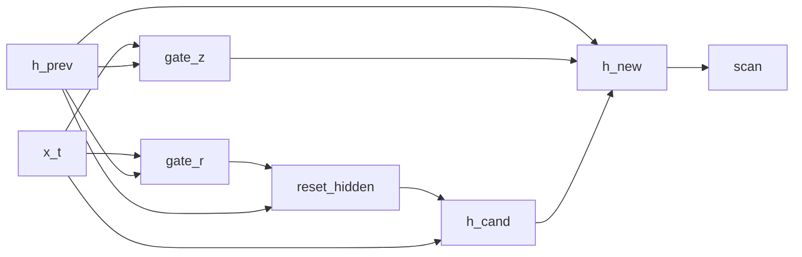

# GRU Language Model

## Overview

A Bayesian [GRU](https://doi.org/10.3115/v1/D14-1179) language model. The recurrent cell follows the canonical GRU equations with [`LogitNormal`](../api/continuous/families.md) update and reset gates and a [`Normal`](../api/continuous/families.md) candidate, and a `Categorical` `lm_head` projects the per-position hidden state onto the vocabulary so the program's `observe` step scores the next-token target.

## QVR Source

```qvr
object Token : FinSet 256
object Embedded : Real 64
object Hidden : Real 128

morphism tok_embed : Token -> Embedded [role=embed]
morphism gate_z, gate_r : Embedded * Hidden -> Hidden ~ LogitNormal
morphism lm_head : Hidden -> Token ~ Categorical

program gru_cell(x_t, h_prev) : Embedded * Hidden -> Hidden
    sample z <- gate_z(x_t, h_prev)
    sample r <- gate_r(x_t, h_prev)

    let reset_hidden = r * h_prev

    sample h_cand <- Normal(reset_hidden, 0.5)

    let z_complement = 1.0 - z
    let h_new = z_complement * h_prev + z * h_cand
    return h_new

define backbone = tok_embed >> scan(gru_cell)

program gru_lm : Token -> Token
    sample h <- backbone

    observe next_token : Token <- lm_head(h)
    return next_token

export gru_lm
```

## Walkthrough

### Cell equations

| Step | DSL | Meaning |
|---|---|---|
| update gate | `z <- gate_z(x_t, h_prev)` | $z_t = \sigma(W_z [x_t, h_{t-1}])$ |
| reset gate | `r <- gate_r(x_t, h_prev)` | $r_t = \sigma(W_r [x_t, h_{t-1}])$ |
| reset-gated state | `let reset_hidden = r * h_prev` | $r_t \odot h_{t-1}$ |
| candidate | `h_cand <- Normal(reset_hidden, 0.5)` | $\tilde h_t = \phi(W \,[x_t, r_t \odot h_{t-1}])$ |
| update | `let h_new = z_complement * h_prev + z * h_cand` | $h_t = (1 - z_t)\,h_{t-1} + z_t \,\tilde h_t$ |

The candidate is drawn from a Normal centered on the reset-gated previous state; the update-gate convex combination $(1 - z_t)\,h_{t-1} + z_t \,\tilde h_t$ interpolates between persistence and the new candidate.

### State threading

`scan(gru_cell)` threads the hidden state $h_t$ across the sequence; the `Categorical` `lm_head` scores the next-token target from the terminal state $h_T$.



## Try it

> The SVI step counts and NUTS warmup, sample, and chain budgets in the snippets below are illustrative: each block is sized to run in tens of seconds and demonstrate the API surface. Production fits typically need 10x to 100x more SVI steps, longer NUTS warmup, and multiple chains to actually converge to the data-generating parameters.


### Generating synthetic data

Initialise the model's stochastic-weight parameters under a fixed seed (these stand in for the ground-truth generative weights), then forward-sample a corpus of token sequences by drawing random prompts and reading off the next-token target through [`rsample`](../api/continuous/programs.md). The corpus is a `(batch, seq_len)` int64 prompt tensor paired with a `(batch,)` next-token target.

```python
import torch
from quivers.dsl import load

torch.manual_seed(0)
prog = load("docs/examples/source/gru_lm.qvr")
model = prog.morphism

for _, p in model.named_parameters():
    p.data.copy_(torch.randn_like(p) * 0.3)

batch, seq_len, vocab = 4, 8, 256
prompts = torch.randint(0, vocab, (batch, seq_len))
targets = model.rsample(prompts)
print("prompts:", prompts.shape, prompts.dtype)
print("targets:", targets.shape, targets.dtype)
```

### SVI fit

Re-initialise the parameters and recover next-token weights from the synthetic corpus with [`AutoNormalGuide`](../api/inference/guide.md) + [`ELBO`](../api/inference/elbo.md) + [`SVI`](../api/inference/svi.md). The loss is the negative ELBO under a Categorical likelihood on the `next_token` site.

```python
import torch
from quivers.dsl import load
from quivers.inference import AutoNormalGuide, ELBO, SVI

torch.manual_seed(0)
prog = load("docs/examples/source/gru_lm.qvr")
model = prog.morphism

for _, p in model.named_parameters():
    p.data.copy_(torch.randn_like(p) * 0.3)
batch, seq_len, vocab = 4, 8, 256
prompts = torch.randint(0, vocab, (batch, seq_len))
targets = model.rsample(prompts)
observations = {"next_token": targets}

torch.manual_seed(1)
for _, p in model.named_parameters():
    p.data.copy_(torch.randn_like(p) * 0.3)

guide = AutoNormalGuide(model, observed_names={"next_token"})
optim = torch.optim.Adam(
    list(model.parameters()) + list(guide.parameters()), lr=5e-2,
)
svi = SVI(model, guide, optim, ELBO(num_particles=1))

losses = [svi.step(prompts, observations)]
for _ in range(30):
    losses.append(svi.step(prompts, observations))

print(f"initial loss: {losses[0]:.2f}")
print(f"final loss:   {losses[-1]:.2f}")
```

### NUTS posterior

The proper Bayesian model has both the parameters $\theta$ and the per-token hidden state $h$ as latents: $p(\theta, h \mid x, y) \propto p(\theta) \, p(h \mid x, \theta) \, p(y \mid h, \theta)$. [`bayesian_lift_parameters`](../api/inference/lifts.md#quivers.inference.lifts.bayesian_lift_parameters) declares Normal priors on every learnable parameter and accepts an `additional_latents` mapping that lifts the intermediate `sample h` site as a NUTS variable with a placeholder Normal prior; the score step substitutes both into the inner program and cancels the placeholder, leaving the lifted log-density equal to the true joint $\log p(\theta) + \log p_{\text{inner}}(h, y \mid x, \theta)$. The log-density is deterministic given the full $(\theta, h)$ state, so the chain targets the exact posterior with no MC noise across leapfrog steps.

```python
import torch
from quivers.dsl import load
from quivers.inference import MCMC, NUTSKernel, bayesian_lift_parameters

torch.manual_seed(0)
prog = load("docs/examples/source/gru_lm.qvr")
model = prog.morphism
for _, p in model.named_parameters():
    p.data.copy_(torch.randn_like(p) * 0.3)
batch, seq_len, vocab = 4, 8, 256
prompts = torch.randint(0, vocab, (batch, seq_len))
targets = model.rsample(prompts)
observations = {"next_token": targets}

h_shape = tuple(model._step_h.rsample(prompts).shape)
lifted, lx, lobs = bayesian_lift_parameters(
    model, prompts, observations,
    prior_scale=1.0,
    additional_latents={"h": h_shape},
)
kernel = NUTSKernel(step_size=0.005, max_tree_depth=3, target_accept=0.8)
mc     = MCMC(kernel, num_warmup=10, num_samples=10, num_chains=1)
result = mc.run(lifted, lx, lobs)

print(f"acceptance:  {float(result.acceptance_rates.mean()):.2f}")
print(f"divergences: {int(result.divergence_counts.sum())}")
```


## Categorical Perspective

The GRU cell is a Kleisli morphism $\mathrm{Embedded} \times \mathrm{Hidden} \to \mathcal{G}(\mathrm{Hidden})$ in the [Giry monad](https://doi.org/10.1007/BFb0092872)'s Kleisli category; `scan(gru_cell)` is its iterated composition along the sequence. The Categorical head and `observe` step close the composite into the LM likelihood by accumulating per-batch categorical log-probabilities.


## References

- Kyunghyun Cho, Bart van Merriënboer, Caglar Gulcehre, Dzmitry Bahdanau, Fethi Bougares, Holger Schwenk, and Yoshua Bengio. 2014. Learning phrase representations using RNN encoder–decoder for statistical machine translation. In *Proceedings of the 2014 Conference on Empirical Methods in Natural Language Processing (EMNLP)*, pages 1724–1734, Doha, Qatar. Association for Computational Linguistics.
- Michèle Giry. 1982. A categorical approach to probability theory. In Bernhard Banaschewski, editor, *Categorical Aspects of Topology and Analysis*, volume 915 of *Lecture Notes in Mathematics*, pages 68–85. Springer, Berlin, Heidelberg.
