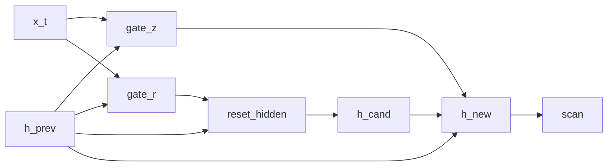

# GRU-shaped language model

## Overview

This stochastic recurrent cell is shaped after a [GRU](https://doi.org/10.3115/v1/D14-1179): it samples update and reset gates and mixes a candidate with the previous hidden state. It is not the canonical GRU equation. In particular, the candidate is centered directly on `r * h_prev` and does not use `x_t` or a learned candidate transformation.

## QVR source

```qvr
# Bayesian GRU Language Model
#
# A standard GRU cell wrapped in scan for temporal recurrence
# and used as a causal language model. Gate activations are
# drawn from LogitNormal priors; the candidate is drawn from a
# Normal centred on the reset-gated previous state.
#
# Generative structure:
#
#   z_t      ~ LogitNormal(gate_z(x_t, h_{t-1}))  update gate
#   r_t      ~ LogitNormal(gate_r(x_t, h_{t-1}))  reset gate
#   h_cand   ~ Normal(r_t * h_{t-1}, 0.5)         candidate state
#   h_t      = (1 - z_t) * h_{t-1} + z_t * h_cand GRU update
#   next_t   ~ Categorical(lm_head(h_t))          next-token target
#
# scan threads hidden state across the sequence; the
# per-position hidden state is projected onto the Token
# vocabulary by a Categorical lm_head.
#
# Resp is the plate: it indexes the 32 scored rows of the corpus,
# one next-token target per context. Token is the vocabulary, so it
# is the value space of what lm_head draws and of what the program
# returns.
#
# Reference: [Cho et al. 2014](https://doi.org/10.3115/v1/D14-1179).

object Token : FinSet 256
object Resp : FinSet 32
object Embedded : Real 64
object Hidden : Real 128

morphism tok_embed : Token -> Embedded [role=embed]
morphism gate_z, gate_r : Embedded * Hidden -> Hidden ~ LogitNormal
morphism lm_head : Hidden -> Token ~ Categorical

program gru_cell(x_t, h_prev) : Embedded * Hidden -> Hidden
    sample z <- gate_z(x_t, h_prev)
    sample r <- gate_r(x_t, h_prev)

    let reset_hidden = r * h_prev

    sample h_cand <- Normal(reset_hidden, 0.5)

    let z_complement = 1.0 - z
    let h_new = z_complement * h_prev + z * h_cand
    return h_new

define backbone = tok_embed >> scan(gru_cell)

program gru_lm : Token -> Token
    sample h <- backbone

    observe next_token : Resp <- lm_head(h)
    return next_token

export gru_lm
```

## Walkthrough

### Cell equations

| Step | DSL | Meaning |
|---|---|---|
| update gate | `z <- gate_z(x_t, h_prev)` | $z_t = \sigma(W_z [x_t, h_{t-1}])$ |
| reset gate | `r <- gate_r(x_t, h_prev)` | $r_t = \sigma(W_r [x_t, h_{t-1}])$ |
| reset-gated state | `let reset_hidden = r * h_prev` | $r_t \odot h_{t-1}$ |
| candidate | `h_cand <- Normal(reset_hidden, 0.5)` | $\tilde h_t \sim \mathcal{N}(r_t \odot h_{t-1}, 0.5)$ |
| update | `let h_new = z_complement * h_prev + z * h_cand` | $h_t = (1 - z_t)\,h_{t-1} + z_t \,\tilde h_t$ |

The candidate is drawn from a Normal centered on the reset-gated previous state; the update-gate convex combination $(1 - z_t)\,h_{t-1} + z_t \,\tilde h_t$ interpolates between persistence and the new candidate.

### State threading

`scan(gru_cell)` threads the hidden state $h_t$ across the sequence; the `Categorical` `lm_head` scores the next-token target from the terminal state $h_T$.

The two `FinSet` objects play different roles. `Resp : FinSet 32` sits in the observe step's index slot, so it is the plate: 32 scored rows, one next-token target per context. `Token : FinSet 256` sits in `lm_head`'s codomain and in the program's own codomain, so it is the value space the draw ranges over.



## Try it

> The short fits below demonstrate the API. Assess convergence with multiple chains and diagnostics before interpreting a posterior.


### Generating synthetic data

Fix the model's stochastic-weight parameters under a chosen seed (they stand in for the ground-truth generative weights), then run one forward [`trace`](../api/inference/trace.md) so the latent hidden state `h` and the next-token target generated from it are jointly consistent. `true_h` names the ground truth for the latent `h` site, and shipping it in the observations dict is what clamps it: an unclamped `h` is redrawn on every call, which leaves any reference joint non-deterministic. The corpus is a `(rows, seq_len)` int64 prompt tensor paired with a `(rows,)` next-token target, one row per element of the `Resp` plate.

```python
import torch
from quivers.dsl import load
from quivers.inference.trace import trace

torch.manual_seed(0)
prog = load("docs/examples/source/gru_lm.qvr")
model = prog.morphism

# Fix the model's stochastic weights to a chosen draw, then run one
# forward trace so the captured hidden state and the next-token target it
# generated are jointly consistent under the same weights.
for _, p in model.named_parameters():
    p.data.copy_(torch.randn_like(p) * 0.3)

rows, seq_len, vocab = 32, 8, 256
prompts = torch.randint(0, vocab, (rows, seq_len))
with torch.no_grad():
    forward = trace(model, prompts)
true_h = forward.sites["h"].value.detach()
next_token = forward.sites["next_token"].value.detach()

x_in = prompts
observations = {"next_token": next_token, "h": true_h}
print("prompts:", prompts.shape, prompts.dtype)
print("true_h:", true_h.shape)
print("next_token:", next_token.shape, next_token.dtype)
```

### SVI fit

Re-initialise the parameters and recover next-token weights from the synthetic corpus with [`AutoNormalGuide`](../api/inference/guide.md) + [`ELBO`](../api/inference/elbo.md) + [`SVI`](../api/inference/svi.md). The loss is the negative ELBO under a Categorical likelihood on the `next_token` site.

```python
import torch
from quivers.dsl import load
from quivers.inference import AutoNormalGuide, ELBO, SVI

torch.manual_seed(0)
prog = load("docs/examples/source/gru_lm.qvr")
model = prog.morphism

for _, p in model.named_parameters():
    p.data.copy_(torch.randn_like(p) * 0.3)
rows, seq_len, vocab = 32, 8, 256
prompts = torch.randint(0, vocab, (rows, seq_len))
targets = model.rsample(prompts)
observations = {"next_token": targets}

torch.manual_seed(1)
for _, p in model.named_parameters():
    p.data.copy_(torch.randn_like(p) * 0.3)

guide = AutoNormalGuide(model, observed_names={"next_token"})
optim = torch.optim.Adam(
    list(model.parameters()) + list(guide.parameters()), lr=5e-2,
)
svi = SVI(model, guide, optim, ELBO(num_particles=1))

losses = [svi.step(prompts, observations)]
for _ in range(30):
    losses.append(svi.step(prompts, observations))

print(f"initial loss: {losses[0]:.2f}")
print(f"final loss:   {losses[-1]:.2f}")
```

### NUTS posterior

The proper Bayesian model has both the parameters $\theta$ and the per-token hidden state $h$ as latents: $p(\theta, h \mid x, y) \propto p(\theta) \, p(h \mid x, \theta) \, p(y \mid h, \theta)$. [`bayesian_lift_parameters`](../api/inference/lifts.md#quivers.inference.lifts.bayesian_lift_parameters) declares Normal priors on every learnable parameter and accepts an `additional_latents` mapping that lifts the intermediate `sample h` site as a NUTS variable with a placeholder Normal prior; the score step substitutes both into the inner program and cancels the placeholder, leaving the lifted log-density equal to the true joint $\log p(\theta) + \log p_{\text{inner}}(h, y \mid x, \theta)$. The log-density is deterministic given the full $(\theta, h)$ state, so the chain targets the exact posterior with no MC noise across leapfrog steps.

```python
import torch
from quivers.dsl import load
from quivers.inference import MCMC, NUTSKernel, bayesian_lift_parameters

torch.manual_seed(0)
prog = load("docs/examples/source/gru_lm.qvr")
model = prog.morphism
for _, p in model.named_parameters():
    p.data.copy_(torch.randn_like(p) * 0.3)
rows, seq_len, vocab = 32, 8, 256
prompts = torch.randint(0, vocab, (rows, seq_len))
targets = model.rsample(prompts)
observations = {"next_token": targets}

h_shape = tuple(model._step_h.rsample(prompts).shape)
lifted, lx, lobs = bayesian_lift_parameters(
    model, prompts, observations,
    prior_scale=1.0,
    additional_latents={"h": h_shape},
)
kernel = NUTSKernel(step_size=0.005, max_tree_depth=3, target_accept=0.8)
mc     = MCMC(kernel, num_warmup=10, num_samples=10, num_chains=1)
result = mc.run(lifted, lx, lobs)

print(f"acceptance:  {float(result.acceptance_rates.mean()):.2f}")
print(f"divergences: {int(result.divergence_counts.sum())}")
```


## Categorical perspective

The GRU cell is a Kleisli morphism $\mathrm{Embedded} \times \mathrm{Hidden} \to \mathcal{G}(\mathrm{Hidden})$ in the [Giry monad](https://doi.org/10.1007/BFb0092872)'s Kleisli category; `scan(gru_cell)` is its iterated composition along the sequence. The Categorical head and `observe` step close the composite into the LM likelihood by accumulating per-batch categorical log-probabilities.


## References

- Kyunghyun Cho, Bart van Merriënboer, Caglar Gulcehre, Dzmitry Bahdanau, Fethi Bougares, Holger Schwenk, and Yoshua Bengio. 2014. Learning phrase representations using RNN encoder–decoder for statistical machine translation. In *Proceedings of the 2014 Conference on Empirical Methods in Natural Language Processing (EMNLP)*, pages 1724–1734, Doha, Qatar. Association for Computational Linguistics.
- Michèle Giry. 1982. A categorical approach to probability theory. In Bernhard Banaschewski, editor, *Categorical Aspects of Topology and Analysis*, volume 915 of *Lecture Notes in Mathematics*, pages 68–85. Springer, Berlin, Heidelberg.
