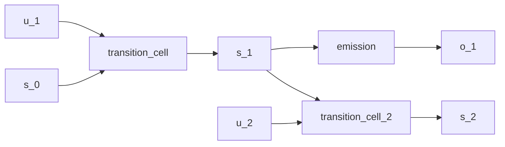

# Linear-Gaussian State-Space Model

## Overview

The canonical linear-Gaussian [state-space model](https://en.wikipedia.org/wiki/State-space_representation) whose closed-form forward filter is the [Kalman filter](https://doi.org/10.1115/1.3662552) and whose closed-form backward smoother is the [Rauch-Tung-Striebel smoother](https://doi.org/10.2514/3.3166):

$$
s_t = A s_{t-1} + B u_t + w_t, \quad w_t \sim \mathcal{N}(0, Q)
$$
$$
o_t = C s_t + v_t, \quad v_t \sim \mathcal{N}(0, R)
$$

Both transitions and emissions are linear in the latent state and the noise covariances are constant in time. Because both the prior and the likelihood are Gaussian, the joint, the filtered marginals, and the data marginal are all Gaussian; the runtime conditions on the observed series and back-props through the per-step `scan`, or invokes the closed-form filter via a downstream `bayes_invert` step. The model is the reference point for the more elaborate [continuous-HMM](continuous-hmm.md) and [deep Markov](deep-markov.md) examples.

## QVR Source

```qvr
object Driver : Real 2
object State : Real 4
object Obs : Real 2

morphism transition_cell : Driver * State -> State ~ Normal
morphism emission : State -> Obs ~ Normal
morphism filter_cell : Obs * State -> State ~ Normal

define generate = scan(transition_cell) >> emission
define filter = scan(filter_cell)

export filter
```

## Walkthrough

`Driver`, `State`, and `Obs` are Euclidean spaces; `Driver` carries an optional exogenous input concatenated with the previous state at each step. The transition cell `Driver * State -> State ~ Normal` parameterizes a Gaussian per-step kernel whose mean is a learned linear function of `(u_t, s_{t-1})` and whose scale is the prior `scale` hyperparameter. The emission `State -> Obs ~ Normal` is the constant-in-time observation kernel.

`scan(transition_cell)` threads the latent state forward across a sequence, producing the per-step filtered state of shape `(batch, seq_len, state_dim)`; composing with `emission` via `>>` produces the generative pipeline. `scan(filter_cell)` is the recognition counterpart: at each step it takes the new observation concatenated with the previous belief and returns the updated belief, exactly the Kalman filter recurrence when `filter_cell` is the closed-form posterior update.

A matrix-Normal prior on the transition matrix is the natural conjugate choice when the analyst wants to separate row and column correlation structure: `~ MatrixNormal(loc, row_scale, col_scale) over (dom, cod)` puts a [Kronecker-covariance](https://en.wikipedia.org/wiki/Kronecker_product) prior on the representing tensor of a finite-state transition morphism. The Euclidean state space here uses parameter networks instead, but the same axis-role surface applies once the state factorizes into named components.

## Try it

> The SVI step counts and NUTS warmup, sample, and chain budgets in the snippets below are illustrative: each block is sized to run in tens of seconds and demonstrate the API surface. Production fits typically need 10x to 100x more SVI steps, longer NUTS warmup, and multiple chains to actually converge to the data-generating parameters.


### Generating synthetic data

Pick concrete ground-truth dynamics `(A, B, C)` with isotropic process and observation noise, then forward-sample a single trajectory of latent states and observations. The driver inputs `u_t` are independent Normal draws; the per-step recurrence is the standard LGSSM kalman setup.

```python
import torch
from quivers.dsl import load

torch.manual_seed(0)
prog = load("docs/examples/source/linear_gaussian_ssm.qvr")
model = prog.morphism

T = 32
A = 0.9 * torch.eye(4)
B = 0.1 * torch.randn(4, 2)
C = torch.randn(2, 4)
Q_scale, R_scale = 0.1, 0.1

u = torch.randn(T, 2)
s = torch.zeros(T + 1, 4)
o = torch.zeros(T, 2)
for t in range(T):
    s[t + 1] = s[t] @ A.T + u[t] @ B.T + Q_scale * torch.randn(4)
    o[t] = s[t + 1] @ C.T + R_scale * torch.randn(2)
o_seq = o.unsqueeze(0)
state_seq = s[1:].unsqueeze(0)
```

### SVI fit

The exported morphism is a [`ScanMorphism`](../api/continuous/scan.md) whose parameter-network weights are kernel parameters without explicit `sample` priors; [`bayesian_lift_parameters`](../api/inference/lifts.md#quivers.inference.lifts.bayesian_lift_parameters) lifts each leaf parameter into a unit-Normal sample site so the standard guide-plus-ELBO machinery applies uniformly. The thin `DictWrap` adapter exposes `log_joint(x, obs_dict)` over the scan's positional state-trajectory argument.

```python
from quivers.inference import AutoNormalGuide, ELBO, SVI, bayesian_lift_parameters

torch.manual_seed(1)
prog = load("docs/examples/source/linear_gaussian_ssm.qvr")
inner = prog.morphism
model, x_lift, obs_lift = bayesian_lift_parameters(
    inner, o_seq, {"h": state_seq}, prior_scale=1.0,
)

guide = AutoNormalGuide(model, observed_names={"h"})
optim = torch.optim.Adam(
    list(model.parameters()) + list(guide.parameters()), lr=1e-2,
)
svi = SVI(model, guide, optim, ELBO())

loss0 = svi.step(x_lift, obs_lift)
losses = [svi.step(x_lift, obs_lift) for _ in range(300)]
loss_final = sum(losses[-20:]) / 20.0
oracle_ll = inner.log_joint(o_seq, state_seq).item()
print(f"initial ELBO loss: {loss0:.1f}")
print(f"final ELBO loss:   {loss_final:.1f}")
print(f"oracle -log p(h):  {-oracle_ll:.1f}")
```

### NUTS posterior

The lifted model is a [`MonadicProgram`](../api/monadic/monads.md) with one Normal sample site per leaf parameter; [`NUTSKernel`](../api/inference/mcmc.md#quivers.inference.mcmc.NUTSKernel) samples them directly. Small budgets keep the snippet inside tens of seconds while still producing a usable posterior summary.

```python
from quivers.inference import MCMC, NUTSKernel, bayesian_lift_parameters

torch.manual_seed(2)
prog = load("docs/examples/source/linear_gaussian_ssm.qvr")
model, x_lift, obs_lift = bayesian_lift_parameters(
    prog.morphism, o_seq, {"h": state_seq}, prior_scale=1.0,
)

kernel = NUTSKernel(step_size=0.05, max_tree_depth=3, target_accept=0.8)
mc = MCMC(kernel, num_warmup=15, num_samples=15, num_chains=1)
result = mc.run(model, x_lift, obs_lift)

print("acceptance:", float(result.acceptance_rates.mean()))
print("divergences:", int(result.divergence_counts.sum()))
```


## Categorical Perspective

The model is a Kleisli morphism in the [Giry monad](https://doi.org/10.1007/BFb0092872)'s Kleisli category. `scan` realizes the iterated Kleisli composition of the per-step Gaussian kernel; the [right Kan extension](https://ncatlab.org/nlab/show/Kan+extension) of the per-step cell along the time projection gives the joint over the sequence. Because every step is affine-Gaussian, the joint is itself Gaussian and the standard linear-algebra recurrences (Kalman / RTS) are the explicit formulae for the categorical pushforward.




## References

- Herbert E. Rauch, F. Tung, and Charles T. Striebel. 1965. Maximum likelihood estimates of linear dynamic systems. *AIAA Journal*, 3(8):1445–1450.
- Michèle Giry. 1982. A categorical approach to probability theory. In Bernhard Banaschewski, editor, *Categorical Aspects of Topology and Analysis*, volume 915 of *Lecture Notes in Mathematics*, pages 68–85. Springer, Berlin, Heidelberg.
- Rudolf E. Kalman. 1960. A new approach to linear filtering and prediction problems. *Journal of Basic Engineering*, 82(1):35–45.
