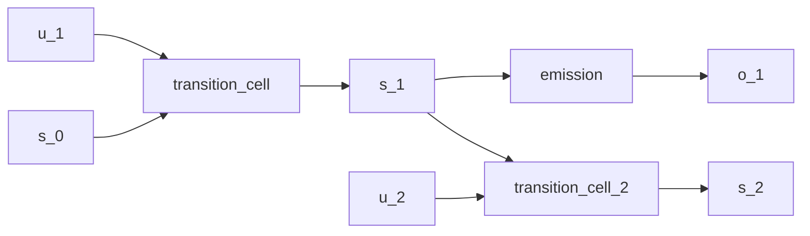

# Linear-Gaussian State-Space Model

## Overview

The canonical linear-Gaussian [state-space model](https://en.wikipedia.org/wiki/State-space_representation) whose closed-form forward filter is the [Kalman filter](https://doi.org/10.1115/1.3662552) and whose closed-form backward smoother is the [Rauch-Tung-Striebel smoother](https://doi.org/10.2514/3.3166):

$$
s_t = A s_{t-1} + B u_t + w_t, \quad w_t \sim \mathcal{N}(0, Q)
$$
$$
o_t = C s_t + v_t, \quad v_t \sim \mathcal{N}(0, R)
$$

Both transitions and emissions are linear in the latent state and the noise covariances are constant in time. Because both the prior and the likelihood are Gaussian, the joint, the filtered marginals, and the data marginal are all Gaussian; the runtime conditions on the observed series and back-props through the per-step `scan`, or invokes the closed-form filter via a downstream `bayes_invert` step. The model is the reference point for the more elaborate [continuous-HMM](continuous-hmm.md) and [deep Markov](deep-markov.md) examples.

## QVR Source

```qvr
type Driver = Euclidean 2
type State = Euclidean 4
type Obs = Euclidean 2

kernel transition_cell : Driver * State -> State ~ Normal [scale=0.1]
kernel emission : State -> Obs ~ Normal [scale=0.1]
kernel filter_cell : Obs * State -> State ~ Normal [scale=0.1]

let generate = scan(transition_cell) >> emission
let filter = scan(filter_cell)

export filter
```

## Walkthrough

`Driver`, `State`, and `Obs` are Euclidean spaces; `Driver` carries an optional exogenous input concatenated with the previous state at each step. The transition cell `Driver * State -> State ~ Normal` parameterizes a Gaussian per-step kernel whose mean is a learned linear function of `(u_t, s_{t-1})` and whose scale is the prior `scale` hyperparameter. The emission `State -> Obs ~ Normal` is the constant-in-time observation kernel.

`scan(transition_cell)` threads the latent state forward across a sequence, producing the per-step filtered state of shape `(batch, seq_len, state_dim)`; composing with `emission` via `>>` produces the generative pipeline. `scan(filter_cell)` is the recognition counterpart: at each step it takes the new observation concatenated with the previous belief and returns the updated belief, exactly the Kalman filter recurrence when `filter_cell` is the closed-form posterior update.

A matrix-Normal prior on the transition matrix is the natural conjugate choice when the analyst wants to separate row and column correlation structure: `~ MatrixNormal(loc, row_scale, col_scale) over (dom, cod)` puts a [Kronecker-covariance](https://en.wikipedia.org/wiki/Kronecker_product) prior on the representing tensor of a finite-state transition morphism. The Euclidean state space here uses parameter networks instead, but the same axis-role surface applies once the state factorizes into named components.

## Try it

```python
import torch
from quivers.dsl import load

torch.manual_seed(0)
prog = load("docs/examples/source/linear_gaussian_ssm.qvr")
filter = prog.morphism

batch, seq_len, obs_dim = 4, 20, 2
o_seq = torch.randn(batch, seq_len, obs_dim) * 0.5
final_state = filter.rsample(o_seq)
print("filtered state shape:", final_state.shape)
```

The exported morphism is the `ScanMorphism` wrapper: calling `.rsample(o_seq)` threads `filter_cell` across the sequence and returns the final filtered state. For end-to-end Bayesian inference against an observed series, wrap the generative pipeline in `condition(...)` and fit by SVI; for the closed-form Kalman path, push the wrapped morphism through a `bayes_invert` block.

## Categorical Perspective

The model is a Kleisli morphism in the [Giry monad](https://doi.org/10.1007/BFb0092872)'s Kleisli category. `scan` realizes the iterated Kleisli composition of the per-step Gaussian kernel; the [right Kan extension](https://ncatlab.org/nlab/show/Kan+extension) of the per-step cell along the time projection gives the joint over the sequence. Because every step is affine-Gaussian, the joint is itself Gaussian and the standard linear-algebra recurrences (Kalman / RTS) are the explicit formulae for the categorical pushforward.


