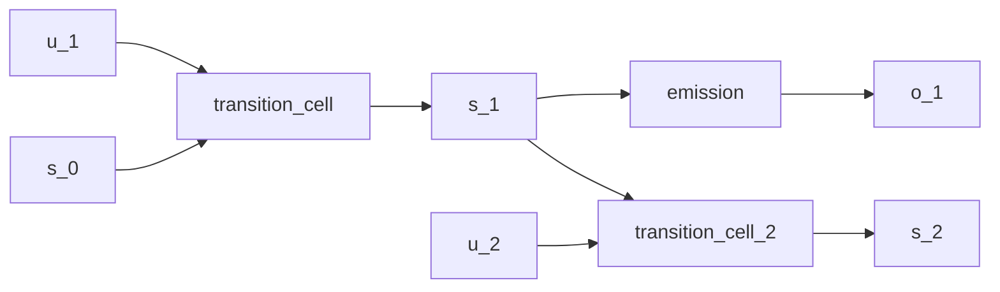

# Gaussian-kernel state-space model

## Overview

The classical linear-Gaussian [state-space model](https://en.wikipedia.org/wiki/State-space_representation) has a closed-form [Kalman filter](https://doi.org/10.1115/1.3662552) and [Rauch-Tung-Striebel smoother](https://doi.org/10.2514/3.3166):

$$
s_t = A s_{t-1} + B u_t + w_t, \quad w_t \sim \mathcal{N}(0, Q)
$$
$$
o_t = C s_t + v_t, \quad v_t \sim \mathcal{N}(0, R)
$$

The QVR source below uses learned conditional-Normal kernels. Their means and diagonal scales are produced from each input, so the source does not guarantee constant covariance, and its separate `filter_cell` is not the analytic Kalman update. It demonstrates the state-space wiring used again in the [continuous-state](continuous-hmm.md) and [deep Markov](deep-markov.md) examples.

## QVR source

```qvr
# Linear-Gaussian State-Space Model
#
# The canonical linear-Gaussian state-space model whose forward
# filter is the Kalman filter. The transition and emission are
# Kleisli morphisms with Normal output families, and scan over
# the input sequence assembles the per-step filtered state.
#
# Generative structure:
#
#   s_t  ~ Normal(transition_cell(driver, s_{t-1}), Q)
#   o_t  ~ Normal(emission(s_t), R)
#   s_t  ~ Normal(filter_cell(o_t, s_{t-1}), R)
#
# Because both the prior and the likelihood are Gaussian, the
# filter and the smoother are closed-form (Kalman /
# Rauch-Tung-Striebel) and the marginal data likelihood is
# itself Gaussian; the runtime can either condition on the
# observed series and back-prop through the per-step scan, or
# use the closed-form filter via a downstream bayes_invert
# step.
#
# Reference: [Kalman 1960](https://doi.org/10.1115/1.3662552).

object Driver : Real 2
object State : Real 4
object Obs : Real 2

morphism transition_cell : Driver * State -> State ~ Normal
morphism emission : State -> Obs ~ Normal
morphism filter_cell : Obs * State -> State ~ Normal

define generate = scan(transition_cell) >> emission
define filter = scan(filter_cell)

# Probabilistic surface: the per-step generative kernel takes
# the previous (driver, state) pair and produces a new state by
# applying the linear-Gaussian transition, then scores the
# observation o under the emission kernel. scan threads this
# step across the input sequence so trace clamps the full
# (s_new, o) trajectory once per call.
program generative_step : Driver * State -> State
    sample s_new <- transition_cell

    observe o <- emission(s_new)
    return s_new

export generative_step
```

## Walkthrough

`Driver`, `State`, and `Obs` are Euclidean spaces; `Driver` carries an exogenous input concatenated with the previous state at each step. The transition and emission are conditional-Normal kernels with learned input-dependent means and diagonal scales.

`scan(transition_cell)` threads the latent state forward across a sequence; composing with `emission` produces the generative pipeline. `scan(filter_cell)` is a separately learned recognition path. Nothing in the declaration constrains `filter_cell` to equal the closed-form posterior update.

A matrix-Normal prior on the transition matrix is the natural conjugate choice when the analyst wants to separate row and column correlation structure: `~ MatrixNormal(loc, row_scale, col_scale) over (dom, cod)` puts a [Kronecker-covariance](https://en.wikipedia.org/wiki/Kronecker_product) prior on the representing tensor of a finite-state transition morphism. The Euclidean state space here uses parameter networks instead, but the same axis-role surface applies once the state factorizes into named components.

## Try it

> The short fits below demonstrate the API. Assess convergence with multiple chains and diagnostics before interpreting a posterior.


### Generating synthetic data

Pick concrete ground-truth dynamics `(A, B, C)` with isotropic process and observation noise, then forward-sample a single trajectory of latent states and observations. The driver inputs `u_t` are independent Normal draws; the per-step recurrence is the standard LGSSM kalman setup. The single-step program `generative_step : Driver * State -> State` reads the previous (driver, state) pair as input; the per-step pair `(s_new, o)` is supplied as the observation dict.

```python
import torch
from quivers.dsl import load

torch.manual_seed(0)
prog = load("docs/examples/source/linear_gaussian_ssm.qvr")
model = prog.morphism

T = 32
state_dim = 4
obs_dim = 2
driver_dim = 2
A = 0.9 * torch.eye(state_dim)
B = 0.1 * torch.randn(state_dim, driver_dim)
C = torch.randn(obs_dim, state_dim)
Q_scale, R_scale = 0.1, 0.1

u = torch.randn(T, driver_dim)
s = torch.zeros(T + 1, state_dim)
o = torch.zeros(T, obs_dim)
for t in range(T):
    s[t + 1] = s[t] @ A.T + u[t] @ B.T + Q_scale * torch.randn(state_dim)
    o[t] = s[t + 1] @ C.T + R_scale * torch.randn(obs_dim)

state_prev = torch.cat([u, s[:T]], dim=-1)
sites = {"s_new": s[1:T + 1], "o": o}
x_in = state_prev
observations = sites
```

### SVI fit

The exported `generative_step` is a monadic program whose linear-Gaussian transition and emission weights are kernel parameters without explicit `sample` priors; [`bayesian_lift_parameters`](../api/inference/lifts.md#quivers.inference.lifts.bayesian_lift_parameters) lifts each leaf parameter into a unit-Normal sample site so the standard guide-plus-ELBO machinery applies uniformly. The per-step `(s_new, o)` trajectory is supplied as the observation dict, so `log_joint` scores the clamped trajectory under each lifted parameter draw.

```python
from quivers.inference import AutoNormalGuide, ELBO, SVI, bayesian_lift_parameters

torch.manual_seed(1)
prog = load("docs/examples/source/linear_gaussian_ssm.qvr")
inner = prog.morphism
model, x_lift, obs_lift = bayesian_lift_parameters(
    inner, x_in, observations, prior_scale=1.0,
)

guide = AutoNormalGuide(model, observed_names=set())
optim = torch.optim.Adam(
    list(model.parameters()) + list(guide.parameters()), lr=1e-2,
)
svi = SVI(model, guide, optim, ELBO())

loss0 = svi.step(x_lift, obs_lift)
losses = [svi.step(x_lift, obs_lift) for _ in range(300)]
loss_final = sum(losses[-20:]) / 20.0
oracle_ll = inner.log_joint(x_in, observations).sum().item()
print(f"initial ELBO loss: {loss0:.1f}")
print(f"final ELBO loss:   {loss_final:.1f}")
print(f"oracle -log p(h):  {-oracle_ll:.1f}")
```

### NUTS posterior

The lifted model is a [`MonadicProgram`](../api/monadic/monads.md) with one Normal sample site per leaf parameter; [`NUTSKernel`](../api/inference/mcmc.md#quivers.inference.mcmc.NUTSKernel) samples them directly. Small budgets keep the snippet inside tens of seconds while still producing a usable posterior summary.

```python
from quivers.inference import MCMC, NUTSKernel, bayesian_lift_parameters

torch.manual_seed(2)
prog = load("docs/examples/source/linear_gaussian_ssm.qvr")
model, x_lift, obs_lift = bayesian_lift_parameters(
    prog.morphism, x_in, observations, prior_scale=1.0,
)

kernel = NUTSKernel(step_size=0.05, max_tree_depth=3, target_accept=0.8)
mc = MCMC(kernel, num_warmup=15, num_samples=15, num_chains=1)
result = mc.run(model, x_lift, obs_lift)

print("acceptance:", float(result.acceptance_rates.mean()))
print("divergences:", int(result.divergence_counts.sum()))
```


## Categorical perspective

`scan` iterates the conditional Gaussian kernel along the time index. Because each intermediate state is stochastic and the kernel parameters can depend on their inputs, the full composed distribution need not remain a single Gaussian. The synthetic-data block uses a classical linear-Gaussian process for comparison, but the QVR declarations are more general.




## References

- Herbert E. Rauch, F. Tung, and Charles T. Striebel. 1965. Maximum likelihood estimates of linear dynamic systems. *AIAA Journal*, 3(8):1445–1450.
- Michèle Giry. 1982. A categorical approach to probability theory. In Bernhard Banaschewski, editor, *Categorical Aspects of Topology and Analysis*, volume 915 of *Lecture Notes in Mathematics*, pages 68–85. Springer, Berlin, Heidelberg.
- Rudolf E. Kalman. 1960. A new approach to linear filtering and prediction problems. *Journal of Basic Engineering*, 82(1):35–45.
