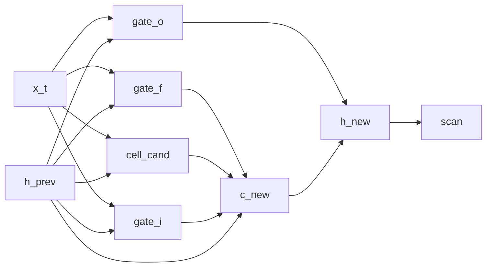

# LSTM-shaped language model

## Overview

This stochastic recurrent cell borrows the gates of an [LSTM](https://doi.org/10.1162/neco.1997.9.8.1735), but it threads only `h_t`. Its local update uses `f_t * h_{t-1}` rather than a separately propagated `f_t * c_{t-1}`. It should thus be read as LSTM-shaped, not as the canonical architecture.

## QVR source

```qvr
# Bayesian LSTM Language Model
#
# A canonical LSTM cell wrapped in scan and used as a causal
# language model. All four gates and the cell candidate are
# Bayesian Kleisli morphisms with stochastic weights; tanh is
# realised from sigmoid via the identity 2*sigmoid(2x) - 1.
#
# Generative structure:
#
#   i_t      ~ LogitNormal(gate_i(x_t, h_{t-1}))  input gate
#   f_t      ~ LogitNormal(gate_f(x_t, h_{t-1}))  forget gate
#   o_t      ~ LogitNormal(gate_o(x_t, h_{t-1}))  output gate
#   g_t      ~ Normal(cell_cand(x_t, h_{t-1}))    cell candidate
#   h_t      = o_t * tanh(f_t * h_{t-1} + i_t * g_t)
#   next_t   ~ Categorical(lm_head(h_t))          next-token target
#
# Resp is the plate: it indexes the 32 scored rows of the corpus,
# one next-token target per context. Token is the vocabulary, so it
# is the value space of what lm_head draws and of what the program
# returns.
#
# In the canonical LSTM the cell state c_t is a separate channel
# from h_t, but scan threads a single hidden codomain, so this
# presentation folds the c-channel into h-and-readout: c_new is
# computed locally inside the cell and used to form h_new.
#
# Reference: [Hochreiter and Schmidhuber 1997](https://doi.org/10.1162/neco.1997.9.8.1735).

object Token : FinSet 256
object Resp : FinSet 32
object Embedded : Real 64
object Hidden : Real 128

morphism tok_embed : Token -> Embedded [role=embed]
morphism gate_i, gate_f, gate_o : Embedded * Hidden -> Hidden ~ LogitNormal
morphism cell_cand : Embedded * Hidden -> Hidden ~ Normal
morphism lm_head : Hidden -> Token ~ Categorical

program lstm_cell(x_t, h_prev) : Embedded * Hidden -> Hidden
    sample i_gate <- gate_i(x_t, h_prev)
    sample f_gate <- gate_f(x_t, h_prev)
    sample o_gate <- gate_o(x_t, h_prev)
    sample g_cand <- cell_cand(x_t, h_prev)

    let c_new = f_gate * h_prev + i_gate * g_cand
    let two_c = 2.0 * c_new
    let sig_2c = sigmoid(two_c)
    let tanh_c = 2.0 * sig_2c - 1.0
    let h_new = o_gate * tanh_c
    return h_new

define backbone = tok_embed >> scan(lstm_cell)

program lstm_lm : Token -> Token
    sample h <- backbone

    observe next_token : Resp <- lm_head(h)
    return next_token

export lstm_lm
```

## Walkthrough

### Cell equations

The parametric program samples three gates and a candidate. `LogitNormal` constrains gate draws to $(0, 1)$, and the candidate is a Normal kernel. Inside the program body:

| Step | DSL | Meaning |
|---|---|---|
| input gate | `i_gate <- gate_i(x_t, h_prev)` | $i_t = \sigma(W_i [x_t, h_{t-1}])$ |
| forget gate | `f_gate <- gate_f(x_t, h_prev)` | $f_t = \sigma(W_f [x_t, h_{t-1}])$ |
| output gate | `o_gate <- gate_o(x_t, h_prev)` | $o_t = \sigma(W_o [x_t, h_{t-1}])$ |
| candidate | `g_cand <- cell_cand(x_t, h_prev)` | $g_t = \phi(W_g [x_t, h_{t-1}])$ |
| cell update | `let c_new = f_gate * h_prev + i_gate * g_cand` | $c_t = f_t \odot h_{t-1} + i_t \odot g_t$ |
| hidden | `let h_new = o_gate * tanh_c` | $h_t = o_t \odot \tanh(c_t)$ |

`tanh` is realized from [`sigmoid`](../guides/dsl-programs-and-lets.md#indexed-gather-in-let) via the identity $\tanh(x) = 2\,\sigma(2x) - 1$.

### State threading

`scan(lstm_cell)` is an iterated Kleisli composition along the sequence: the threaded state is the per-step hidden output $h_t$, which the Categorical `lm_head` reads at the terminal position to score the next token. The cell-state vector $c_t$ is computed inside the cell at every step from the threaded $h_{t-1}$ and used immediately to form $h_t$ via the output-gate / $\tanh$ post-composition. Because `scan` threads a single codomain, this presentation folds the canonical LSTM's separate $c$-channel into the local cell body: the long-term cell-state memory channel that a two-state LSTM exposes is not propagated across time steps here, and the recurrence reduces to $h_t = o_t \odot \tanh(f_t \odot h_{t-1} + i_t \odot g_t)$.

The two `FinSet` objects play different roles. `Resp : FinSet 32` sits in the observe step's index slot, so it is the plate: 32 scored rows, one next-token target per context. `Token : FinSet 256` sits in `lm_head`'s codomain and in the program's own codomain, so it is the value space the draw ranges over.



## Try it

> The short fits below demonstrate the API. Assess convergence with multiple chains and diagnostics before interpreting a posterior.


### Generating synthetic data

Fix the model's stochastic-weight parameters under a chosen seed (they stand in for the ground-truth generative weights), then run one forward [`trace`](../api/inference/trace.md) so the latent hidden state `h` and the next-token target generated from it are jointly consistent. `true_h` names the ground truth for the latent `h` site, and shipping it in the observations dict is what clamps it: an unclamped `h` is redrawn on every call, which leaves any reference joint non-deterministic. The corpus is a `(rows, seq_len)` int64 prompt tensor paired with a `(rows,)` next-token target, one row per element of the `Resp` plate.

```python
import torch
from quivers.dsl import load
from quivers.inference.trace import trace

torch.manual_seed(0)
prog = load("docs/examples/source/lstm_lm.qvr")
model = prog.morphism

# Fix the model's stochastic weights to a chosen draw, then run one
# forward trace so the captured hidden state and the next-token target it
# generated are jointly consistent under the same weights.
for _, p in model.named_parameters():
    p.data.copy_(torch.randn_like(p) * 0.3)

rows, seq_len, vocab = 32, 8, 256
prompts = torch.randint(0, vocab, (rows, seq_len))
with torch.no_grad():
    forward = trace(model, prompts)
true_h = forward.sites["h"].value.detach()
next_token = forward.sites["next_token"].value.detach()

x_in = prompts
observations = {"next_token": next_token, "h": true_h}
print("prompts:", prompts.shape, prompts.dtype)
print("true_h:", true_h.shape)
print("next_token:", next_token.shape, next_token.dtype)
```

### SVI fit

Re-initialise the parameters and recover next-token weights from the synthetic corpus with [`AutoNormalGuide`](../api/inference/guide.md) + [`ELBO`](../api/inference/elbo.md) + [`SVI`](../api/inference/svi.md). The loss is the negative ELBO under a Categorical likelihood on the `next_token` site.

```python
import torch
from quivers.dsl import load
from quivers.inference import AutoNormalGuide, ELBO, SVI

torch.manual_seed(0)
prog = load("docs/examples/source/lstm_lm.qvr")
model = prog.morphism

for _, p in model.named_parameters():
    p.data.copy_(torch.randn_like(p) * 0.3)
rows, seq_len, vocab = 32, 8, 256
prompts = torch.randint(0, vocab, (rows, seq_len))
targets = model.rsample(prompts)
observations = {"next_token": targets}

torch.manual_seed(1)
for _, p in model.named_parameters():
    p.data.copy_(torch.randn_like(p) * 0.3)

guide = AutoNormalGuide(model, observed_names={"next_token"})
optim = torch.optim.Adam(
    list(model.parameters()) + list(guide.parameters()), lr=5e-2,
)
svi = SVI(model, guide, optim, ELBO(num_particles=1))

losses = [svi.step(prompts, observations)]
for _ in range(30):
    losses.append(svi.step(prompts, observations))

print(f"initial loss: {losses[0]:.2f}")
print(f"final loss:   {losses[-1]:.2f}")
```

### NUTS posterior

The LSTM's four gates and cell candidate are kernel Bayesian morphisms whose weights live as `nn.Parameter`s inside the program. [`bayesian_lift_parameters`](../api/inference/lifts.md#quivers.inference.lifts.bayesian_lift_parameters) lifts those parameters into Normal-prior sample sites so [`NUTSKernel`](../api/inference/mcmc.md#quivers.inference.mcmc.NUTSKernel) has a continuous unconstrained state space. The likelihood scores the next-token target via the Categorical [`lm_head`](../api/continuous/families.md) applied to a forward sample of the hidden state.

```python
import torch
from quivers.dsl import load
from quivers.inference import MCMC, NUTSKernel, bayesian_lift_parameters

torch.manual_seed(0)
prog = load("docs/examples/source/lstm_lm.qvr")
model = prog.morphism
for _, p in model.named_parameters():
    p.data.copy_(torch.randn_like(p) * 0.3)
rows, seq_len, vocab = 32, 8, 256
prompts = torch.randint(0, vocab, (rows, seq_len))
targets = model.rsample(prompts)
observations = {"next_token": targets}

h_shape = tuple(model._step_h.rsample(prompts).shape)
lifted, lx, lobs = bayesian_lift_parameters(
    model, prompts, observations,
    prior_scale=1.0,
    additional_latents={"h": h_shape},
)
kernel = NUTSKernel(step_size=0.005, max_tree_depth=3, target_accept=0.8)
mc     = MCMC(kernel, num_warmup=10, num_samples=10, num_chains=1)
result = mc.run(lifted, lx, lobs)

print(f"acceptance:  {float(result.acceptance_rates.mean()):.2f}")
print(f"divergences: {int(result.divergence_counts.sum())}")
```


## Categorical perspective

The cell program denotes a Kleisli morphism $\mathrm{Embedded} \times \mathrm{Hidden} \to \mathcal{G}(\mathrm{Hidden})$ in the Kleisli category of the [Giry monad](https://doi.org/10.1007/BFb0092872); `scan(lstm_cell)` is its iterated composition over the sequence. The Categorical head closes the composite with a finite-set codomain, and `observe next_token` accumulates per-batch categorical log-likelihood through a [right Kan extension](https://ncatlab.org/nlab/show/Kan+extension).


## References

- Michèle Giry. 1982. A categorical approach to probability theory. In Bernhard Banaschewski, editor, *Categorical Aspects of Topology and Analysis*, volume 915 of *Lecture Notes in Mathematics*, pages 68–85. Springer, Berlin, Heidelberg.
- Sepp Hochreiter and Jürgen Schmidhuber. 1997. Long short-term memory. *Neural Computation*, 9(8):1735–1780.
