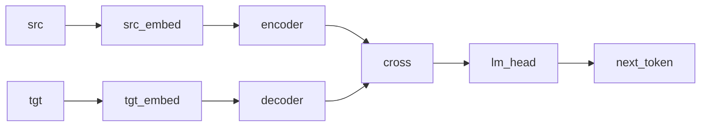

# Sequence-to-Sequence (Encoder + Decoder)

## Overview

A single transformer-style encoder-decoder ([Sutskever, Vinyals, and Le 2014](https://doi.org/10.48550/arXiv.1409.3215); [Vaswani et al. 2017](https://doi.org/10.48550/arXiv.1706.03762)) combining both halves in one example. The encoder is a stacked self-attention + feed-forward backbone on the source vocabulary; the decoder is a parallel stacked backbone on the target vocabulary; a `cross` Bayesian morphism merges the two latent streams into a single `Combined` representation, and a Categorical `lm_head` scores the next target token. Composing the encoder and decoder via [`@`](../guides/dsl-overview.md) and following with `cross >> lm_head` gives a Kleisli morphism $\mathrm{Source} \times \mathrm{Target} \to \mathcal{G}(\mathrm{Target})$.

## QVR Source

```qvr
object Source : FinSet 32
object Target : FinSet 32
object Latent : Real 16
object HeadOut : Real 4
object FFHidden : Real 32
object Combined : Real 32

morphism src_embed : Source -> Latent [role=embed]
morphism tgt_embed : Target -> Latent [role=embed]
morphism enc_head : Latent -> HeadOut [role=kernel, replicate=4, scale=0.1] ~ Normal
morphism enc_attn_proj : Latent -> Latent [role=kernel, scale=0.1] ~ Normal
morphism enc_residual_attn : Latent -> Latent [role=kernel, scale=0.01] ~ Normal
morphism enc_ff_up : Latent -> FFHidden [role=kernel] ~ Normal
morphism enc_ff_down : FFHidden -> Latent [role=kernel, scale=0.1] ~ Normal
morphism enc_residual_ff : Latent -> Latent [role=kernel, scale=0.01] ~ Normal
morphism dec_head : Latent -> HeadOut [role=kernel, replicate=4, scale=0.1] ~ Normal
morphism dec_attn_proj : Latent -> Latent [role=kernel, scale=0.1] ~ Normal
morphism dec_residual_attn : Latent -> Latent [role=kernel, scale=0.01] ~ Normal
morphism dec_ff_up : Latent -> FFHidden [role=kernel] ~ Normal
morphism dec_ff_down : FFHidden -> Latent [role=kernel, scale=0.1] ~ Normal
morphism dec_residual_ff : Latent -> Latent [role=kernel, scale=0.01] ~ Normal
morphism cross : Combined -> Combined [role=kernel, scale=0.1] ~ Normal
morphism lm_head : Combined -> Target [role=kernel] ~ Categorical

let enc_block = fan(enc_head) >> enc_attn_proj >> enc_residual_attn >> enc_ff_up >> enc_ff_down >> enc_residual_ff
let dec_block = fan(dec_head) >> dec_attn_proj >> dec_residual_attn >> dec_ff_up >> dec_ff_down >> dec_residual_ff
let encoder = src_embed >> stack(enc_block, 2)
let decoder = tgt_embed >> stack(dec_block, 2)
let backbone = (encoder @ decoder) >> cross

program seq2seq : Source * Target -> Target
    sample h <- backbone

    observe next_token : Target <- lm_head(h)
    return next_token

export seq2seq
```

## Walkthrough

### Encoder

`src_embed >> stack(enc_block, 2)` is the non-autoregressive encoder: source tokens are embedded into the sixteen-dimensional `Latent` space and run through two independent stacked self-attention plus feed-forward blocks. Each block uses four-head fan via `fan(enc_head)` (`replicate=4` on the per-head morphism), an `enc_attn_proj` recombination, two small residual Bayesian morphisms, and a two-stage feed-forward sub-block. [`stack`](../guides/dsl-declarations.md#stack-independent-multi-layer) gives each layer its own parameters.

### Decoder

`tgt_embed >> stack(dec_block, 2)` mirrors the encoder structure on the target side with its own independent parameters. In a strict causal decoder the runtime supplies a causal mask to the per-step self-attention; in this categorical surface the mask is a runtime concern, not a structural one.

### Cross-composition

`(encoder @ decoder) >> cross` runs the encoder and decoder in parallel via the [tensor product](https://ncatlab.org/nlab/show/tensor+product) `@` of Kleisli morphisms and then merges the two `Latent` streams into the `Combined` representation through the `cross` Bayesian morphism. `cross` plays the role of [cross-attention](https://doi.org/10.48550/arXiv.1706.03762) between source and target.

### Language-model head

The closing `morphism lm_head : Combined -> Target [role=kernel] ~ Categorical` maps the combined representation onto a Categorical distribution over the target vocabulary; the program's `observe next_token` step accumulates the per-position categorical log-likelihood against the supplied target tensor.



## Try it

> The SVI step counts and NUTS warmup, sample, and chain budgets in the snippets below are illustrative: each block is sized to run in tens of seconds and demonstrate the API surface. Production fits typically need 10x to 100x more SVI steps, longer NUTS warmup, and multiple chains to actually converge to the data-generating parameters.


The program's domain is the product object `Source * Target`, so the runtime input is a `(batch, 2)` tensor whose two columns are the source and target token indices. The encoder reads the source column, the decoder reads the target column, and the model returns one predicted next-target-token per batch element. A pair of length-`L` source / target sequences becomes a `(L, 2)` batch by flattening the position axis into the batch dimension; a corpus of `B` such pairs becomes `(B * L, 2)`.

### Generating synthetic data

Pick a small source / target token batch by drawing each column from a uniform Categorical over the vocabulary, then forward-sample the combined latent `h` and the next-token observations from the prior. The encoder reads the source column, the decoder reads the target column, and `lm_head` scores one Categorical draw per row.

```python
import torch
from quivers.dsl import load
from quivers.inference.trace import trace as run_trace

torch.manual_seed(0)
prog = load("docs/examples/source/seq2seq.qvr")
model = prog.morphism

B, L = 2, 8
src = torch.randint(0, 32, (B, L))
tgt = torch.randint(0, 32, (B, L))
x = torch.stack([src.reshape(-1), tgt.reshape(-1)], dim=-1)

tr = run_trace(model, x)
h_obs = tr.sites["h"].value.detach()
y_obs = tr.sites["next_token"].value.detach()
print("x:", tuple(x.shape), "h:", tuple(h_obs.shape), "y:", tuple(y_obs.shape))
```

### SVI fit

Re-initialise the encoder + decoder kernel parameters, then minimise the [`ELBO`](../api/inference/elbo.md#quivers.inference.objectives.ELBO) against the next-token observations using an [`AutoNormalGuide`](../api/inference/guide.md#quivers.inference.guides.AutoNormalGuide) and [`SVI`](../api/inference/svi.md#svi). The continuous latent `h` is left unobserved, so the guide carries a Normal posterior over it and the loss is the per-row target negative log-likelihood plus the usual variational gap.

```python
import torch
from quivers.dsl import load
from quivers.inference import AutoNormalGuide, ELBO, SVI
from quivers.inference.trace import trace as run_trace

torch.manual_seed(0)
prog = load("docs/examples/source/seq2seq.qvr")
model = prog.morphism

B, L = 2, 8
src = torch.randint(0, 32, (B, L))
tgt = torch.randint(0, 32, (B, L))
x = torch.stack([src.reshape(-1), tgt.reshape(-1)], dim=-1)
y_obs = run_trace(model, x).sites["next_token"].value.detach()
obs = {"next_token": y_obs}

torch.manual_seed(1)
prog = load("docs/examples/source/seq2seq.qvr")
model = prog.morphism
guide = AutoNormalGuide(model, observed_names={"next_token"})
optim = torch.optim.Adam(
    list(model.parameters()) + list(guide.parameters()), lr=2e-2,
)
svi = SVI(model, guide, optim, ELBO())
loss0 = svi.step(x, obs)
for _ in range(50):
    loss = svi.step(x, obs)
print(f"ELBO loss: {loss0:.2f} -> {loss:.2f}")
```

### NUTS posterior

The encoder + decoder kernels are `[role=latent]` parameters with no explicit prior, while `h` is an explicit `sample` site. Conditioning on the forward-sampled `h` makes the program's `log_joint` well-defined as a function of the kernel parameters alone; lifting those parameters into Normal-prior sample sites with [`bayesian_lift_parameters`](../api/inference/lifts.md#quivers.inference.lifts.bayesian_lift_parameters) closes the model under [`NUTSKernel`](../api/inference/mcmc.md#quivers.inference.mcmc.NUTSKernel).

```python
import torch
from quivers.dsl import load
from quivers.inference import MCMC, NUTSKernel
from quivers.inference.trace import trace as run_trace
from quivers.inference import bayesian_lift_parameters

torch.manual_seed(0)
prog = load("docs/examples/source/seq2seq.qvr")
model = prog.morphism

B, L = 2, 8
src = torch.randint(0, 32, (B, L))
tgt = torch.randint(0, 32, (B, L))
x = torch.stack([src.reshape(-1), tgt.reshape(-1)], dim=-1)
tr = run_trace(model, x)
obs = {
    "h":          tr.sites["h"].value.detach(),
    "next_token": tr.sites["next_token"].value.detach(),
}

torch.manual_seed(2)
prog = load("docs/examples/source/seq2seq.qvr")
model = prog.morphism
lifted, lx, lobs = bayesian_lift_parameters(model, x, obs, prior_scale=1.0)

kernel = NUTSKernel(step_size=0.05, max_tree_depth=3, target_accept=0.8)
mc     = MCMC(kernel, num_warmup=10, num_samples=10, num_chains=1)
result = mc.run(lifted, lx, lobs)

print("acceptance:", float(result.acceptance_rates.mean()))
print("divergences:", int(result.divergence_counts.sum()))
```


## Categorical Perspective

The seq2seq model denotes a Kleisli morphism $\mathrm{Source} \times \mathrm{Target} \to \mathcal{G}(\mathrm{Target})$ in the [Giry monad](https://doi.org/10.1007/BFb0092872)'s Kleisli category. The encoder and decoder are independent Kleisli morphisms over distinct objects; the [tensor product](https://ncatlab.org/nlab/show/tensor+product) `@` is their strong-monoidal product, and `cross` is the merge that closes the bilinear pairing into a single combined latent. The Categorical head puts a finite-set codomain on the composite, and `observe` is the [right Kan extension](https://ncatlab.org/nlab/show/Kan+extension) closing the LM likelihood.
