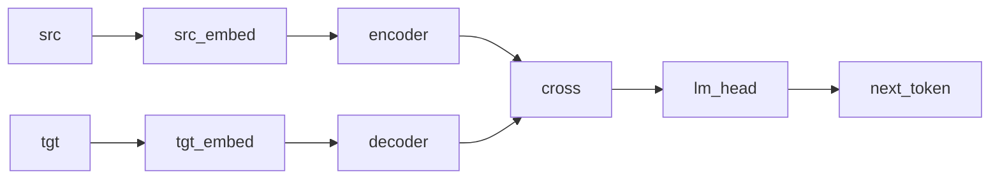

# Sequence-to-Sequence (Encoder + Decoder)

## Overview

This example combines source and target branches in an encoder-decoder-shaped model ([Sutskever, Vinyals, and Le, 2014](https://doi.org/10.48550/arXiv.1409.3215)). Each branch contains parallel MLP-Normal kernels and feed-forward stages. A `cross` morphism merges paired source and target representations before a Categorical head. The source contains no self-attention, cross-attention, or causal mask.

## QVR source

```qvr
# Bayesian Sequence-to-Sequence Model
#
# A transformer-style encoder-decoder model with separate
# source-side and target-side vocabularies. Both halves are
# stacked self-attention plus feed-forward backbones; a cross
# morphism merges the two Latent streams; the Categorical
# lm_head scores the next target token.
#
# Generative structure:
#
#   h_enc    ~ encoder(source)                    non-autoregressive enc
#   h_dec    ~ decoder(target)                    autoregressive dec
#   h        ~ cross(h_enc, h_dec)                merged representation
#   next_t   ~ Categorical(lm_head(h))            next-token target
#
# Composing the two backbones via the tensor product @ and
# following with cross >> lm_head gives a Kleisli morphism
# Source * Target -> Target in the Giry monad's Kleisli
# category.
#
# Resp is the plate: it indexes the 32 scored rows, one
# next-token target per (source, target) position pair. Target is
# the target-side vocabulary, so it is the value space of what
# lm_head draws and of what the program returns.
#
# Reference: [Sutskever, Vinyals, and Le 2014](https://doi.org/10.48550/arXiv.1409.3215).
# Reference: [Vaswani et al. 2017](https://doi.org/10.48550/arXiv.1706.03762).

object Source, Target : FinSet 32
object Resp : FinSet 32
object Latent : Real 16
object HeadOut : Real 4
object FFHidden, Combined : Real 32

morphism src_embed : Source -> Latent [role=embed]
morphism tgt_embed : Target -> Latent [role=embed]
morphism enc_head : Latent -> HeadOut [replicate=4, param_source=mlp] ~ Normal
morphism enc_attn_proj : Latent -> Latent [param_source=mlp] ~ Normal
morphism enc_residual_attn : Latent -> Latent [param_source=mlp] ~ Normal
morphism enc_ff_up : Latent -> FFHidden [param_source=mlp] ~ Normal
morphism enc_ff_down : FFHidden -> Latent [param_source=mlp] ~ Normal
morphism enc_residual_ff : Latent -> Latent [param_source=mlp] ~ Normal
morphism dec_head : Latent -> HeadOut [replicate=4, param_source=mlp] ~ Normal
morphism dec_attn_proj : Latent -> Latent [param_source=mlp] ~ Normal
morphism dec_residual_attn : Latent -> Latent [param_source=mlp] ~ Normal
morphism dec_ff_up : Latent -> FFHidden [param_source=mlp] ~ Normal
morphism dec_ff_down : FFHidden -> Latent [param_source=mlp] ~ Normal
morphism dec_residual_ff : Latent -> Latent [param_source=mlp] ~ Normal
morphism cross : Combined -> Combined [param_source=mlp] ~ Normal
morphism lm_head : Combined -> Target ~ Categorical

define enc_block = fan(enc_head) >> enc_attn_proj >> enc_residual_attn >> enc_ff_up >> enc_ff_down >> enc_residual_ff
define dec_block = fan(dec_head) >> dec_attn_proj >> dec_residual_attn >> dec_ff_up >> dec_ff_down >> dec_residual_ff
define encoder = src_embed >> stack(enc_block, 2)
define decoder = tgt_embed >> stack(dec_block, 2)
define backbone = (encoder @ decoder) >> cross

program seq2seq : Source * Target -> Target
    sample h <- backbone

    observe next_token : Resp <- lm_head(h)
    return next_token

export seq2seq
```

## Walkthrough

### Encoder

`src_embed >> stack(enc_block, 2)` embeds source tokens and applies two independently parameterized blocks. Each block fans the input across four stochastic branches, recombines them, and applies further MLP-Normal kernels. These are parallel branches, not attention heads.

### Decoder

`tgt_embed >> stack(dec_block, 2)` mirrors the source branch with independent parameters. The current runtime call does not supply or apply a causal mask.

### Cross-composition

`(encoder @ decoder) >> cross` runs the branches in parallel and merges their paired outputs through a learned Normal kernel. Because `cross` receives only the paired vector and computes no query-key weighting over source positions, it is a merge rather than cross-attention.

### Language-model head

The closing `morphism lm_head : Combined -> Target ~ Categorical` maps the combined representation onto a Categorical distribution over the target vocabulary; the program's `observe next_token` step accumulates the per-position categorical log-likelihood against the supplied target tensor.

`Resp : FinSet 32` and `Target : FinSet 32` are the same size and mean different things, and their positions are what fix them. `Resp` fills the observe step's index slot, so it is the plate: 32 scored rows, one per flattened `(source, target)` position pair. `Target` fills `lm_head`'s codomain and the program's own codomain, so it is the value space: the 32 target-vocabulary outcomes a draw ranges over, and the space the returned `next_token` lives in.



## Try it

> The short fits below demonstrate the API. Assess convergence with multiple chains and diagnostics before interpreting a posterior.


The program's domain is the product object `Source * Target`, so the runtime input is a `(batch, 2)` tensor whose two columns are the source and target token indices. The encoder reads the source column, the decoder reads the target column, and the model returns one predicted next-target-token per batch element. A pair of length-`L` source / target sequences becomes a `(L, 2)` batch by flattening the position axis into the batch dimension; a corpus of `B` such pairs becomes `(B * L, 2)`.

### Generating synthetic data

Draw a source and a target token batch column by column from a uniform Categorical over the two vocabularies, flatten the `(B, L)` grid into rows, and run one forward [`trace`](../api/inference/trace.md) so the merged latent `h` and the next-token targets generated from it are jointly consistent. `true_h` names the ground truth for the latent `h` site, and shipping it in the observations dict is what clamps it: an unclamped `h` is redrawn on every call, which leaves any reference joint non-deterministic. The `B * L = 32` rows are the elements of the `Resp` plate: the encoder reads the source column, the decoder reads the target column, and `lm_head` scores one Categorical draw per row.

```python
import torch
from quivers.dsl import load
from quivers.inference.trace import trace

torch.manual_seed(0)
prog = load("docs/examples/source/seq2seq.qvr")
model = prog.morphism

B, L, vocab = 4, 8, 32
src = torch.randint(0, vocab, (B, L))
tgt = torch.randint(0, vocab, (B, L))
x_in = torch.stack([src.reshape(-1), tgt.reshape(-1)], dim=-1)

with torch.no_grad():
    forward = trace(model, x_in)
true_h = forward.sites["h"].value.detach()
next_token = forward.sites["next_token"].value.detach()

observations = {"next_token": next_token, "h": true_h}
print("x_in:", tuple(x_in.shape))
print("true_h:", tuple(true_h.shape))
print("next_token:", tuple(next_token.shape))
```

### SVI fit

Re-initialise the encoder + decoder kernel parameters, then minimise the [`ELBO`](../api/inference/elbo.md#quivers.inference.objectives.ELBO) against the next-token observations using an [`AutoNormalGuide`](../api/inference/guide.md#quivers.inference.guides.AutoNormalGuide) and [`SVI`](../api/inference/svi.md#svi). The continuous latent `h` is left unobserved, so the guide carries a Normal posterior over it and the loss is the per-row target negative log-likelihood plus the usual variational gap.

```python
import torch
from quivers.dsl import load
from quivers.inference import AutoNormalGuide, ELBO, SVI
from quivers.inference.trace import trace as run_trace

torch.manual_seed(0)
prog = load("docs/examples/source/seq2seq.qvr")
model = prog.morphism

B, L = 4, 8
src = torch.randint(0, 32, (B, L))
tgt = torch.randint(0, 32, (B, L))
x = torch.stack([src.reshape(-1), tgt.reshape(-1)], dim=-1)
y_obs = run_trace(model, x).sites["next_token"].value.detach()
obs = {"next_token": y_obs}

torch.manual_seed(1)
prog = load("docs/examples/source/seq2seq.qvr")
model = prog.morphism
guide = AutoNormalGuide(model, observed_names={"next_token"})
optim = torch.optim.Adam(
    list(model.parameters()) + list(guide.parameters()), lr=2e-2,
)
svi = SVI(model, guide, optim, ELBO())
loss0 = svi.step(x, obs)
for _ in range(50):
    loss = svi.step(x, obs)
print(f"ELBO loss: {loss0:.2f} -> {loss:.2f}")
```

### NUTS posterior

The encoder + decoder kernels are `[role=latent]` parameters with no explicit prior, while `h` is an explicit `sample` site. Conditioning on the forward-sampled `h` makes the program's `log_joint` well-defined as a function of the kernel parameters alone; lifting those parameters into Normal-prior sample sites with [`bayesian_lift_parameters`](../api/inference/lifts.md#quivers.inference.lifts.bayesian_lift_parameters) closes the model under [`NUTSKernel`](../api/inference/mcmc.md#quivers.inference.mcmc.NUTSKernel).

```python
import torch
from quivers.dsl import load
from quivers.inference import MCMC, NUTSKernel
from quivers.inference.trace import trace as run_trace
from quivers.inference import bayesian_lift_parameters

torch.manual_seed(0)
prog = load("docs/examples/source/seq2seq.qvr")
model = prog.morphism

B, L = 4, 8
src = torch.randint(0, 32, (B, L))
tgt = torch.randint(0, 32, (B, L))
x = torch.stack([src.reshape(-1), tgt.reshape(-1)], dim=-1)
tr = run_trace(model, x)
obs = {
    "h":          tr.sites["h"].value.detach(),
    "next_token": tr.sites["next_token"].value.detach(),
}

torch.manual_seed(2)
prog = load("docs/examples/source/seq2seq.qvr")
model = prog.morphism
lifted, lx, lobs = bayesian_lift_parameters(model, x, obs, prior_scale=1.0)

kernel = NUTSKernel(step_size=0.05, max_tree_depth=3, target_accept=0.8)
mc     = MCMC(kernel, num_warmup=10, num_samples=10, num_chains=1)
result = mc.run(lifted, lx, lobs)

print("acceptance:", float(result.acceptance_rates.mean()))
print("divergences:", int(result.divergence_counts.sum()))
```


## Categorical perspective

The seq2seq model denotes a Kleisli morphism $\mathrm{Source} \times \mathrm{Target} \to \mathcal{G}(\mathrm{Target})$ in the [Giry monad](https://doi.org/10.1007/BFb0092872)'s Kleisli category. The encoder and decoder are independent Kleisli morphisms over distinct objects; the [tensor product](https://ncatlab.org/nlab/show/tensor+product) `@` is their strong-monoidal product, and `cross` is the merge that closes the bilinear pairing into a single combined latent. The Categorical head puts a finite-set codomain on the composite, and `observe` is the [right Kan extension](https://ncatlab.org/nlab/show/Kan+extension) closing the LM likelihood.


## References

- Ashish Vaswani, Noam Shazeer, Niki Parmar, Jakob Uszkoreit, Llion Jones, Aidan N. Gomez, Łukasz Kaiser, and Illia Polosukhin. 2017. Attention is all you need. arXiv preprint arXiv:1706.03762.
- Ilya Sutskever, Oriol Vinyals, and Quoc V. Le. 2014. Sequence to sequence learning with neural networks. arXiv preprint arXiv:1409.3215.
