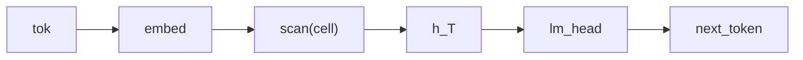

# Vanilla RNN Language Model

## Overview

The simplest recurrent language model in the gallery: a single Bayesian [Kleisli morphism](https://ncatlab.org/nlab/show/Kleisli+category) [`cell`](../api/continuous/morphisms.md) `: Embedded * Hidden -> Hidden` updates the hidden state from the current input and the previous state, and a `Categorical` [`lm_head`](../api/continuous/families.md) projects the per-position hidden state onto the vocabulary so the program can `observe` the next-token target. The model exercises the [`scan`](../guides/dsl-declarations.md#scan-temporal-recurrence) combinator for threading state across a sequence and the minimal end-to-end LM wiring in the DSL.

## QVR Source

```qvr
object Token : FinSet 256
object Embedded : Real 64
object Hidden : Real 128

morphism tok_embed : Token -> Embedded [role=embed]
morphism cell : Embedded * Hidden -> Hidden [scale=0.1] ~ Normal
morphism lm_head : Hidden -> Token ~ Categorical

define backbone = tok_embed >> scan(cell)

program vanilla_rnn_lm : Token -> Token
    sample h <- backbone

    observe next_token : Token <- lm_head(h)
    return next_token

export vanilla_rnn_lm
```

## Walkthrough

Tokens are embedded into the 64-dimensional `Embedded` space, then `scan(cell)` threads a 128-dimensional hidden state across the sequence: at each step the cell consumes the concatenated `(x_t, h_{t-1})` and emits `h_t`. The terminal hidden state $h_T$ summarizes the whole prefix; the `Categorical` [`lm_head`](../api/continuous/families.md) maps it to a Categorical distribution over the 256-symbol vocabulary, and the program's `observe next_token` step conditions on the next-token target tensor.



## Try it

> The SVI step counts and NUTS warmup, sample, and chain budgets in the snippets below are illustrative: each block is sized to run in tens of seconds and demonstrate the API surface. Production fits typically need 10x to 100x more SVI steps, longer NUTS warmup, and multiple chains to actually converge to the data-generating parameters.


### Generating synthetic data

Initialise the model's stochastic-weight parameters under a fixed seed (these stand in for the ground-truth generative weights), then forward-sample a corpus of token sequences by drawing random prompts and reading off the next-token target through [`rsample`](../api/continuous/programs.md). The corpus is a `(batch, seq_len)` int64 prompt tensor paired with a `(batch,)` next-token target.

```python
import torch
from quivers.dsl import load

torch.manual_seed(0)
prog = load("docs/examples/source/vanilla_rnn_lm.qvr")
model = prog.morphism

# Fix the model's stochastic weights to a chosen draw, then
# forward-sample next-token targets for a corpus of random prompts.
for _, p in model.named_parameters():
    p.data.copy_(torch.randn_like(p) * 0.3)

batch, seq_len, vocab = 4, 8, 256
prompts = torch.randint(0, vocab, (batch, seq_len))
targets = model.rsample(prompts)
print("prompts:", prompts.shape, prompts.dtype)
print("targets:", targets.shape, targets.dtype)
```

### SVI fit

Re-initialise the parameters and recover next-token weights from the synthetic corpus with [`AutoNormalGuide`](../api/inference/guide.md) + [`ELBO`](../api/inference/elbo.md) + [`SVI`](../api/inference/svi.md). The loss is the negative ELBO under a Categorical likelihood on the `next_token` site.

```python
import torch
from quivers.dsl import load
from quivers.inference import AutoNormalGuide, ELBO, SVI

torch.manual_seed(0)
prog = load("docs/examples/source/vanilla_rnn_lm.qvr")
model = prog.morphism

# Regenerate the synthetic corpus under the same seed used for
# data generation.
for _, p in model.named_parameters():
    p.data.copy_(torch.randn_like(p) * 0.3)
batch, seq_len, vocab = 4, 8, 256
prompts = torch.randint(0, vocab, (batch, seq_len))
targets = model.rsample(prompts)
observations = {"next_token": targets}

# Fresh weights for fitting.
torch.manual_seed(1)
for _, p in model.named_parameters():
    p.data.copy_(torch.randn_like(p) * 0.3)

guide = AutoNormalGuide(model, observed_names={"next_token"})
optim = torch.optim.Adam(
    list(model.parameters()) + list(guide.parameters()), lr=5e-2,
)
svi = SVI(model, guide, optim, ELBO(num_particles=1))

losses = [svi.step(prompts, observations)]
for _ in range(30):
    losses.append(svi.step(prompts, observations))

print(f"initial loss: {losses[0]:.2f}")
print(f"final loss:   {losses[-1]:.2f}")
```

### NUTS posterior

The proper Bayesian model has both the parameters $\theta$ and the per-token hidden state $h$ as latents: $p(\theta, h \mid x, y) \propto p(\theta) \, p(h \mid x, \theta) \, p(y \mid h, \theta)$. [`bayesian_lift_parameters`](../api/inference/lifts.md#quivers.inference.lifts.bayesian_lift_parameters) declares Normal priors on every learnable parameter and accepts an `additional_latents` mapping that lifts the intermediate `sample h` site as a NUTS variable with a placeholder Normal prior; the score step substitutes both into the inner program and cancels the placeholder, leaving the lifted log-density equal to the true joint $\log p(\theta) + \log p_{\text{inner}}(h, y \mid x, \theta)$. The log-density is deterministic given the full $(\theta, h)$ state, so the chain targets the exact posterior with no MC noise across leapfrog steps.

```python
import torch
from quivers.dsl import load
from quivers.inference import MCMC, NUTSKernel, bayesian_lift_parameters

torch.manual_seed(0)
prog = load("docs/examples/source/vanilla_rnn_lm.qvr")
model = prog.morphism
for _, p in model.named_parameters():
    p.data.copy_(torch.randn_like(p) * 0.3)
batch, seq_len, vocab = 4, 8, 256
prompts = torch.randint(0, vocab, (batch, seq_len))
targets = model.rsample(prompts)
observations = {"next_token": targets}

h_shape = tuple(model._step_h.rsample(prompts).shape)
lifted, lx, lobs = bayesian_lift_parameters(
    model, prompts, observations,
    prior_scale=1.0,
    additional_latents={"h": h_shape},
)
kernel = NUTSKernel(step_size=0.005, max_tree_depth=3, target_accept=0.8)
mc     = MCMC(kernel, num_warmup=10, num_samples=10, num_chains=1)
result = mc.run(lifted, lx, lobs)

print(f"acceptance:  {float(result.acceptance_rates.mean()):.2f}")
print(f"divergences: {int(result.divergence_counts.sum())}")
```


## Categorical Perspective

The model is a Kleisli morphism $\mathrm{Token} \to \mathcal{G}(\mathrm{Token})$ in the [Giry monad](https://doi.org/10.1007/BFb0092872)'s Kleisli category. [`scan(cell)`](../guides/dsl-declarations.md#scan-temporal-recurrence) is the recursive [fold](https://ncatlab.org/nlab/show/fold) along the sequence in the Kleisli category: each step composes the previous step's output kernel with the new cell. The closing Categorical head observes the next-token label as a sub-probability kernel in $\mathcal{G}_{\le 1}$.


## References

- Michèle Giry. 1982. A categorical approach to probability theory. In Bernhard Banaschewski, editor, *Categorical Aspects of Topology and Analysis*, volume 915 of *Lecture Notes in Mathematics*, pages 68–85. Springer, Berlin, Heidelberg.
