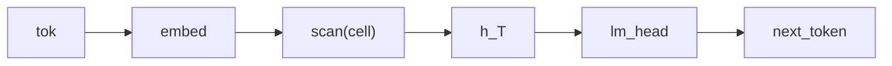

# Vanilla RNN Language Model

## Overview

The simplest recurrent language model in the gallery: a single Bayesian [Kleisli morphism](https://ncatlab.org/nlab/show/Kleisli+category) [`cell`](../api/continuous/morphisms.md) `: Embedded * Hidden -> Hidden` updates the hidden state from the current input and the previous state, and a `Categorical` [`lm_head`](../api/continuous/families.md) projects the per-position hidden state onto the vocabulary so the program can `observe` the next-token target. The model exercises the [`scan`](../guides/dsl-declarations.md#scan-temporal-recurrence) combinator for threading state across a sequence and the minimal end-to-end LM wiring in the DSL.

## QVR source

```qvr
# Bayesian Vanilla RNN Language Model
#
# A standard vanilla RNN used as a causal language model. The
# cell f is a Bayesian Kleisli morphism with stochastic weights
# drawn from a Normal prior; scan threads hidden state across
# the input sequence; the per-position hidden state is projected
# onto the Token vocabulary by a Categorical lm_head.
#
# Generative structure:
#
#   h_t      ~ Normal(cell(x_t, h_{t-1}), 0.1)    recurrent update
#   next_t   ~ Categorical(lm_head(h_t))          next-token target
#
# Resp is the plate: it indexes the 32 scored rows of the corpus,
# one next-token target per context. Token is the vocabulary, so it
# is the value space of what lm_head draws and of what the program
# returns.
#
# This is the simplest sequence model in the gallery and the
# baseline against which gru_lm.qvr and lstm_lm.qvr add gating
# structure.

object Token : FinSet 256
object Resp : FinSet 32
object Embedded : Real 64
object Hidden : Real 128

morphism tok_embed : Token -> Embedded [role=embed]
morphism cell : Embedded * Hidden -> Hidden [param_source=mlp] ~ Normal
morphism lm_head : Hidden -> Token ~ Categorical

define backbone = tok_embed >> scan(cell)

program vanilla_rnn_lm : Token -> Token
    sample h <- backbone

    observe next_token : Resp <- lm_head(h)
    return next_token

export vanilla_rnn_lm
```

## Walkthrough

Tokens are embedded into the 64-dimensional `Embedded` space, then `scan(cell)` threads a 128-dimensional hidden state across the sequence: at each step the cell consumes the concatenated `(x_t, h_{t-1})` and emits `h_t`. The terminal hidden state $h_T$ summarizes the whole prefix; the `Categorical` [`lm_head`](../api/continuous/families.md) maps it to a Categorical distribution over the 256-symbol vocabulary, and the program's `observe next_token` step conditions on the next-token target tensor.

The two `FinSet` objects play different roles, and the positions they appear in are what fix them. `Resp : FinSet 32` sits in the observe step's index slot, so it is the plate: 32 scored rows, one next-token target per context. `Token : FinSet 256` sits in `lm_head`'s codomain and in the program's own codomain, so it is the value space: the 256 outcomes a draw ranges over, and the space the returned `next_token` lives in.



## Try it

> The short fits below demonstrate the API. Assess convergence with multiple chains and diagnostics before interpreting a posterior.


### Generating synthetic data

Fix the model's stochastic-weight parameters under a chosen seed (they stand in for the ground-truth generative weights), then run one forward [`trace`](../api/inference/trace.md) so the latent hidden state `h` and the next-token target generated from it are jointly consistent. `true_h` names the ground truth for the latent `h` site, and shipping it in the observations dict is what clamps it: an unclamped `h` is redrawn on every call, which leaves any reference joint non-deterministic. The corpus is a `(rows, seq_len)` int64 prompt tensor paired with a `(rows,)` next-token target, one row per element of the `Resp` plate.

```python
import torch
from quivers.dsl import load
from quivers.inference.trace import trace

torch.manual_seed(0)
prog = load("docs/examples/source/vanilla_rnn_lm.qvr")
model = prog.morphism

# Fix the model's stochastic weights to a chosen draw, then run one
# forward trace so the captured hidden state and the next-token target it
# generated are jointly consistent under the same weights.
for _, p in model.named_parameters():
    p.data.copy_(torch.randn_like(p) * 0.3)

rows, seq_len, vocab = 32, 8, 256
prompts = torch.randint(0, vocab, (rows, seq_len))
with torch.no_grad():
    forward = trace(model, prompts)
true_h = forward.sites["h"].value.detach()
next_token = forward.sites["next_token"].value.detach()

x_in = prompts
observations = {"next_token": next_token, "h": true_h}
print("prompts:", prompts.shape, prompts.dtype)
print("true_h:", true_h.shape)
print("next_token:", next_token.shape, next_token.dtype)
```

### SVI fit

Re-initialise the parameters and recover next-token weights from the synthetic corpus with [`AutoNormalGuide`](../api/inference/guide.md) + [`ELBO`](../api/inference/elbo.md) + [`SVI`](../api/inference/svi.md). The loss is the negative ELBO under a Categorical likelihood on the `next_token` site.

```python
import torch
from quivers.dsl import load
from quivers.inference import AutoNormalGuide, ELBO, SVI

torch.manual_seed(0)
prog = load("docs/examples/source/vanilla_rnn_lm.qvr")
model = prog.morphism

# Regenerate the synthetic corpus under the same seed used for
# data generation.
for _, p in model.named_parameters():
    p.data.copy_(torch.randn_like(p) * 0.3)
rows, seq_len, vocab = 32, 8, 256
prompts = torch.randint(0, vocab, (rows, seq_len))
targets = model.rsample(prompts)
observations = {"next_token": targets}

# Fresh weights for fitting.
torch.manual_seed(1)
for _, p in model.named_parameters():
    p.data.copy_(torch.randn_like(p) * 0.3)

guide = AutoNormalGuide(model, observed_names={"next_token"})
optim = torch.optim.Adam(
    list(model.parameters()) + list(guide.parameters()), lr=5e-2,
)
svi = SVI(model, guide, optim, ELBO(num_particles=1))

losses = [svi.step(prompts, observations)]
for _ in range(30):
    losses.append(svi.step(prompts, observations))

print(f"initial loss: {losses[0]:.2f}")
print(f"final loss:   {losses[-1]:.2f}")
```

### NUTS posterior

The proper Bayesian model has both the parameters $\theta$ and the per-token hidden state $h$ as latents: $p(\theta, h \mid x, y) \propto p(\theta) \, p(h \mid x, \theta) \, p(y \mid h, \theta)$. [`bayesian_lift_parameters`](../api/inference/lifts.md#quivers.inference.lifts.bayesian_lift_parameters) declares Normal priors on every learnable parameter and accepts an `additional_latents` mapping that lifts the intermediate `sample h` site as a NUTS variable with a placeholder Normal prior; the score step substitutes both into the inner program and cancels the placeholder, leaving the lifted log-density equal to the true joint $\log p(\theta) + \log p_{\text{inner}}(h, y \mid x, \theta)$. The log-density is deterministic given the full $(\theta, h)$ state, so the chain targets the exact posterior with no MC noise across leapfrog steps.

```python
import torch
from quivers.dsl import load
from quivers.inference import MCMC, NUTSKernel, bayesian_lift_parameters

torch.manual_seed(0)
prog = load("docs/examples/source/vanilla_rnn_lm.qvr")
model = prog.morphism
for _, p in model.named_parameters():
    p.data.copy_(torch.randn_like(p) * 0.3)
rows, seq_len, vocab = 32, 8, 256
prompts = torch.randint(0, vocab, (rows, seq_len))
targets = model.rsample(prompts)
observations = {"next_token": targets}

h_shape = tuple(model._step_h.rsample(prompts).shape)
lifted, lx, lobs = bayesian_lift_parameters(
    model, prompts, observations,
    prior_scale=1.0,
    additional_latents={"h": h_shape},
)
kernel = NUTSKernel(step_size=0.005, max_tree_depth=3, target_accept=0.8)
mc     = MCMC(kernel, num_warmup=10, num_samples=10, num_chains=1)
result = mc.run(lifted, lx, lobs)

print(f"acceptance:  {float(result.acceptance_rates.mean()):.2f}")
print(f"divergences: {int(result.divergence_counts.sum())}")
```


## Categorical perspective

The model is a Kleisli morphism $\mathrm{Token} \to \mathcal{G}(\mathrm{Token})$ in the [Giry monad](https://doi.org/10.1007/BFb0092872)'s Kleisli category. [`scan(cell)`](../guides/dsl-declarations.md#scan-temporal-recurrence) is the recursive [fold](https://ncatlab.org/nlab/show/fold) along the sequence in the Kleisli category: each step composes the previous step's output kernel with the new cell. The closing Categorical head observes the next-token label as a sub-probability kernel in $\mathcal{G}_{\le 1}$.


## References

- Michèle Giry. 1982. A categorical approach to probability theory. In Bernhard Banaschewski, editor, *Categorical Aspects of Topology and Analysis*, volume 915 of *Lecture Notes in Mathematics*, pages 68–85. Springer, Berlin, Heidelberg.
