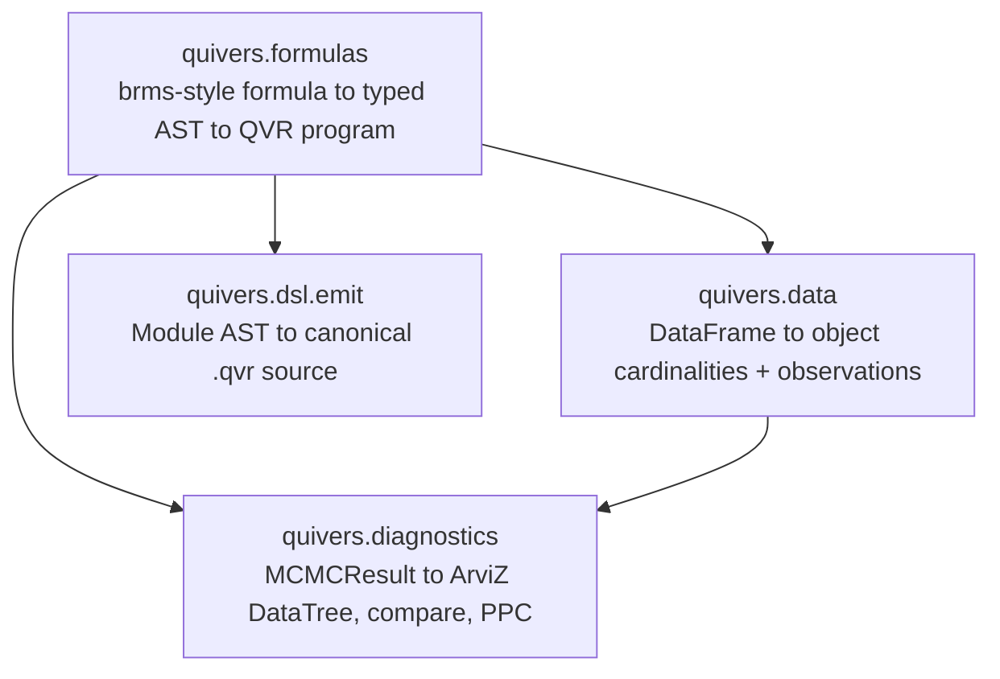

# Analysis: Data and Formulas

This page covers the front-half of the analysis stack: feeding
dataframes into models, declaring a model with a brms-style
formula, and inspecting / emitting the QVR source the formula
compiles to. The back-half (fitting, diagnostics, algebra-guided
training tooling) lives in
[Fitting and Diagnostics](analysis-fitting-and-diagnostics.md).

## Architecture

Four small subpackages, each consumable independently:



Each subpackage is gated behind an optional dependency extra, so a
user who only wants the DSL and inference does not pull dataframe,
ArviZ, or formula dependencies. Install the full stack with
`pip install "quivers[formulas]"`.

## Dataframes: `quivers.data`

[`DatasetSchema`](../api/data/schema.md) is a typed
[`didactic.api.Model`](https://didactic.dev/api/Model) that maps
dataframe columns to QVR-program artifacts. It accepts pandas,
polars, or any other
[Narwhals](https://narwhals-dev.github.io/narwhals/)-compatible
dataframe.

<!-- python: skip -->
```python
import pandas as pd
from quivers.data import DatasetSchema, compose

df = pd.DataFrame({
    "verb": ["eat", "drink", "run", "eat", ...],
    "subject": ["s1", "s2", "s1", "s3", ...],
    "rt": [0.31, 0.42, 0.28, 0.55, ...],
    "response": [1, 0, 1, 1, ...],
})

schema = DatasetSchema(
    df=df,
    objects={"verb": "Verb", "subject": "Subject"},
    plate_indices={"verb": "verb_idx", "subject": "subj_idx"},
    covariates={"rt": "rt"},
    observations={"response": "y"},
)

print(schema.declarations())          # object Verb : FinSet 17 / object Subject : FinSet 50
print(schema.cardinalities)           # {"Verb": 17, "Subject": 50}
obs = schema.observations_dict()      # {"verb_idx": tensor, "subj_idx": tensor, ...}
```

Two artifacts come out:

- [`declarations()`](../api/data/schema.md#quivers.data.schema.DatasetSchema.declarations)
  emits a `.qvr` prelude with one `object X : FinSet N` line per declared
  object axis. The cardinality is inferred from
  `df[col].n_unique()`; canonical category ordering is the column's
  sorted unique non-null values so plate indices are reproducible
  across reruns.
- [`observations_dict()`](../api/data/schema.md#quivers.data.schema.DatasetSchema.observations_dict)
  packs the per-row tensors that inference consumes (response,
  plate indices, numeric covariates), ready to pass into
  [`SVI.step`](../api/inference/svi.md) or
  [`MCMC.run`](../api/inference/mcmc.md).

The companion
[`compose(qvr_body, schema)`](../api/data/schema.md#quivers.data.schema.compose)
prepends the schema's declarations to a user's `.qvr` body before
compiling, so the user writes only the program body and the
cardinalities come from the data.

Missing-data handling is configurable per schema via
[`MissingPolicy`](../api/data/encoding.md#quivers.data.encoding.MissingPolicy):
`RAISE` (default), `DROP`, `IMPUTE`, or `MASK`.

## Formulas: `quivers.formulas`

The [formula frontend](../api/formulas/index.md) compiles a
[brms](https://paul-buerkner.github.io/brms/) /
[`lme4`](https://cran.r-project.org/package=lme4)-style formula
into a typed QVR [`Module`](../api/dsl/ast_nodes.md) AST. No
source-string concatenation: the translation
[`FormulaToQVRModule`](../api/formulas/compile.md#quivers.formulas.compile.FormulaToQVRModule)
is a [`didactic.api.Lens`](https://didactic.dev/api/Lens) from
`Formula` to `Module`, mirroring the existing resolution-lens
pattern in
[`quivers.dsl.resolution`](../api/dsl/resolution.md). Formula
syntax is parsed by the
[`formulae`](https://bambinos.github.io/formulae/) library (the
[Bambi](https://bambinos.github.io/bambi/) team's pure-Python
brms-style parser), then lifted into a typed `Formula` record.

### Inspect or dump the generated QVR

<!-- python: skip -->
```python
from quivers.formulas import formula_to_qvr

src = formula_to_qvr("y ~ poly(x, 2) + (1 | g)", data=df)
print(src)                                  # canonical .qvr source
```

The emit goes through
[`quivers.dsl.emit.module_to_source`](../api/dsl/emit.md), which
walks the `Module` AST and produces canonical `.qvr` source. The
emitted source re-parses through
[`quivers.dsl.loads`](../api/dsl/parser.md) into a `Module` that
compiles to the same program: the round-trip is exercised on every
formula in the test suite.

### R / brms conventions

- **Orthogonal polynomials by default.** `poly(x, k)` produces $k$
  orthonormal centred columns, matching R's
  [`stats::poly`](https://stat.ethz.ch/R-manual/R-devel/library/stats/html/poly.html).
  Raw monomials remain available via `I(x**k)`.
- **One coefficient per design-matrix column** (matches brms
  display). `poly(x, 2)` produces two named coefficients
  `beta_poly_x_2_1` and `beta_poly_x_2_2`; `x*z` produces three
  named coefficients (`beta_x`, `beta_z`, `beta_x_z`). The
  per-column data flows in as a free variable via the host-data
  channel (see the
  [conditioning surface](inference-foundations.md#host-data-per-row-covariates-and-index-arrays)).
- **R-style transforms** preloaded into the formulae evaluation
  namespace: `log`, `exp`, `sqrt`, `abs`, `sin`, `cos`, `tan`,
  `log10`, `log2`, `log1p`, `expm1`, `asin`, `acos`, `atan`,
  `sinh`, `cosh`, `tanh`. No registration required.
- **Random-effect groups** `(1 | g)`, `(1 + x | g)`, `(x | g)`,
  `(0 + x | g)` parse identically to brms / lme4. Multiple slopes
  per group emit independent random-effect terms (the lme4
  `(... || g)` uncorrelated semantics); correlated LKJ-prior slopes
  are future scope.
- **Interactions** `x:z` (elementwise product, one coefficient) and
  `x*z` (expands to `x + z + x:z`, three coefficients).

### Family registry

`fit(..., family=...)` accepts a string name or a
[`Family`](../api/formulas/family.md#quivers.formulas.family.Family)
value. The built-in families:

| Family | Link (inverse) | Auxiliary parameters |
|---|---|---|
| `gaussian` | identity | `sigma ~ HalfCauchy(2.0)` |
| `bernoulli` | logit (sigmoid) | – |
| `binomial` | logit (sigmoid) | known trial count |
| `categorical` | softmax | – |
| `poisson` | log (exp) | – |
| `negative_binomial` | log (exp) | `disp ~ Gamma(2.0, 2.0)` |
| `gamma` | log (exp) | `shape ~ Gamma(2.0, 2.0)` |
| `beta` | logit (sigmoid) | `phi ~ HalfCauchy(2.0)` |
| `student_t` | identity | `nu ~ Gamma(2.0, 0.1)`, `sigma ~ HalfCauchy(2.0)` |
| `cumulative` | identity | learned ordered cutpoints |
| `zero_inflated_poisson` | log (exp) | `zi ~ Beta(2.0, 2.0)` |
| `hurdle_poisson` | log (exp) | `zi ~ Beta(2.0, 2.0)` |
| `mixture` | identity | `loc ~ Normal(0.0, 5.0)`, `scale ~ HalfCauchy(2.0)` |

Custom families are pluggable: subclass
[`Family`](../api/formulas/family.md#quivers.formulas.family.Family)
and register your own observe kernel and link.

For binomial data, `binomial_trials` is either one common positive
integer or the name of a per-row data column:

<!-- python: skip -->
```python
fit(
    "successes ~ condition + (1 | participant)",
    data=df,
    family="binomial",
    binomial_trials="trials",
)
```

The emitted likelihood is `Binomial(trials, sigmoid(eta))`. The
negative-binomial family uses the NB2 mean/concentration form at the
formula surface: `mu = exp(eta)`, `disp > 0`, and the compiler emits
`NegativeBinomial(disp, mu / (mu + disp))`, matching QVR's
`(total_count, probs)` convention.

### Ordinal mixed models and neural predictors

The cumulative family infers the number of categories from contiguous
integer response labels `0, ..., K-1`. Shared cutpoints are represented
by cumulative positive spacings and centered to separate their location
from the formula intercept. `thresholds_by` replaces the shared spacing
vector with partially pooled group-specific spacings:

<!-- python: skip -->
```python
ordinal_fit = fit(
    "rating ~ condition + (1 | participant) + (1 | item)",
    data=df,
    family="cumulative",
    thresholds_by="participant",
    method="nuts",
)
```

Every participant's cutpoints remain ordered. Their vector is centered,
so a participant random intercept controls location while the random
threshold spacings model differences in scale use.

A differentiable PyTorch predictor can contribute directly to `eta`.
Pass the module and its input tensor separately from the dataframe:

<!-- python: skip -->
```python
parser = NeuralChartParser(...)

joint_fit = fit(
    "rating ~ condition + (1 | participant) + (1 | item)",
    data=df,
    family="cumulative",
    thresholds_by="participant",
    predictor=parser,
    predictor_data=sentence_features,
    method="svi",
    num_samples=4000,
)
```

The runtime recomputes `parser(sentence_features)` on every SVI step
and places the result in the emitted program's `neural_eta` host-data
slot. The SVI optimizer includes the predictor parameters, so gradients
flow through the ordinal likelihood into the parser. A trainable external
predictor is restricted to SVI; NUTS and HMC accept it only after its
parameters have been frozen.

Every [`ParamSource`](../api/continuous/param_source.md) is an
`nn.Module`, so `LinearSource`, `MLPSource`, and `FunctionSource` can be
passed as `predictor` directly. The predictor must return one location
value per response row, with shape `(N,)` or `(N, 1)`.

An arbitrary Python module is a runtime attachment and cannot be encoded
inside portable QVR source. `joint_fit.qvr_source` therefore names the
`neural_eta` input explicitly. To emit the same interface without fitting,
use `formula_to_qvr(..., predictor_name="neural_eta")` and supply that
tensor from the host runtime.

### Coefficient priors are autoscaled

A column enters the linear predictor as `beta * column`, so a prior on
the coefficient alone is really a statement about the coefficient's
contribution, and the same nominal prior means something different for
every column. The default fixed-effect prior is thus autoscaled:
its scale is divided by the column's root-mean-square, which states it
in contribution space so that `Normal(0.0, 5.0)` means the same thing
on a raw predictor and on an orthonormal `poly` column. The
coefficients themselves stay on their own column's scale, so nothing
needs transforming back.

This matters most for a basis whose columns are not O(1). `poly(x, k)`
returns columns of norm one, whose entries run about $1/\sqrt{N}$; an
unscaled `Normal(0.0, 5.0)` would assert that the contribution is near
zero, and the fit would agree with the prior rather than the data,
putting the noise scale at the marginal spread of the response and
leaving the coefficients where they started.

### Prior overrides

Prior overrides are keyed by the latent's name in the emitted QVR
program (which `formula_to_qvr` lets you inspect upfront). The
prior template is a brms-style `Family(arg, arg, ...)` call;
numeric args become floats, identifier args stay as references to
other latents in the program. An explicit prior is your statement
about that coefficient and is emitted exactly as written, without the
autoscaling above. The full call shape lives in
[Fitting and Diagnostics](analysis-fitting-and-diagnostics.md#prior-overrides).

## See also

- [Fitting and Diagnostics](analysis-fitting-and-diagnostics.md):
  the `fit(...)` entry point, diagnostics, and algebra-guided
  training tooling.
- [DSL Overview](dsl-overview.md): the typed DSL the formula
  frontend emits source for.
- [Hierarchical Programs](programs-hierarchical.md): the program
  surface that random-effects formulas compile to.
