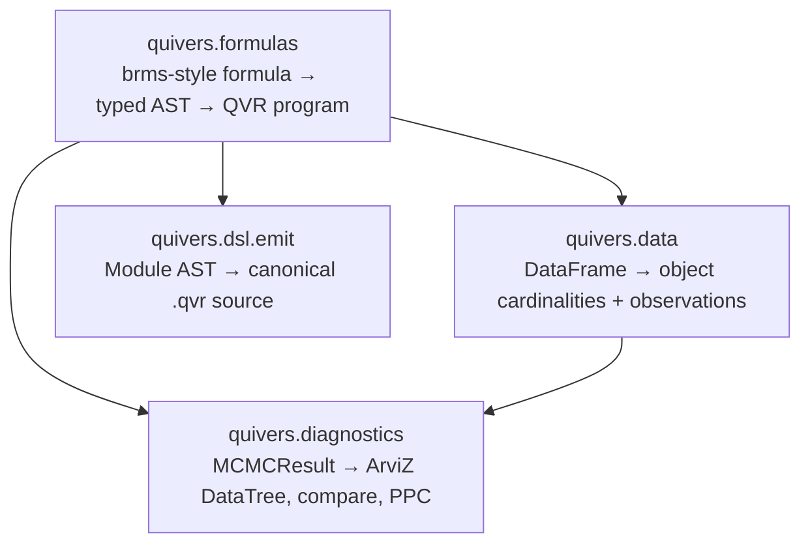

# Analysis Pipelines

This guide covers the workflow surface around inference: feeding
dataframes into models, fitting and diagnosing the result, comparing
models, and emitting QVR programs from a brms-style formula. The
goal is to let a user coming from R / brms / Stan / PyMC describe a
fit, run it, and inspect the posterior without writing any glue
code, while still being able to drop down to the typed QVR DSL when
the formula language is too restrictive.

## Architecture

Four small subpackages, each consumable independently:



Each subpackage is gated behind an optional dependency extra so a
user who only wants the DSL + inference doesn't pull pandas /
polars / arviz / formulae. Install everything together via
`pip install "quivers[analysis]"`.

## Dataframes: `quivers.data`

[`DatasetSchema`](../api/data/schema.md) is a typed
[`didactic.api.Model`](https://didactic.dev/api/Model) that maps
dataframe columns to QVR-program artifacts. It accepts pandas,
polars, or any other
[Narwhals](https://narwhals-dev.github.io/narwhals/)-compatible
dataframe.

```python
import pandas as pd
from quivers.data import DatasetSchema, compose

df = pd.DataFrame({
    "verb": ["eat", "drink", "run", "eat", ...],
    "subject": ["s1", "s2", "s1", "s3", ...],
    "rt": [0.31, 0.42, 0.28, 0.55, ...],
    "response": [1, 0, 1, 1, ...],
})

schema = DatasetSchema(
    df=df,
    objects={"verb": "Verb", "subject": "Subject"},
    plate_indices={"verb": "verb_idx", "subject": "subj_idx"},
    covariates={"rt": "rt"},
    observations={"response": "y"},
)

print(schema.declarations())          # object Verb : 17 / object Subject : 50
print(schema.cardinalities)           # {"Verb": 17, "Subject": 50}
obs = schema.observations_dict()      # {"verb_idx": tensor, "subj_idx": tensor, ...}
```

Two artifacts come out:

* [`declarations()`](../api/data/schema.md#quivers.data.schema.DatasetSchema.declarations) emits a `.qvr` prelude with one
  `object X : N` line per declared object axis. The cardinality
  is inferred from `df[col].n_unique()`; canonical category
  ordering is the column's sorted unique non-null values so plate
  indices are reproducible across reruns.
* [`observations_dict()`](../api/data/schema.md#quivers.data.schema.DatasetSchema.observations_dict) packs the per-row tensors that
  inference consumes (response, plate indices, numeric covariates),
  ready to pass into
  [`SVI.step`](../api/inference/svi.md) or
  [`MCMC.run`](../api/inference/predictive.md).

The companion [`compose(qvr_body, schema)`](../api/data/schema.md#quivers.data.schema.compose) prepends the schema's
declarations to a user's `.qvr` body before compiling, so the user
writes only the program body and the cardinalities come from the
data.

Missing-data handling is configurable per schema via
[`MissingPolicy`](../api/data/encoding.md#quivers.data.encoding.MissingPolicy):
`RAISE` (default), `DROP`, `IMPUTE`, or `MASK`.

## Formulas: `quivers.formulas`

The [formula frontend](../api/formulas/index.md) compiles a
[brms](https://paul-buerkner.github.io/brms/) / `lme4`-style
formula into a typed QVR
[`Module`](../api/dsl/ast_nodes.md) AST. No source-string
concatenation: the translation
[`FormulaToQVRModule`](../api/formulas/compile.md#quivers.formulas.compile.FormulaToQVRModule)
is a [`didactic.api.Lens`](https://didactic.dev/api/Lens) from
`Formula` to `Module`, mirroring the existing resolution-lens
pattern in [`quivers.dsl.resolution`](../api/dsl/resolution.md).
Formula syntax is parsed by the
[`formulae`](https://bambinos.github.io/formulae/) library (the
Bambi team's pure-Python brms-style parser), then lifted into a
typed `Formula` record.

### One-line fit

```python
from quivers.formulas import fit

result = fit(
    "acceptability ~ verb + frame + log(rt) + (1 + verb | subject)",
    data=df,                       # pandas or polars
    family="bernoulli",            # auto-derives the logit link
    method="nuts",
    num_warmup=500,
    num_samples=1000,
    num_chains=4,
    seed=0,
)
```

The returned [`BayesianFit`](../api/formulas/fit.md) is
itself a frozen `dx.Model`, with `.formula`, `.family`, `.program`
(the compiled
[`MonadicProgram`](../api/continuous/programs.md)),
`.posterior` (either an
[`MCMCResult`](../api/inference/predictive.md) or a
[`Guide`](../api/inference/guide.md)), and `.observations`
(the inference-time observations dict).

### Inspect or dump the generated QVR

```python
print(result.qvr_source)                    # canonical .qvr source
result.dump_qvr("acceptability.qvr")        # write to disk

# Or compile the formula without fitting:
from quivers.formulas import formula_to_qvr
src = formula_to_qvr("y ~ poly(x, 2) + (1 | g)", data=df)
```

The emit goes through
[`quivers.dsl.emit.module_to_source`](../api/dsl/emit.md), which
walks the `Module` AST and produces canonical `.qvr` source. The
emitted source re-parses through
[`quivers.dsl.loads`](../api/dsl/parser.md) into a `Module` that
compiles to the same program — the round-trip is exercised on every
formula in the test suite.

### R / brms behaviour, exactly

* **Orthogonal polynomials by default.** `poly(x, k)` produces `k`
  orthonormal centred columns, matching R's
  [`stats::poly`](https://stat.ethz.ch/R-manual/R-devel/library/stats/html/poly.html).
  Raw monomials remain available via `I(x**k)`.
* **One coefficient per design-matrix column** (matches brms
  display). `poly(x, 2)` produces two named coefficients
  `beta_poly_x_2_1` and `beta_poly_x_2_2`; `x*z` produces three
  named coefficients (`beta_x`, `beta_z`, `beta_x_z`). The
  per-column data flows in as a free variable via the host-data
  channel (see the [DSL guide](dsl.md) on `condition`).
* **R-style transforms** preloaded into the formulae evaluation
  namespace: `log`, `exp`, `sqrt`, `abs`, `sin`, `cos`, `tan`,
  `log10`, `log2`, `log1p`, `expm1`, `asin`, `acos`, `atan`,
  `sinh`, `cosh`, `tanh`. No registration required.
* **Random-effect groups** `(1 | g)`, `(1 + x | g)`, `(x | g)`,
  `(0 + x | g)` parse identically to brms / lme4. Multiple slopes
  per group emit independent random-effect terms (the lme4
  `(... || g)` uncorrelated semantics); correlated LKJ-prior
  slopes are future scope.
* **Interactions** `x:z` (elementwise product, one coefficient) and
  `x*z` (expands to `x + z + x:z`, three coefficients).

### Family registry

`fit(..., family=...)` accepts a string name or a
[`Family`](../api/formulas/family.md#quivers.formulas.family.Family) value.
v0.7.0 ships the ten brms-canonical families:

| Family | Link (inverse) | Auxiliary parameters |
|---|---|---|
| `gaussian` | identity | `sigma ~ HalfCauchy(2.0)` |
| `bernoulli`, `binomial` | logit (sigmoid) | – |
| `categorical` | softmax | – |
| `poisson` | log (exp) | – |
| `negative_binomial` | log (exp) | `disp ~ Gamma(2.0, 2.0)` |
| `gamma` | log (exp) | `shape ~ Gamma(2.0, 2.0)` |
| `beta` | logit (sigmoid) | `phi ~ HalfCauchy(2.0)` |
| `student_t` | identity | `nu ~ Gamma(2.0, 0.1)`, `sigma ~ HalfCauchy(2.0)` |
| `cumulative` | identity | – |

Custom families are pluggable: subclass
[`Family`](../api/formulas/family.md#quivers.formulas.family.Family)
and register your own observe kernel + link.

### Prior overrides

```python
result = fit(
    "y ~ x + (1 | g)",
    data=df,
    family="gaussian",
    priors={
        "intercept": "Normal(0.0, 10.0)",
        "beta_x": "Normal(0.0, 1.0)",
        "sigma_g_Intercept": "HalfCauchy(0.5)",
    },
)
```

Prior overrides are keyed by the latent's name in the emitted QVR
program (which `formula_to_qvr` lets you inspect upfront). The
prior template is a brms-style
``Family(arg, arg, ...)`` call; numeric args become floats,
identifier args stay as references to other latents in the
program.

## Diagnostics: `quivers.diagnostics`

The [diagnostics adapter](../api/diagnostics/index.md) is glue
between quivers' inference records and
[ArviZ 1.x](https://python.arviz.org/), the canonical
posterior-analysis library. ArviZ 1.x replaced the legacy
`InferenceData` container with
[`xarray.DataTree`](https://docs.xarray.dev/en/stable/generated/xarray.DataTree.html);
the adapter targets that surface directly.

```python
import arviz as az
from quivers.diagnostics import to_datatree, compare, posterior_predictive_check

idata_a = to_datatree(
    fit_a.posterior,
    observed_data={"y": y_obs},
    posterior_predictive={"y": pp_a},
    log_likelihood={"y": ll_a},
    coords={"Verb": ["eat", "drink", "run"]},
    dims={"beta": ["Verb"]},
)
idata_b = to_datatree(fit_b.posterior, ...)

# PSIS-LOO ranked comparison + stacking weights.
print(compare({"a": idata_a, "b": idata_b}))

# Posterior-predictive p-value on a chosen test statistic.
result = posterior_predictive_check(
    idata_a, observed_name="y", statistic="mean", by="Verb"
)
print(result["ppp"])

# Forest plot, trace plot, energy plot, etc. all consume the DataTree.
az.plot_forest(idata_a, var_names=["beta_x"])
```

[`to_datatree`](../api/diagnostics/arviz_io.md#quivers.diagnostics.arviz_io.to_datatree)
populates the canonical ArviZ groups (`posterior`, `sample_stats`,
`posterior_predictive`, `log_likelihood`, `observed_data`,
`constant_data`) from the `(num_chains, num_samples, *site_shape)`
tensors that
[`MCMCResult`](../api/inference/predictive.md) already produces.
[`compare`](../api/diagnostics/comparison.md#quivers.diagnostics.comparison.compare)
delegates to
[`arviz.compare`](https://python.arviz.org/en/stable/api/generated/arviz.compare.html)
with stacking weights ([Yao et al. 2018](https://doi.org/10.1214/17-BA1091)).
[`posterior_predictive_check`](../api/diagnostics/predictive_checks.md#quivers.diagnostics.predictive_checks.posterior_predictive_check)
computes the canonical
[posterior-predictive p-value](https://en.wikipedia.org/wiki/Posterior_predictive_p-value)
for a user-chosen
[test statistic](../api/diagnostics/predictive_checks.md),
optionally grouped by a named dim.

No information-criterion math is reimplemented here; every
analytics primitive comes from ArviZ.

## Module ↔ source: `quivers.dsl.emit`

[`module_to_source`](../api/dsl/emit.md) walks a
[`Module`](../api/dsl/ast_nodes.md) AST and produces canonical
`.qvr` source. The printer covers the subset of statement / step /
expression variants the formula frontend builds (object / morphism /
let / program / export declarations, plus let-arithmetic and
program-step nodes); other AST variants raise
`NotImplementedError` rather than guessing a serialisation. The
emit is one-way and semantic: the emitted source, re-parsed by
[`quivers.dsl.loads`](../api/dsl/parser.md), produces a `Module`
that compiles to the same program as the original AST.

## Autograd-safe morphism transforms

The 0.7 surface fixes
[a longstanding autograd bug](https://github.com/FACTSlab/quivers/issues/22)
that blocked multi-step training through `change_base`,
[`.dagger`](../api/core/morphisms.md#quivers.core.morphisms.Morphism.dagger),
[`.trace`](../api/core/morphisms.md#quivers.core.morphisms.Morphism.trace),
and [`.refactor`](../api/core/morphisms.md#quivers.core.morphisms.Morphism.refactor).
These operations now return a
[`TransformedMorphism`](../api/core/morphisms.md#quivers.core.morphisms.TransformedMorphism)
whose `.tensor` is recomputed from the source's tensor on each
access, and whose `.module()` registers the source as a submodule so
`.parameters()` walks reach the upstream learnable parameters.
Every backward through a fresh `.tensor` access gets its own
autograd graph, so multi-step optimisation propagates gradients
through the V-Cat surface correctly.

`ObservedMorphism` stays put for genuinely frozen data tensors (the
`from_data(...)` path); it no longer doubles as the wrapper for
derived-from-source morphisms. The categorical distinction "this
morphism is a tensor function of another morphism" earns the
separate class.

## End-to-end example

A complete regression workflow, top to bottom:

```python
import pandas as pd
from quivers.formulas import fit
from quivers.diagnostics import to_datatree, compare, posterior_predictive_check

df = pd.read_csv("acceptability.csv")

# Fit a hierarchical logistic model with a polynomial predictor.
fit_full = fit(
    "response ~ poly(rt, 2) + verb + (1 + verb | subject)",
    data=df,
    family="bernoulli",
    method="nuts",
    num_warmup=500, num_samples=1000, num_chains=4,
    priors={"sigma_subject_Intercept": "HalfCauchy(0.5)"},
    seed=0,
)

# Compare against a simpler null model.
fit_null = fit(
    "response ~ verb + (1 | subject)",
    data=df, family="bernoulli", method="nuts",
    num_warmup=500, num_samples=1000, num_chains=4, seed=0,
)

idata_full = to_datatree(fit_full.posterior, ...)
idata_null = to_datatree(fit_null.posterior, ...)
print(compare({"full": idata_full, "null": idata_null}))

# Per-verb posterior-predictive p-value (PPP) on the response rate.
print(posterior_predictive_check(
    idata_full, observed_name="response", statistic="mean", by="verb",
))

# Inspect / save the emitted QVR.
fit_full.dump_qvr("acceptability_model.qvr")
```

The same workflow drops down to the QVR DSL whenever the formula
language is too restrictive — `formula_to_qvr(...)` emits the
program, and the user edits the source and feeds it back through
[`quivers.dsl.loads`](../api/dsl/parser.md).
