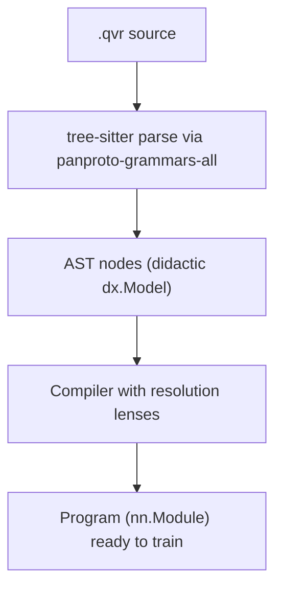

# The QVR DSL: Overview

`.qvr` is the file format you write probabilistic programs in. A
`.qvr` file declares some types (objects and continuous spaces),
some morphisms (parameters, kernels, observed data), and one or
more `program` blocks that sample, observe, and return values.
Compilation produces a trainable [PyTorch
`nn.Module`](https://docs.pytorch.org/docs/stable/generated/torch.nn.Module.html).

```python
import torch
from quivers.dsl import loads

prog = loads("""
composition product_fuzzy as algebra

object X : FinSet 3
object Y : FinSet 4

morphism f : X -> Y [role=latent]
export f
""")

optimizer = torch.optim.Adam(prog.parameters())
```

`load("model.qvr")` reads the same surface from a file path.

The program-block surface looks familiar if you've used Pyro,
NumPyro, Stan, or PyMC: `<-` is the sample sigil, `observe` scores
data, `marginalize` integrates out a discrete latent, `let` is a
deterministic binding, `return` names the program's output.

A few features distinguish the QVR surface from those alternatives:

- **First-class structured priors on weight matrices** via
  `morphism W : A -> B [role=latent] ~ Family(args)` with an
  `[over=..., iid_over=...]` axis-role clause on each `sample` /
  `observe` / `marginalize` step.
  [Matrix-Normal](https://en.wikipedia.org/wiki/Matrix_normal_distribution),
  [LKJ](https://doi.org/10.1016/j.jmva.2009.04.008),
  [Gaussian-process](https://en.wikipedia.org/wiki/Gaussian_process),
  and [Horseshoe](https://doi.org/10.1093/biomet/asq017) priors take
  the form they take on paper.
- **Marginalization as a control-flow construct.**
  `marginalize z : K <- F(...)` followed by an indented body is a
  syntactic block, not a runtime flag; the compiler emits the
  [log-sum-exp](https://en.wikipedia.org/wiki/LogSumExp).
- **Compile-time effect signatures.** Every program declares its
  effect row in the option block:
  `program p(...) : A -> B [effects=[Sample, Score]]`. Allowed
  effects are `Pure`, `Sample`, `Score`, `Marginal`; the compiler
  rejects an effectful step inside a `[effects=[Pure]]` block
  before training starts.
- **A typed categorical denotation.** Every well-typed phrase has a
  meaning in a $\mathcal{V}$-enriched [symmetric monoidal closed
  category](https://ncatlab.org/nlab/show/symmetric+monoidal+closed+category);
  the compiler is proved adequate against the denotation
  in the [semantics chapter](../semantics/index.md). You can
  ignore this layer unless you want to extend the language.

## Compilation pipeline



The grammar at `grammars/qvr/` is registered with
[panproto](https://panproto.dev)'s
`panproto-grammars-all` distribution; the AST nodes are documented
in [`ast_nodes`](../api/dsl/ast_nodes.md); resolution between
syntactic [`TypeExpr`](../api/dsl/ast_nodes.md) /
[`SpaceExpr`](../api/dsl/ast_nodes.md) trees and runtime
[`SetObject`](../api/core/objects.md) /
[`ContinuousSpace`](../api/continuous/spaces.md) values is a
[`dx.Lens`](https://didactic.dev/api/Lens) family in
[`resolution.py`](../api/dsl/resolution.md). Each compiled program
extracts to a panproto [`Schema`](https://panproto.dev/api/schema)
via [`program_theory`](../api/dsl/program_theory.md), so diff,
migrate, and lens-generation tooling applies directly to `.qvr`
programs.

The [`Compiler`](../api/dsl/compiler.md) transforms the AST to a
[`Program`](../api/program.md) in four passes:

1. **Resolve declarations**: collect all objects, spaces, morphisms.
   Type and space resolution is delegated to the lens family in
   [`quivers.dsl.resolution`](../api/dsl/resolution.md),
   `TypeExprToSetObject` (parameterized by the object inventory)
   and `SpaceExprToContinuousSpace` (parameterized by the space
   and object inventories). Each lens is
   [`dx.Lens[<AST>, <runtime value>, <AST>]`](https://didactic.dev/api/Lens);
   [round-trip laws](https://didactic.dev/concepts/laws) hold by
   construction.
2. **Type check**: ensure domains and codomains match in
   compositions.
3. **Build morphism DAG**: construct morphism modules.
4. **Wrap in Program**: create an
   [`nn.Module`](https://docs.pytorch.org/docs/stable/generated/torch.nn.Module.html)
   that manages all parameters.

```python
from quivers.dsl import Compiler, parse

source = "object X : FinSet 3\nmorphism f : X -> X [role=latent]\nexport f"
ast = parse(source)
compiler = Compiler(ast)
program = compiler.compile()
```

### Programs as panproto schemas

After compilation, the resolved environment can be exported as a
panproto `Schema` over `QVR_PROGRAM_PROTOCOL`:

```python
from quivers.dsl import parse, Compiler, extract_program_schema

source = "object X : FinSet 3\nmorphism f : X -> X [role=latent]\nexport f"
ast = parse(source)
compiler = Compiler(ast)
compiler.compile()
schema = extract_program_schema(compiler)  # Schema instance
```

The schema's vertices enumerate every declared object, space, and
morphism (with kinds drawn from `finset`, `product_set`,
`coproduct_set`, `free_monoid`, `empty_set`, `euclidean`,
`simplex`, `positive_reals`, `product_space`, plus the declaration
variants). This makes `panproto schema diff`,
`panproto lens generate`, and the rest of the panproto toolbox
available on `.qvr` programs without further work.

## Grammar

The authoritative grammar is the tree-sitter source at
`grammars/qvr/grammar.js` in the quivers repository. The summary
below is a human-readable EBNF view of the same productions; the
tree-sitter grammar is the source of truth.

```ebnf
module         := statement*

statement      := composition_decl
                | category_decl
                | rule_decl
                | schema_decl
                | object_decl
                | morphism_decl
                | bundle_decl
                | program_decl
                | contraction_decl
                | let_decl
                | export_decl
                | deduction_decl
                | signature_decl
                | encoder_decl
                | decoder_decl
                | loss_decl
                | pragma_outer
                | pragma_inner

(* Selects the module's composition rule. The `as` clause fixes the
   algebraic level the surrounding morphisms must live in; the
   optional indented body declares a fresh rule inline (each entry
   is a let-expression). *)
composition_decl
               := 'composition' IDENT
                  ['as' composition_level]
                  [composition_rule_block]
composition_level
               := 'algebra' | 'semigroupoid' | 'bilinear_form' | 'rule'
composition_rule_entry
               := IDENT ['(' IDENT (',' IDENT)* ')'] '=' let_expr

(* Objects. The RHS is one of: an enum literal `{a, b, c}`,
   `FreeResiduated(...)`, `FreeMonoid(...)`, or any object
   expression (e.g. `FinSet N`, `Real n`, `Euclidean(...)`,
   products, coproducts, etc.). *)
object_decl    := 'object' IDENT ':' object_value
object_value   := enum_set_literal
                | free_residuated_expr
                | free_monoid_expr
                | object_expr

(* Morphisms. The role keyword (`latent` / `observed` / `kernel` /
   `embed` / `discretize`) and every other modifier live in the
   bracketed option block. An optional `~ Family(args)` initializer
   attaches a distribution family; without it the morphism is bare
   structural data. *)
morphism_decl  := 'morphism' IDENT ':' object_expr '->' object_expr
                  option_block
                  ['~' morphism_init]
morphism_init  := morphism_init_family | expr
morphism_init_family
               := IDENT '(' [draw_arg (',' draw_arg)*] ')'

(* Option block. Keys depend on the surrounding form. For
   morphisms / sample / observe / marginalize, the recognised keys
   include `role`, `effects`, `over`, `iid_over`, `via`, `init`,
   `reduction`. `[]` is the empty option block. *)
option_block   := '[' [option_entry (',' option_entry)*] ']'
option_entry   := IDENT '=' option_value
option_value   := IDENT | string | integer | float | option_list
option_list    := '[' [option_value (',' option_value)*] ']'

(* Operadic n-ary contraction. Inputs are named morphisms; the
   `wiring` / `share` / `rule` options live in the option block. *)
contraction_decl
               := 'contraction' IDENT
                  '(' contraction_input (',' contraction_input)* ')'
                  ':' object_expr '->' object_expr
                  option_block
contraction_input
               := IDENT ':' object_expr '->' object_expr

(* Bundle: a named tuple of rule references. *)
bundle_decl    := 'bundle' IDENT '=' '[' IDENT (',' IDENT)* ']'

(* Top-level production-style rule. *)
rule_decl      := 'rule' IDENT '(' IDENT (',' IDENT)* ')'
                  ':' object_expr (',' object_expr)*
                  '=>' object_expr

(* Schema: a parameterised morphism shape. *)
schema_decl    := 'schema' IDENT '(' schema_parameter (',' schema_parameter)* ')'
                  ':' object_expr '->' object_expr
schema_parameter
               := IDENT (',' IDENT)* ':' object_expr

(* Weighted deduction system: the agenda-based framework subsumes
   CKY, Earley, Viterbi, inside-outside, semi-naive Datalog, A*,
   Knuth, and bidirectional MLTT proof search. *)
deduction_decl := 'deduction' IDENT ':' object_expr '->' object_expr
                  [option_block] INDENT deduction_body_entry+ DEDENT
deduction_body_entry
               := deduction_atoms | deduction_binders | deduction_rule
                | deduction_lexicon | deduction_lexicon_from_file

(* Signature / encoder / decoder / loss for structural compression. *)
signature_decl := 'signature' IDENT ['(' IDENT (',' IDENT)* ')']
                  INDENT signature_body_entry+ DEDENT

encoder_decl   := 'encoder' IDENT ':' IDENT
                  ['(' IDENT (',' IDENT)* ')']
                  [option_block]
                  [INDENT encoder_body_entry+ DEDENT]

decoder_decl   := 'decoder' IDENT 'over' IDENT
                  ['(' IDENT (',' IDENT)* ')']
                  [option_block]
                  INDENT decoder_body_entry+ DEDENT

loss_decl      := 'loss' IDENT [option_block]
                  INDENT loss_body_entry+ DEDENT

(* Program. The option block holds `effects`, `over`, etc. The
   body is an indented sequence of steps, terminated by a required
   `return`. *)
program_decl   := 'program' IDENT ['(' program_param (',' program_param)* ')']
                  ':' object_expr '->' object_expr
                  [option_block]
                  INDENT program_step* return_step DEDENT
program_param  := IDENT | (IDENT ':' param_kind)
param_kind     := 'FinSet' | 'Space' | 'Object'
                | 'Real' | 'Nat'
                | 'Mor' '[' object_expr ',' object_expr ']'
program_step   := sample_step | observe_step | marginalize_step
                | let_step | score_step

sample_step    := 'sample' var_pattern [':' object_expr]
                  '<-' IDENT ['(' draw_arg (',' draw_arg)* ')']
                  [option_block]
observe_step   := 'observe' IDENT [':' object_expr]
                  '<-' IDENT ['(' draw_arg (',' draw_arg)* ')']
                  [option_block]
marginalize_step
               := 'marginalize' IDENT [':' object_expr]
                  '<-' IDENT ['(' draw_arg (',' draw_arg)* ')']
                  [option_block]
                  INDENT program_step+ DEDENT
let_step       := 'let' IDENT '=' let_arith
score_step     := 'score' IDENT '=' let_arith
return_step    := 'return' return_pattern

let_decl       := 'let' IDENT '=' expr ['where' INDENT let_decl+ DEDENT]
export_decl    := 'export' expr

(* Pragmas. `#[...]` attaches to the next declaration; `#![...]`
   attaches to the enclosing module. *)
pragma_outer   := '#[' pragma_entry (',' pragma_entry)* ']'
pragma_inner   := '#![' pragma_entry (',' pragma_entry)* ']'
pragma_entry   := IDENT ['=' option_value]
```

Each declaration form is detailed in its own page:
[declarations](dsl-declarations.md),
[programs and let-expressions](dsl-programs-and-lets.md),
and [contractions](dsl-contractions.md). The
[grammar fragment in the semantics chapter](../semantics/grammar.md)
gives the productions a categorical denotation.

## Comments

Lines starting with `#` are ignored:

```text
# This is a comment
object X : FinSet 3  # inline comment

# Define morphisms
morphism f : X -> X [role=latent]
```

### Doc comments

Lines starting with `#!` are *doc comments*: they're attached to
the declaration that immediately follows and surface through the
AST, the panproto schema, and tooling (`qvr check --json`, LSP
hover). Plain `#` line comments are dropped at parse time.

```qvr
#! The terminal vocabulary; cardinality 256 is one byte.
object Token : FinSet 256
#! Latent token-to-category embedding learned during training.
morphism emit : Token -> Token [role=latent]
```

Doc comments are recognized on every declaration that carries a
`docs:` field, including `object`, `morphism`, `composition`,
`bundle`, `contraction`, `schema`, `program`, `deduction`,
`signature`, `encoder`, `decoder`, `loss`, `let`, and `export`.

## Error handling

The DSL provides two error types:

- [`ParseError`](../api/dsl/parser.md#quivers.dsl.parser.ParseError):
  syntactic error (the tree-sitter grammar reported an error node,
  or a required field was missing in the parse tree).
- [`CompileError`](../api/dsl/compiler.md#quivers.dsl.compiler.CompileError):
  semantic error (type mismatch, undefined name, ill-formed program
  structure).

```python
from quivers.dsl import loads, ParseError, CompileError

bad_source = "object X : FinSet 3\nmorphism f : X -> Y [role=latent]\nexport f"
try:
    prog = loads(bad_source)
except ParseError as e:
    print(f"Parse error: {e}")
except CompileError as e:
    print(f"Compilation error: {e}")
```

Tree-sitter's lexer is integrated with the grammar, so lexical
errors surface as `ParseError`.

## Tips

1. **Always declare objects before using them** in morphisms.
2. **Algebra must come first** (if specified).
3. **Use let to name complex compositions** for clarity.
4. **Programs are the main output**: use them for
   [inference](inference-foundations.md).
5. **Type errors in composition** happen at compile time, not
   runtime.

## Where to next

- [DSL Declarations](dsl-declarations.md): every declaration form
  (objects, morphisms, spaces, kernels, algebras, deductions,
  aliases, combinators, exports).
- [Programs and Let-Expressions](dsl-programs-and-lets.md): the
  `program` block surface, bind / observe / marginalize / let
  steps, the axis-role clause, factor expressions, the
  let-expression primitive surface, and inline distribution
  families.
- [Contractions](dsl-contractions.md): operadic n-ary contractions,
  type-driven wiring inference, `share`, and the explicit `wiring`
  escape hatch.


## References

- Carlos M. Carvalho, Nicholas G. Polson, and James G. Scott. 2010. The horseshoe estimator for sparse signals. *Biometrika*, 97(2):465–480.
- Daniel Lewandowski, Dorota Kurowicka, and Harry Joe. 2009. Generating random correlation matrices based on vines and extended onion method. *Journal of Multivariate Analysis*, 100(9):1989–2001.
