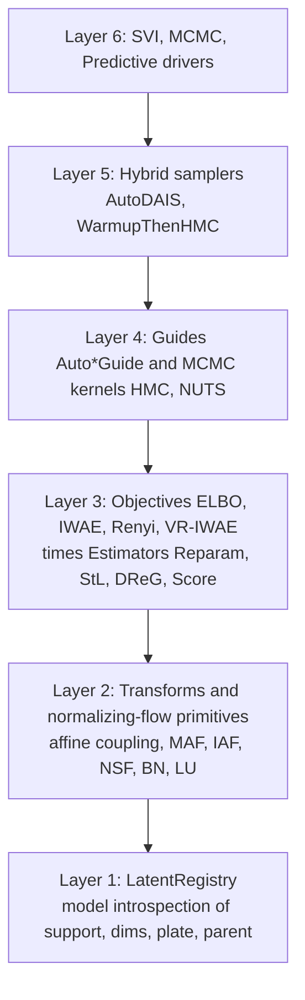
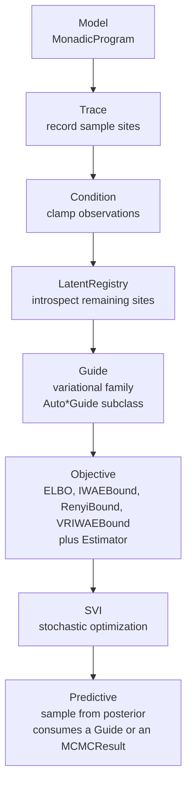

# Inference Foundations

This page introduces the inference stack's architecture, the trace
and sample-site interface, and the conditioning surface used to
clamp observations. The variational-family layer (guides,
objectives, SVI) lives in
[Variational Inference: SVI](inference-svi.md); the
gradient-based-MCMC layer lives in
[Variational Inference: MCMC](inference-mcmc.md).

## Architecture

The inference subpackage is a six-layer stack, each layer consumable
independently and re-exported from
[`quivers.inference`](../api/inference/trace.md):



Every guide and MCMC kernel consumes a single
[`LatentRegistry.from_model(model, observed_names)`](../api/inference/trace.md),
which flattens / unflattens between site-keyed dicts and a single
unconstrained vector and routes every per-site bijector through
[`torch.distributions.constraint_registry.biject_to`](https://docs.pytorch.org/docs/stable/distributions.html#torch.distributions.constraint_registry.biject_to).

## The variational pipeline



## Trace and sample sites

A trace records all stochastic operations in a program. Each sample
point is a
[`SampleSite`](../api/inference/trace.md#quivers.inference.trace.SampleSite).

<!-- python: skip -->
```python
from quivers.inference import trace, Trace, SampleSite

model = ...  # MonadicProgram

# Execute model with tracing
tr = trace(model, x)

# Access sites
sites = tr.sites  # dict[site_name -> SampleSite]

for name, site in sites.items():
    print(f"{name}: {site.log_prob}")
```

A `SampleSite` records:

- `name`: identifier of the sample
- `morphism`: the generating distribution (`None` for `let` bindings)
- `value`: sampled or observed value
- `log_prob`: log-density of the value under the morphism, shape `(batch,)` (zero for `let` bindings)
- `is_observed`: whether the site was clamped to an observed value
- `is_deterministic`: whether the site is a deterministic `let` binding

## Conditioning on observations

The
[`condition()`](../api/inference/conditioning.md#quivers.inference.conditioning.condition)
function clamps observations, fixing certain variables:

<!-- python: skip -->
```python
from quivers.inference import condition, Conditioned

model = ...  # MonadicProgram

# Observed values (e.g., from an experiment)
observations = {
    "y_1": torch.tensor(1.5),
    "y_2": torch.tensor(-0.3),
}

# Create conditioned model
conditioned = condition(model, observations)

# Trace the conditioned model: observed sites are clamped to the data
tr = conditioned.trace(x)
```

The conditioned model is a
[`Conditioned`](../api/inference/conditioning.md#quivers.inference.conditioning.Conditioned)
instance that wraps the original model and enforces observation
constraints.

### Host data: per-row covariates and index arrays

Keys in the `condition` data dict that don't match any declared
sample / observe site are exposed to the program's runtime
environment as deterministic values, visible to `let`-expression
evaluation. This is the canonical hook for per-row covariate or
index arrays used in hierarchical regression:

<!-- python: skip -->
```python
import torch
from quivers.dsl import loads
from quivers.inference import condition

model = loads('''
object Subj : FinSet 4
object Resp : FinSet 12

program p : Resp -> Resp
    sample by_subj : Subj <- Normal(0.0, 1.0)
    let mu = by_subj[subj_idx]
    observe r : Resp <- Normal(mu, 1.0)
    return r
export p
''').morphism

subj_idx = torch.tensor([0, 1, 2, 3, 0, 1, 2, 3, 0, 1, 2, 3])
r_obs    = torch.zeros(12)

cond = condition(model, {"subj_idx": subj_idx, "r": r_obs})
tr   = cond.trace(torch.zeros(12, 1))
```

`r` matches the observed sample site `r : Resp <- Normal(mu, 1.0)`
and is clamped as usual. `subj_idx` doesn't match any site; it
lands in the runtime environment, and `let mu = by_subj[subj_idx]`
advance-indexes into the per-subject draw. Free variables in `let`
expressions (names not bound by any sample / observe / let / lambda
step) resolve against the data dict at trace time; if the value is
missing the runtime raises a clear `KeyError`.

## Debugging

Enable tracing to inspect sites and log probabilities:

<!-- python: skip -->
```python
from quivers.inference import trace

tr = trace(model, x)

for name, site in tr.sites.items():
    print(f"{name}: log_prob={site.log_prob.item():.4f}")
```

Monitor the ELBO during training to detect divergence or poor guide
fit (see [SVI](inference-svi.md#svi-stochastic-variational-inference)).

## Where to next

- [Variational Inference: SVI](inference-svi.md): guides,
  objectives, gradient estimators, the SVI training loop, and
  predictive sampling.
- [Variational Inference: MCMC](inference-mcmc.md): HMC, NUTS,
  hybrid samplers, and predictive sampling from MCMC chains.
- [Analysis Pipelines: Fitting and Diagnostics](analysis-fitting-and-diagnostics.md):
  the higher-level fit / compare / posterior-predictive-check
  surface built on top of these primitives.
