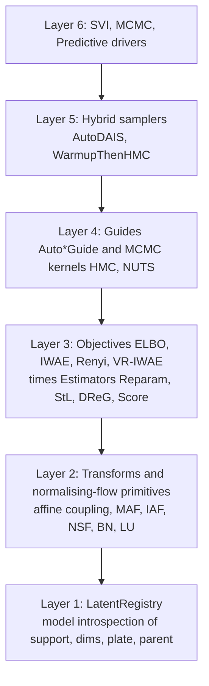
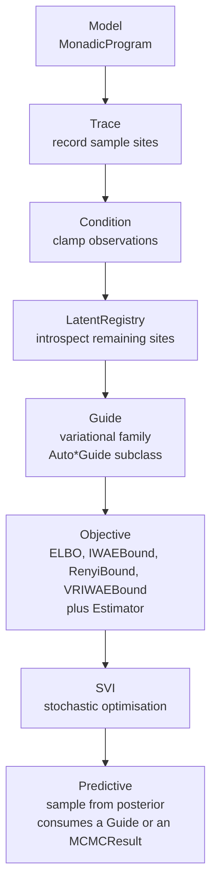

# Inference

## Architecture

The inference subpackage is a six-layer stack, each layer consumable independently and re-exported from `quivers.inference`:



Every guide and MCMC kernel consumes a single `LatentRegistry.from_model(model, observed_names)`, which flattens / unflattens between site-keyed dicts and a single unconstrained vector and routes every per-site bijector through `torch.distributions.constraint_registry.biject_to`.

## The variational pipeline



## Trace and Sample Sites

A trace records all stochastic operations in a program. Each sample point is a `SampleSite`.

```python
from quivers.inference import trace, Trace, SampleSite

model = ...  # MonadicProgram

# Execute model with tracing
tr = trace(model, x)

# Access sites
sites = tr.sites  # dict[site_name -> SampleSite]

for name, site in sites.items():
    print(f"{name}: {site.log_prob}")
```

A `SampleSite` records:

- `name`: identifier of the sample
- `value`: sampled value
- `log_prob`: log probability of the sample
- `morphism`: the generating distribution

## Conditioning on Observations

The `condition()` function clamps observations, fixing certain variables:

```python
from quivers.inference import condition, Conditioned

model = ...  # MonadicProgram

# Observed values (e.g., from an experiment)
observations = {
    "y_1": torch.tensor(1.5),
    "y_2": torch.tensor(-0.3),
}

# Create conditioned model
conditioned = condition(model, observations)

# Forward pass uses clamped values
log_pjoint = conditioned.log_joint(x, y_obs)
```

The conditioned model is a `Conditioned` instance that wraps the original model and enforces observation constraints.

### Host data: per-row covariates and index arrays

Keys in the `condition` data dict that don't match any declared sample / observe site are exposed to the program's runtime environment as deterministic values, visible to `let`-expression evaluation. This is the canonical hook for per-row covariate or index arrays used in hierarchical regression:

```python
import torch
from quivers.dsl import loads
from quivers.inference import condition

model = loads('''
object Subj : 4
object Resp : 12

program p : Resp -> Resp
    by_subj : Subj <- Normal(0.0, 1.0)
    let mu = by_subj[subj_idx]
    observe r : Resp <- Normal(mu, 1.0)
    return r
export p
''').morphism

subj_idx = torch.tensor([0, 1, 2, 3, 0, 1, 2, 3, 0, 1, 2, 3])
r_obs    = torch.zeros(12)

cond = condition(model, {"subj_idx": subj_idx, "r": r_obs})
tr   = cond.trace(torch.zeros(12, 1))
```

`r` matches the observed sample site `r : Resp <- Normal(mu, 1.0)` and is clamped as usual. `subj_idx` doesn't match any site; it lands in the runtime environment, and `let mu = by_subj[subj_idx]` advance-indexes into the per-subject draw. Free variables in `let` expressions (names not bound by any sample / observe / let / lambda step) resolve against the data dict at trace time; if the value is missing the runtime raises a clear `KeyError`.

## Guides: Variational Families

A guide $q_\phi(z | x, y)$ is a variational family approximating the posterior. Eleven `Auto*Guide` subclasses cover the standard zoo, all documented under [Variational Guides](../api/inference/guide.md); each is constructed from the model and a set of observed site names:

| Guide | Posterior structure | When to use |
|---|---|---|
| [`AutoNormalGuide`](../api/inference/guide.md#quivers.inference.guides.AutoNormalGuide) | Diagonal Normal (mean-field) | Default; identifiable posterior, weak correlation |
| [`AutoMultivariateNormalGuide`](../api/inference/guide.md#quivers.inference.guides.AutoMultivariateNormalGuide) | Full-rank Normal (Cholesky) | Strong posterior correlations; D ≲ 1000 |
| [`AutoLowRankMultivariateNormalGuide`](../api/inference/guide.md#quivers.inference.guides.AutoLowRankMultivariateNormalGuide) | Low-rank + diagonal | Hierarchical models with localized correlations |
| [`AutoLaplaceApproximation`](../api/inference/guide.md#quivers.inference.guides.AutoLaplaceApproximation) | Gaussian centred at MAP w/ Hessian inverse | Post-hoc; cheap quadratic-around-MAP |
| [`AutoNormalizingFlow`](../api/inference/guide.md#quivers.inference.guides.AutoNormalizingFlow) | Composed bijector over Normal base | Multimodal / heavy-tailed posteriors |
| [`AutoIAFGuide`](../api/inference/guide.md#quivers.inference.guides.AutoIAFGuide) | Inverse autoregressive flow | Flagship NF default |
| [`AutoNeuralSplineGuide`](../api/inference/guide.md#quivers.inference.guides.AutoNeuralSplineGuide) | Rational-quadratic spline coupling | Sharper than IAF for bounded support |
| [`AutoMixtureGuide`](../api/inference/guide.md#quivers.inference.guides.AutoMixtureGuide) | K-component mixture of guides | Multimodal posteriors |
| [`AutoDeltaGuide`](../api/inference/guide.md#quivers.inference.guides.AutoDeltaGuide) | Dirac at MAP | Quick MAP; no uncertainty |

Every guide uses `biject_to(support)` per site, so samples always lie inside the prior's constrained support; `log_prob` carries the corresponding log-det Jacobian.

### AutoNormalGuide

A diagonal Gaussian approximation to the posterior, with a per-site bijector that maps unconstrained Normal samples to the prior's constrained support:

$$q_\phi(z_i | x, y) = T_i\bigl(\,\mathcal{N}(\mu_i, \sigma_i)\,\bigr)$$

where $T_i = \mathsf{biject\_to}(\mathrm{support}(p_i))$ is the bijector for site $i$'s prior support, the identity on the real line for `Normal`, $\exp$ for `HalfNormal` / `Gamma` / `Exponential` / `LogNormal`, sigmoid for `Beta` / `Uniform(0, 1)` / `LogitNormal`, an affine-shifted sigmoid for arbitrary `Uniform(low, high)` / `TruncatedNormal`, and `StickBreakingTransform` for `Dirichlet`. The learnable parameters $(\mu_i, \sigma_i)$ live in the unconstrained space; the constrained sample $v_i = T_i(z_i)$ is always inside the prior's support, so `prior.log_prob(v_i)` evaluates without raising `Expected value to be within the support of …`. Pyro's `AutoNormal` uses the same construction.

```python
from quivers.inference import AutoNormalGuide

model = ...  # MonadicProgram
conditioned = condition(model, observations)

guide = AutoNormalGuide(conditioned.model, observed_names=set(observations))

# Sample latents from guide (each lives in its prior's support)
latents = guide.rsample(x)  # dict {name: tensor}

# Log probability under guide (with Jacobian correction)
log_q = guide.log_prob(x, latents)
```

### AutoDeltaGuide

A delta (point mass) approximation, i.e. a single best estimate. The point lives in the unconstrained space and is pushed through `biject_to(support)` at evaluation time, so it always lies inside the prior's support:

$$q_\phi(z_i | x, y) = \delta_{T_i(\zeta_i)}(z_i)$$

where $\zeta_i$ is the learnable unconstrained point and $T_i$ the same per-site bijector as `AutoNormalGuide`.

```python
from quivers.inference import AutoDeltaGuide

guide = AutoDeltaGuide(conditioned.model, observed_names=set(observations))

# Point estimate (deterministic, inside the prior's support)
z_map = guide.rsample(x)

# Delta log probability (zero; the delta term cancels in the ELBO)
log_q = guide.log_prob(x, z_map)
```

## Objectives and gradient estimators

`SVI` accepts any `Objective` subclass, not just `ELBO`. Four are shipped:

| Objective | Bound | Use case |
|---|---|---|
| `ELBO(num_particles=K)` | $\mathbb{E}_q[\log p - \log q]$ | Default |
| `IWAEBound(K, estimator=...)` | $\mathbb{E}[\log \tfrac{1}{K}\sum_k (p/q)_k]$ | Tighter than ELBO for $K > 1$ (Burda et al. 2016) |
| `RenyiBound(alpha, K)` | $\alpha$-divergence bound (Li-Turner 2016) | $\alpha = 0$ recovers IWAE; $\alpha = 1$ recovers ELBO |
| `VRIWAEBound(alpha, K)` | Variational Rényi-IWAE (Daudel et al. 2023) | Interpolates cheap-vs-tight regimes |

Each accepts an `estimator=` strategy:

| Estimator | What it does |
|---|---|
| `Reparameterised` | Standard pathwise gradient (default) |
| `StickingTheLanding` | Detaches variational params in `log_q` (Roeder et al. 2017); variance → 0 as $q \to p^*$ |
| `DoublyReparameterised` | DReG for IWAE (Tucker et al. 2019); kills the K-growing score term |
| `ScoreFunction` | REINFORCE; for non-reparameterisable sites |

```python
from quivers.inference import IWAEBound, DoublyReparameterised

iwae = IWAEBound(num_particles=16, estimator=DoublyReparameterised())
loss = iwae(model, guide, x, observations)
```

The Monte Carlo particle dimension is broadcast as a leading torch axis end-to-end; the inner `model.log_joint` evaluation is a single fused call against a `(K, batch, …)`-shaped latent dict.

## ELBO: Evidence Lower Bound

The ELBO is the variational objective:

$$\mathcal{L}(\phi) = \mathbb{E}_{q_\phi(z | x, y)} [\log p(y, z | x) - \log q_\phi(z | x, y)]$$

It lower bounds the log marginal likelihood $\log p(y | x)$ and equals it when $q_\phi = p(\cdot | x, y)$.

Indexed-observe steps (`observe r : N <- F(args)`) read their response tensors from a runtime `observations: dict[str, torch.Tensor]` keyed by the observed-variable name. The dict is threaded through `ELBO.forward` and `SVI.step` via the `observations` kwarg, alongside the domain input.

The `ELBO` class computes this:

```python
from quivers.inference import ELBO

model = ...  # MonadicProgram (joint p)
guide = ...  # variational q

elbo = ELBO(num_particles=10)

# Compute loss
x = torch.randn(5)
observations = {"y": y_obs}
loss = elbo(model, guide, x, observations)  # negative ELBO (for minimization)

loss.backward()  # backprop through both model and guide
```

Internally, the ELBO:
1. Samples latent variables $z \sim q_\phi(\cdot | x, y)$
2. Computes $\log p(y, z | x)$ via `model.log_joint()`
3. Computes $\log q_\phi(z | x, y)$ via `guide.log_prob()`
4. Returns $\frac{1}{n}\sum_i [\log q - \log p]$

## SVI: Stochastic Variational Inference

The SVI training loop optimizes both model and guide parameters:

```python
from quivers.inference import ELBO, SVI
import torch.optim as optim

model = ...   # MonadicProgram
guide = ...   # Guide
elbo  = ELBO(num_particles=5)

optimizer = optim.Adam(
    list(model.parameters()) + list(guide.parameters()),
    lr=1e-3,
)

svi = SVI(model, guide, optimizer, elbo)

# Training loop
for epoch in range(100):
    x = next(data_loader)  # minibatch
    observations = {"y": x[:, -1]}
    x_input = x[:, :-1]

    loss = svi.step(x_input, observations)
    print(f"Epoch {epoch}: loss={loss:.4f}")
```

The `step` method:
1. Computes ELBO loss
2. Backpropagates gradients
3. Updates optimizer

## Predictive Sampling

After training, sample from the posterior predictive:

$$p(y_\text{new} | x_\text{new}, \text{observations}) = \int p(y_\text{new} | z, x_\text{new}) p(z | x, y_\text{obs}) dz$$

```python
from quivers.inference import Predictive

predictive = Predictive(
    model=conditioned,
    guide=guide,
    num_samples=1000,
)

# Sample from posterior predictive
x_new = torch.randn(5)
samples = predictive(x_new)              # dict[str, torch.Tensor]
y_new_samples = samples["y"]             # shape (num_samples, batch, ...)

# Posterior mean and credible intervals
y_mean = y_new_samples.mean(dim=0)
y_low = y_new_samples.quantile(0.025, dim=0)
y_high = y_new_samples.quantile(0.975, dim=0)
```

The predictive:
1. Samples latents from the guide: $z \sim q_\phi(\cdot | x, y_\text{obs})$
2. Samples outcomes: $y_\text{new} \sim p(\cdot | z, x_\text{new})$
3. Returns the ensemble

## Full Example: Bayesian Linear Regression

```python
from quivers.continuous.programs import MonadicProgram
from quivers.continuous.families import ConditionalNormal
from quivers.continuous.spaces import Euclidean
from quivers.core.objects import Unit
from quivers.inference import (
    condition, AutoNormalGuide, ELBO, SVI, Predictive
)
import torch
import torch.optim as optim

# Model: y = w·x + noise
program = MonadicProgram(
    domain=Euclidean(1),
    codomain=Euclidean(1),
)

# Prior on weight
prior_w = ConditionalNormal(Unit, Euclidean(1))
program.add_morphism("prior_w", prior_w)

# Likelihood
likelihood = ConditionalNormal(Euclidean(1), Euclidean(1))
program.add_morphism("likelihood", likelihood)

# Steps
program.add_draw("w", "prior_w")
program.add_draw("y", "likelihood", args=("w",))
program.add_return("y")

# Observed data
x_obs = torch.randn(100, 1)
y_obs = 2.0 * x_obs + torch.randn(100, 1) * 0.1

# Condition on observations
conditioned = condition(program, {"y": y_obs})

# Variational guide
guide = AutoNormalGuide(conditioned, observed_names={"y"})
elbo  = ELBO(num_particles=10)

# Optimization
optimizer = optim.Adam(
    list(conditioned.parameters()) + list(guide.parameters()),
    lr=1e-2,
)
svi = SVI(conditioned, guide, optimizer, elbo)

observations = {"y": y_obs}
for epoch in range(100):
    loss = svi.step(x_obs, observations)
    if epoch % 10 == 0:
        print(f"Epoch {epoch}: loss={loss:.4f}")

# Posterior predictive on new data
x_new = torch.linspace(-3, 3, 50).view(-1, 1)
predictive = Predictive(model=conditioned, guide=guide, num_samples=500)
samples = predictive(x_new)
y_pred = samples["y"]

# Summarize
y_mean = y_pred.mean(dim=0)
y_std = y_pred.std(dim=0)

print(f"Posterior mean of w: {y_mean[0, 0]:.2f} ± {y_std[0, 0]:.2f}")
```

## Advanced: Custom Guides

Implement a custom guide by subclassing `Guide`:

```python
from quivers.inference.guide import Guide

class MyGuide(Guide):
    def __init__(self, model):
        super().__init__()
        self.mu_net = torch.nn.Linear(5, 10)
        self.sigma_net = torch.nn.Linear(5, 10)

    def rsample(self, x: torch.Tensor) -> dict[str, torch.Tensor]:
        """Sample latent sites z ~ q(· | x). Returns {site_name: tensor}."""
        raise NotImplementedError()

    def log_prob(
        self, x: torch.Tensor, sites: dict[str, torch.Tensor]
    ) -> torch.Tensor:
        """Compute log q(sites | x), summed across latent sites."""
        raise NotImplementedError()
```

## MCMC: HMC and NUTS

When variational families underfit, fall back to gradient-based MCMC. The kernel runs on the registry's unconstrained vector; gradients flow through `torch.autograd.grad`.

```python
from quivers.inference import NUTSKernel, MCMC

kernel = NUTSKernel(
    target_accept_prob=0.8,
    max_tree_depth=10,
    mass_matrix="diagonal",
)
mcmc = MCMC(
    kernel=kernel,
    num_warmup=1000,
    num_samples=2000,
    num_chains=4,
)
result = mcmc.run(model, x, observations)

print(result.r_hat)       # per-site split R-hat (Vehtari et al. 2021)
print(result.ess)         # effective sample size
print(result.divergences) # divergence count per chain
samples = result.samples  # dict[str, Tensor] of shape (chains, draws, …)
```

`HMCKernel` and `NUTSKernel` both implement Nesterov dual-averaging step-size adaptation and Welford-online mass-matrix adaptation during warmup. The leapfrog integrator vectorises `num_chains` chains as a leading batch axis; warmup runs unvectorised (adaptation is impure), sampling runs vectorised (kernel is pure).

## Hybrid samplers

### AutoDAIS

Differentiable annealed importance sampling (Geffner-Domke 2021, Zhang et al. 2021) wraps a base guide with $K$ HMC trajectories along an annealing path between base and target. The base mean / scale, the step size, and the inverse temperatures are jointly trained via SVI. Closes the parity gap with NumPyro / Pyro `AutoDAIS`.

```python
from quivers.inference import AutoNormalGuide, AutoDAIS

base = AutoNormalGuide(model, observed_names={"y"})
guide = AutoDAIS(base, num_steps=8, step_size=0.05, base_temperature=1.0)
# Plug into SVI exactly like any other guide.
```

### WarmupThenHMC

Train a variational guide to convergence, then initialise HMC chains from the guide's posterior mean. Pareto-dominates cold-start HMC on hierarchical models with skewed prior support.

```python
from quivers.inference import AutoMultivariateNormalGuide, NUTSKernel, WarmupThenHMC

sampler = WarmupThenHMC(
    guide=AutoMultivariateNormalGuide(model, observed_names={"y"}),
    svi_steps=1000,
    mcmc_kernel=NUTSKernel(),
    mcmc_samples=2000,
)
result = sampler.run(model, x, observations)
```

## Predictive with MCMC

`Predictive` consumes either a `Guide` or an `MCMCResult`. With an `MCMCResult`, it iterates over posterior samples instead of calling `guide.rsample`.

```python
from quivers.inference import Predictive

predictive = Predictive(model=conditioned, posterior=result, num_samples=500)
samples = predictive(x_new)
```

## Debugging

Enable tracing to inspect sites and log probabilities:

```python
from quivers.inference import trace

tr = trace(model, x)

for name, site in tr.sites.items():
    print(f"{name}: log_prob={site.log_prob.item():.4f}")
```

Monitor the ELBO during training to detect divergence or poor guide fit.
