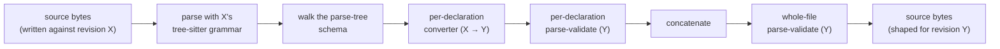

# Migrating `.qvr` source between grammar revisions

QVR's surface grammar evolves between releases. `qvr migrate` lowers
`.qvr` source written for one tagged grammar revision into source
shaped for a later revision. The transformation is grammar-bound at
every step: every per-declaration output is parse-validated against
the target revision's grammar, and the assembled output is
parse-validated as a whole file before being written.

This page covers what the migrator does today, how to use it, and
what's still pending.

## What `qvr migrate` does

The pipeline runs per source file:



Each adjacent revision pair `(X, Y)` on the migration
[`CHAIN`](#the-migration-chain) has either a converter module under
`src/quivers/cli/migrations/` or a manifest-verified mapping from
`_identity.migrator(X, Y)`. Migrating across multiple revisions composes the
intermediate hops.

Immutable tree-sitter parser sources live at
`grammars/qvr/vcs/parsers/<snapshot>/source/`; a manifest maps releases with
byte-identical grammars to the same snapshot. The migration schemas live in the
[panproto VCS](#the-panproto-vcs-chain) at
`grammars/qvr/vcs/.panproto/`. Installed packages carry the same assets under
`quivers.cli.migrations._grammar_vcs`. Each platform wheel also carries a native
library and source-binding manifest for every snapshot. Thus an installed
`qvr migrate` never needs to locate a host C compiler; a missing or inconsistent
native pair is an installation error rather than a request to compile at first
use.

## Common invocations

Migrate one file in place from v0.18.0 to the current grammar:

```bash
qvr migrate --from v0.18.0 docs/examples/source/lda.qvr
```

Migrate every `.qvr` under a directory:

```bash
qvr migrate --from v0.18.0 docs/examples/source/
```

Pick specific revisions explicitly:

```bash
qvr migrate --from v0.10.0 --to v0.11.0 docs/examples/source/lda.qvr
```

Dry-run (report what would change, write nothing):

```bash
qvr migrate --from v0.18.0 --dry-run docs/examples/source/
```

Write migrated copies to a separate directory:

```bash
qvr migrate --from v0.18.0 --output /tmp/migrated docs/examples/source/
```

Run the [coverage check](#-check-mode-coverage-against-the-vcs) against
the migration chain without migrating any files:

```bash
qvr migrate --check
```

`--from` is required because QVR source files do not carry their grammar
revision. This **explicit-origin rule** prevents the migrator from guessing a
source grammar and reinterpreting accepted tokens. `--to` defaults to `HEAD`,
the chain's current grammar.

## What survives migration

What's preserved by the migrator today:

- **Declarations handled by a converter.** Each supported source
  declaration becomes the semantically equivalent target declaration,
  even when the surface changed (e.g. `latent f : A -> B` becomes
  `morphism f : A -> B [role=latent]`). The two hops with empty converter
  tables still parse both endpoints and reject output that the target grammar
  cannot accept.
- **Top-level comments.** Header comments (file preamble,
  between-decl explanations) pass through verbatim.
- **In-body comments.** Comments inside `program`, `deduction`,
  `marginalize`, `signature`, `encoder`, `decoder`, `loss`, and
  composition rule bodies pass through as their raw source text,
  interleaved with the (translated) structural body entries in
  document order.
- **Lexicon block comments.** Comments between lexicon entries
  survive.
- **Doc comments.** `#!` doc comment lines attached to a
  declaration migrate with that declaration.
- **Multi-line bracketed forms.** Where the source revision allows
  multi-line `[...]` / `(...)` / `{...}` and the source has
  interior comments, the migrator's
  `emit_bracketed_list` helper preserves them.

What's intentionally dropped or transformed:

- **Single-line interior comments.** A comment inside an
  inline-form bracketed list (e.g. `[role=latent, # comment\n
  over=cod]` written without a leading newline) cannot exist in
  the grammar: the inline form forbids newlines. The user must
  switch to the multi-line bracket form to retain such a comment.
- **Body keywords that became option entries.** v0.10.0's
  `deduction` body carried `semiring LogProb`, `start S`, `depth 6`
  on their own lines; these hoist into the header option block as
  `[semiring=LogProb, start=S, depth=6]`. Same for program effects
  (`! Score, Sample` → `[effects=[Score, Sample]]`) and
  marginalize plates (`over G` → `[over=G]`).

## The migration chain

The chain is declared in
[`src/quivers/cli/migrations/__init__.py`](https://github.com/FACTSlab/quivers/blob/main/src/quivers/cli/migrations/__init__.py)
as the tuple `CHAIN`:

| Pair | Status |
| ---- | ------ |
| `v0.2.0 → v0.3.0` | explicit rule-declaration converter |
| `v0.3.0 → v0.4.0` | explicit program and output converters |
| `v0.4.0 → v0.5.0` | explicit continuous and stochastic converters |
| `v0.5.0 → v0.6.0` | grammar-bound migration with an empty converter table |
| `v0.6.0 → v0.7.0` | explicit `quantale` to `algebra` converter |
| `v0.7.0 → v0.9.0` | grammar-bound migration with an empty converter table |
| `v0.9.0 → v0.10.0` | identity (grammar byte-identical) |
| `v0.10.0 → v0.11.0` | full homogenization hop (all in-tree examples) |
| `v0.11.0 → v0.14.0` | identity (target grammar is an extension) |
| `v0.14.0 → v0.15.0` | full token-local converter; removed compose operators raise `MigrationError` |
| `v0.15.0 → v0.16.0` | manifest-verified identity |
| `v0.16.0 → v0.17.0` | manifest-verified identity |
| `v0.17.0 → v0.18.0` | manifest-verified identity |
| `v0.18.0 → v0.19.0` | additive QIEC hop; validates both revisions and preserves source bytes |
| `v0.19.0 → HEAD` | additive layout hop; validates both revisions and preserves source bytes |

The v0.5.0 → v0.6.0 and v0.7.0 → v0.9.0 modules have empty converter
tables. Every other non-identity structural hop declares the source rules it
converts through
[`SOURCE_RULE_COVERAGE`](#-check-mode-coverage-against-the-vcs).

The v0.18 to v0.19 hop adds the indexed-family and algebraic-effect grammar
without removing a previous production. Thus migration does not invent
indices, effect rows, or handlers in v0.18 input. The final hop accepts
hanging-indented delimiters while retaining every v0.19 layout. Both hops
validate unchanged bytes with their pinned source and target parsers.

## `--check` mode: coverage against the VCS

The panproto VCS at `grammars/qvr/vcs/.panproto/` holds one commit
per distinct grammar revision. `qvr migrate --check` walks every
adjacent pair on `CHAIN`, computes
`panproto.diff_schemas(src_schema, tgt_schema)`, and reports:

- **added**: rules that appear in the target's grammar but not the
  source's.
- **removed**: rules that appear in the source's grammar but not
  the target's.
- **UNCOVERED removed rules**: rules removed at the target whose
  corresponding hop migrator has no entry in its
  `SOURCE_RULE_COVERAGE` set. Each one is a missing converter that
  will silently let source bytes through; the resulting target
  source will be invalid.

The command exits non-zero when any pair has uncovered removals, which makes it
CI-suitable. Panproto 0.74.2 validates historical QVR objects against the exact
persisted enum payload read from disk. Current writes and tamper detection
remain unchanged. Thus `qvr migrate --check` exercises the original object IDs
written by earlier Panproto versions; the fixtures must not be regenerated to
match a new in-memory representation.

To clear an "uncovered" entry: write a converter for the rule in
the corresponding hop module and add the rule name to that
module's `SOURCE_RULE_COVERAGE` frozenset.

## VCS blame on migration failure

When a migrator encounters a top-level declaration whose `kind` it
has no converter for, it queries the panproto VCS for the rule's
history and writes a diagnostic to stderr alongside the
pass-through:

```
qvr migrate [v0.5.0 -> v0.6.0]: no converter for 'continuous_decl'.
VCS blame: introduced at v0.4.0; last present at v0.4.0.
```

This points the user at the precise release that needs a converter
written. The migration continues with the source bytes passed
through verbatim, which usually surfaces as a final-stage parse
error against the target grammar.

## Adding a new release

When a new QVR release ships:

1. Tag the release in git: `git tag v0.X.Y`.
2. Rebuild the VCS schema chain:
   ```bash
   python grammars/qvr/vcs/build_schemas.py
   ```
   Adds a new commit to `grammars/qvr/vcs/.panproto/` only if the
   tagged `grammars/qvr/grammar.js` differs in bytes from the
   previous tag's. Releases with identical grammars share commits
   (see `v0.10.0` / `v0.9.0` today).
3. Rebuild the per-revision parser:
   ```bash
   python grammars/qvr/vcs/build_parsers.py
   ```
   Produces the immutable source snapshot and a development-machine library
   under `grammars/qvr/vcs/parsers/v0.X.Y/`. The Hatch wheel hook compiles the
   current parser and every snapshot again on the wheel's target platform,
   writes source-binding manifests, and marks the result as a platform wheel.
4. Append the new revision to `CHAIN` in
   `src/quivers/cli/migrations/__init__.py`.
5. If the new grammar differs structurally: write
   `vP_Q_R_to_v0_X_Y.py` with per-decl converters and a
   `SOURCE_RULE_COVERAGE` frozenset listing every source rule it
   handles. Register it in `MIGRATORS`.
6. If the new grammar is byte-identical to the previous release, register
   `_identity.migrator(previous, current)` in `MIGRATORS`. This validates the
   manifest and both parse endpoints without adding another module.
7. Run `qvr migrate --check` to confirm the new hop's coverage is
   complete.
8. Let the release workflow build wheels through `cibuildwheel` on Linux,
   macOS, and Windows. The installed-wheel CI smoke test disables compiler
   fallback while loading the current parser and every migration snapshot.

## The panproto VCS chain

`grammars/qvr/vcs/` holds a panproto repository whose commits track
grammar evolution.

- One commit per distinct grammar revision; each commit holds a
  panproto `Schema` whose vertices are the rule names in the
  grammar's `grammar.json` and whose edges are the structural
  fan-out between rules. Vertices keyed by rule name means
  panproto's auto-derivation recognizes unchanged rules in O(1).
- Each commit tagged with the matching git tag (`v0.X.Y`); the
  working-tree grammar commits un-tagged.
- Used by `qvr migrate --check` to compute schema diffs and by the
  blame diagnostic to identify when a rule was introduced or
  removed.

The Python migrators do NOT consult the VCS at runtime to PERFORM
the migration; they are hand-written walks over the parsed source
schema. The VCS provides authoritative grammar history and powers
the coverage / blame tooling layered on top.

## Limits and planned work

- **Two converter tables are empty.** The v0.5.0 → v0.6.0 and v0.7.0 →
  v0.9.0 modules currently rely on grammar-bound pass-through and endpoint
  validation. `qvr migrate --check` identifies any removed source rule that
  still needs a converter.
- **Interior-bracket comments in inline forms.** A `#` comment
  inside a single-line `[...]` / `(...)` / `{...}` cannot exist:
  the grammar forbids newlines in inline forms. The user must
  switch to multi-line form (newline immediately after the
  opener) to retain interior comments.
- **No backward migration.** `qvr migrate` only composes forward
  along `CHAIN`. Backward migration (rendering newer source as
  older) is not implemented.
- **No Schema-construction emit.** The migrator currently emits
  target source via per-declaration text construction validated
  through `lens.parse`, not via `SchemaBuilder` +
  `emit_pretty`. The construction-by-Schema path depends on
  several panproto upstream issues to resolve before it's the
  default; see
  [the panproto issues filed by quivers](https://github.com/panproto/panproto/issues?q=quivers).

## Related

- [`grammars/qvr/vcs/README.md`](https://github.com/FACTSlab/quivers/blob/main/grammars/qvr/vcs/README.md):
  the VCS workflow for grammar authors.
- The
  [DSL overview](dsl-overview.md)
  for the current source-level surface.
