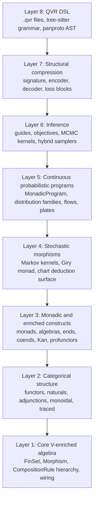

# Quivers

A typed, compositional probabilistic programming language for PyTorch.

Quivers is a probabilistic programming language for PyTorch. The surface looks familiar if you have used Pyro, NumPyro, Stan, or PyMC: declare variables with `<-`, score observations with `observe`, integrate out discrete latents with `marginalize`, fit with SVI / NUTS / HMC, get a trainable `nn.Module` back.

Distinguishing features:

- **Algebra-parametric semantics.** The composition and aggregation operations used by `>>`, `marginalize`, and `deduction` blocks are set by an [`algebra`](semantics/algebras.md) keyword at the top of a program. The default `algebra probability` gives ordinary Bayesian inference. `algebra log_prob` runs the same program in log-space for numerical stability on long sequences. `algebra tropical` replaces summation with maximization, so the forward pass over a hidden Markov model produces a Viterbi decode rather than a marginal likelihood. `algebra boolean` reduces scores to truth values; `deduction` blocks then behave like weighted Datalog. Eleven built-in algebras (`probability`, `log_prob`, `boolean`, `tropical`, `max_plus`, `markov`, `product_fuzzy`, `lukasiewicz`, `godel`, `real`, `counting`); [homomorphisms between them](semantics/morphisms.md) are values you can transport models along, with the laws checked at compile time.
- **Programs are typed compositional values.** A program has a domain, codomain, algebra, and effect signature (`! Sample, Score, Marginal, Pure`), checked at compile time. Programs compose with `>>`, parallel-compose with `@`, transport across algebras with `change_base`, and marginalize discrete latents with `marginalize z : K <- ... in { ... }`.
- **Shared substrate for inference, deduction, and structural compression.** A CKY parser in a `deduction { atoms ... rule ... }` block, a transformer-as-encoder over a `signature { ... }` block, and a Bayesian regression all compile to morphisms in the same category, with the same composition operators, and can compose with each other.
- **Inference toolkit.** Forty distribution families. SVI with nine automatic guides (mean-field through full-rank multivariate normal, low-rank, mixture, IAF, neural-spline flow, AutoDAIS). Four objectives ([`ELBO`](api/inference/elbo.md), [`IWAEBound`](api/inference/elbo.md), [`RenyiBound`](api/inference/elbo.md), [`VRIWAEBound`](api/inference/elbo.md)) with reparameterized, score-function, sticking-the-landing, and DReG gradient estimators. NUTS and HMC with dual-averaging step-size adaptation and Welford mass-matrix adaptation. A brms-style [formula frontend](guides/analysis.md) (`fit("y ~ x + (1|g)", data=df)`) with [ArviZ diagnostics](api/diagnostics/index.md) and PSIS-LOO model comparison.

## Quick start

```qvr
object Item : 100

# Predictor `x` flows in as exogenous data via the observations
# dict; free variables in `let` expressions resolve from the
# conditioning data at trace time (host-data channel).
program regression : Item -> Item ! Sample, Score
    sigma  <- HalfNormal(1.0)
    beta_0 <- Normal(0.0, 5.0)
    beta_1 <- Normal(0.0, 2.0)
    let mu = beta_0 + beta_1 * x
    observe y : Item <- Normal(mu, sigma)
    return y

export regression
```

```python
from quivers.dsl import loads
from quivers.inference import AutoNormalGuide, ELBO, SVI
import torch

program = loads(open("regression.qvr").read())
model   = program.morphism
guide   = AutoNormalGuide(model, observed_names={"y"})
optim   = torch.optim.Adam(guide.parameters(), lr=1e-2)
svi     = SVI(model, guide, optim, ELBO())
for _ in range(2000):
    svi.step(torch.zeros(100, 1), {"x": x_data, "y": y_data})
```

The same regression also expresses through a [brms-style formula frontend](guides/analysis.md):

```python
from quivers.formulas import fit

result = fit(
    "y ~ x + (1 | g)",
    data=df,                  # pandas or polars
    family="gaussian",
    method="nuts",
)
result.dump_qvr("regression.qvr")   # inspect the emitted QVR program
```

## Where to start

- **[Installation](getting-started/installation.md)** for setup.
- **[Quickstart](getting-started/quickstart.md)** for a working model in five minutes.
- **[QVR tutorial](tutorials/qvr/01-first-model.md)** for probabilistic-programming users: seven chapters from linear regression through hierarchical models, sequence models, and inference-algorithm choice, with Pyro / NumPyro / Stan equivalents side-by-side.
- **[Python API tutorial](tutorials/python/01-first-quiver.md)** for library developers and category-theory-fluent users: seven chapters covering the typed categorical surface.
- **[Examples gallery](examples/index.md)**: 36 end-to-end models grouped by family.
- **[Conceptual guides](guides/index.md)** for feature-area deep dives.
- **[API reference](api/index.md)** for the typed Python surface.
- **[Denotational semantics](semantics/index.md)** for the formal meaning of every well-typed program.

## Architecture

The DSL is a thin layer over a typed categorical surface. If you want to extend the library, write a new distribution family, or prove anything about a model, the categorical layer is what you read. If you just want to fit models, you can ignore it.

The library decomposes into eight layers. Each is consumable in isolation; each builds on those below it:



The central abstraction is a morphism between finite sets, parameterized by an algebra (a complete lattice with a monoidal product distributing over joins). A morphism `f : A -> B` is a PyTorch tensor of shape `(|A|, |B|)` whose entries take values in the algebra; composition `f >> g` contracts along the shared dimension under the algebra's tensor product and join. Different algebras give different composition semantics: Boolean composes by AND / OR (relational composition), ProductFuzzy by multiplication / noisy-OR, Real by sum-product, Markov by row-stochastic kernel composition, and so on.

The [denotational semantics](semantics/index.md) gives every well-typed QVR phrase a formal meaning in a $\mathcal{V}$-enriched symmetric monoidal closed category. The implementation rests on enriched category theory ([Kelly, 1982](http://www.tac.mta.ca/tac/reprints/articles/10/tr10abs.html)), the categorical foundations of probability ([Giry, 1982](https://doi.org/10.1007/BFb0092872); [Fritz, 2020](https://doi.org/10.1016/j.aim.2020.107239)), and the SVI / HMC inference substrate ([Hoffman, Blei, Wang & Paisley, 2013](https://doi.org/10.5555/2567709.2502622); [Neal, 2011](https://doi.org/10.1201/b10905-6); [Hoffman & Gelman, 2014](https://www.jmlr.org/papers/v15/hoffman14a.html)).
