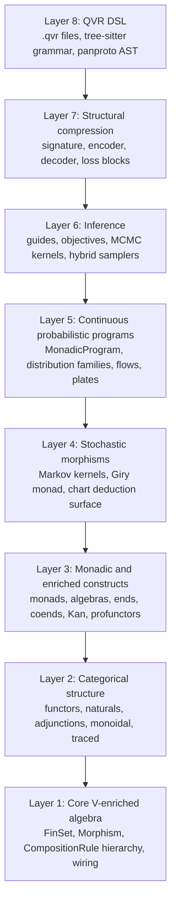
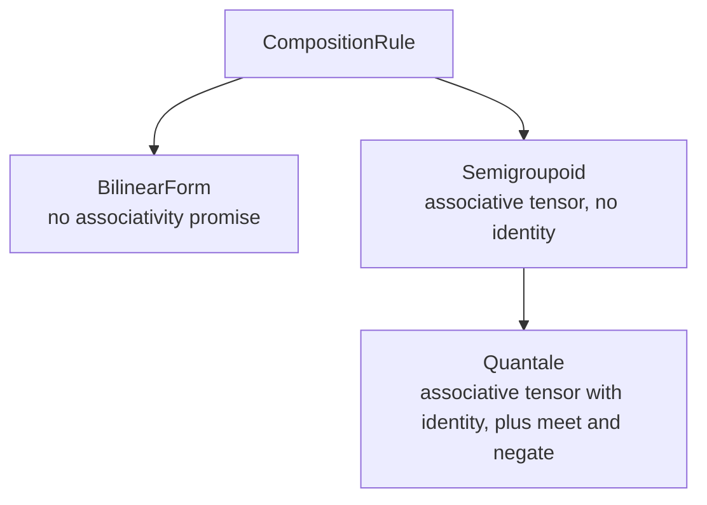

# Quivers

A typed probabilistic programming language for PyTorch. First-class structured priors on weight matrices, scoped marginalization of discrete latents as a syntactic block, and compile-checked sample / score / marginalize effects on every program.

You write Bayesian models in a small, readable DSL and fit them with stochastic variational inference (SVI), NUTS, HMC, or any of nine automatic guides. The program surface should look familiar if you have used Pyro, NumPyro, Stan, or PyMC: declare variables with `<-`, score observations with `observe`, integrate out discrete latents with `marginalize`, get a trainable PyTorch module back. Three things make it different:

- A weight matrix can carry a real **matrix-valued prior** (Matrix-Normal, Wishart, LKJ, GP) via an axis-role clause that names which axes the family's joint covariance lives on. Factor analysis, PPCA, BNNs, and the like are written the way they're drawn on the board.
- **Marginalization is a control-flow construct.** `marginalize z : K <- Categorical(p) in { ... }` runs the body once per discrete value of `z` and aggregates by `logsumexp`. Standard Rao-Blackwellization, spelled as syntax instead of a runtime flag.
- **Effects are checked at compile time.** Every program declares a signature like `! Sample, Score, Marginal, Pure`. A `! Pure` block that tries to `observe` is rejected with a typed error before training begins.

```qvr
object Item : 100

program regression : Item -> Item ! Sample, Score
    sigma  <- HalfNormal(1.0)
    beta_0 <- Normal(0.0, 5.0)
    beta_1 <- Normal(0.0, 2.0)
    x      <- Normal(0.0, 1.0)
    let mu = beta_0 + beta_1 * x
    observe y <- Normal(mu, sigma)
    return y

export regression
```

```python
from quivers.dsl import loads
from quivers.inference import AutoNormalGuide, ELBO, SVI
import torch

program = loads(open("regression.qvr").read())
model   = program.morphism
guide   = AutoNormalGuide(model, observed_names={"y"})
optim   = torch.optim.Adam(guide.parameters(), lr=1e-2)
svi     = SVI(model, guide, optim, ELBO())
for _ in range(2000):
    svi.step({"x": x_data}, {"y": y_data})
```

## What you get

The everyday PPL features you would expect, on a PyTorch backend:

- **Forty conditional distribution families** (Normal, Beta, Gamma, Dirichlet, MVN, LKJ, MatrixNormal, GP, Horseshoe, mixtures, normalizing flows, and more).
- **Nine variational guides** from mean-field through full-rank multivariate normal, low-rank, mixture, IAF, neural-spline flow, and AutoDAIS.
- **Four inference objectives** ([`ELBO`](api/inference/elbo.md#quivers.inference.elbo.ELBO), [`IWAEBound`](api/inference/elbo.md#quivers.inference.elbo.IWAEBound), [`RenyiBound`](api/inference/elbo.md#quivers.inference.elbo.RenyiBound), [`VRIWAEBound`](api/inference/elbo.md#quivers.inference.elbo.VRIWAEBound)) with reparameterized, score-function, sticking-the-landing, and DReG gradient estimators.
- **NUTS and HMC** with dual-averaging step-size adaptation and Welford mass-matrix adaptation, plus a `WarmupThenHMC` hybrid sampler.
- **Marginalized discrete latents** as a first-class block (`marginalize z : K <- Categorical(p) in { ... }`), with `logsumexp` aggregation handled for you.
- **Plates and grouped marginalization** for hierarchical models with vectorized observations and per-row fibration into shared random effects.
- **A 36-example gallery** covering regression (Bayesian, beta, Dirichlet, NegBin, horseshoe, ZIP), latent-variable (factor analysis, PPCA, LDA, IRT, PMF, BNN, GMM, VAE), state space (HMM discrete and continuous, linear-Gaussian SSM, deep Markov, AR1, stochastic volatility, changepoint, Weibull survival), language models (RNN, LSTM, GRU, bidirectional, transformer), seq2seq with encoder and decoder, and formal grammars (PCFG, CCG, Lambek, multimodal TLG).

## Where to start

- **[Installation](getting-started/installation.md)** for setup.
- **[Quickstart](getting-started/quickstart.md)** for a working model in five minutes.
- **[QVR tutorial](tutorials/qvr/01-first-model.md)**: seven chapters that walk a probabilistic-programming user from linear regression through hierarchical models, sequence models, and inference-algorithm choice. Pyro / NumPyro / Stan equivalents shown side-by-side.
- **[Examples gallery](examples/index.md)**: 36 end-to-end models grouped by family.
- **[Conceptual guides](guides/index.md)** for feature-area deep dives.
- **[API reference](api/index.md)** for the typed surface.

## What's distinctive

Most PPLs let you write `observe y ~ Normal(mu, sigma)`. Quivers lets you write the same thing AND a few things ordinary PPLs do not.

- **Typed scoped marginalization.** `marginalize z : K <- Categorical(p) in { ... }` is a syntactic block whose body runs once per discrete value of `z`, with the per-value scores aggregated by `logsumexp`. This is the standard Rao-Blackwellization trick, but spelled as a control-flow construct instead of a runtime flag.
- **Axis-role priors on weights.** A weight matrix `latent W : Euclidean(D) -> Euclidean(K)` can carry a structured prior whose covariance is genuinely matrix-valued: `~ MatrixNormal(loc, row_cov, col_cov) over (dom, cod)`. The `over <axes>` clause says which axes the family's joint covariance lives on; the rest are iid. This is the right surface for factor analysis, PPCA, Bayesian neural nets, and other "matrix of weights with prior" models.
- **Exact-likelihood structured families.** HMMs and Kalman smoothers compose like ordinary distributions; the forward, forward-backward, and smoother passes are wrapped.
- **Compile-time effects.** Programs carry an effect signature `! Sample, Score, Marginal, Pure` that the compiler checks against the body. A `! Pure` block that contains an `observe` is rejected with a typed error before training begins.
- **First-class transformations.** Softmax row-normalization, L1 / L2 row-normalization, Bayes inversion, and the quantale homomorphisms ([Rosenthal, 1990](https://doi.org/10.1090/conm/094)) that translate between composition semirings are values: let-bindable, composable with `>>>`, passable into `change_base`.
- **Weighted deduction.** Chart algorithms (CKY, Earley, Viterbi, A\*, Knuth's algorithm, semi-naive Datalog) are exposed as a `deduction { atoms ... rule ... semiring ... start ... }` block whose chart is a differentiable tensor. Drops in alongside the rest of the language.
- **Structural compression.** A four-block pattern (`signature { ... } encoder { ... } decoder { ... } loss { ... }`) factors out transformers, tree LSTMs, graph NNs, autoregressive LMs, variational autoencoders ([Kingma & Welling, 2014](https://doi.org/10.48550/arXiv.1312.6114)), and the vector inside-outside parser ([Le & Zuidema, 2014](https://doi.org/10.3115/v1/D14-1081)) as instances of one interface.

## What's under the hood (optional reading)

The DSL is a thin layer over a typed categorical surface. If you want to extend the library, write a new distribution family, or prove anything about a model, the categorical layer is what you read. If you just want to fit models, you can ignore it.

The library decomposes into eight layers. Each is consumable in isolation; each builds on those below it:



The central abstraction is a *morphism between finite sets*, parameterized by a *quantale* (a complete lattice with a monoidal product distributing over joins). A morphism `f : A -> B` is a PyTorch tensor of shape `(|A|, |B|)` whose entries take values in the quantale; composition `f >> g` contracts along the shared dimension under the quantale's tensor product and join. Different quantales give different composition semantics: Boolean composes by AND / OR (relational composition), ProductFuzzy by multiplication / noisy-OR, Real by sum-product, Markov by row-stochastic kernel composition, and so on.

The composition surface is a small hierarchy:



On top of this, the library defines stochastic morphisms (Markov kernels in the Kleisli category of the Giry monad, [Giry, 1982](https://doi.org/10.1007/BFb0092872)), continuous conditional distribution families, monadic programs (Kleisli arrows with effects tracked statically), and an inference stack covering variational and MCMC families.

The [denotational semantics](semantics/index.md) gives every well-typed QVR phrase a formal meaning in a $\mathcal{V}$-enriched symmetric monoidal closed category. The compiler implementation is proved adequate against the denotation. The implementation rests on enriched category theory ([Kelly, 1982](http://www.tac.mta.ca/tac/reprints/articles/10/tr10abs.html)), the categorical foundations of probability ([Giry, 1982](https://doi.org/10.1007/BFb0092872); [Fritz, 2020](https://doi.org/10.1016/j.aim.2020.107239)), and the SVI / HMC inference substrate ([Hoffman, Blei, Wang & Paisley, 2013](https://doi.org/10.5555/2567709.2502622); [Neal, 2011](https://doi.org/10.1201/b10905-6); [Hoffman & Gelman, 2014](https://www.jmlr.org/papers/v15/hoffman14a.html)).
