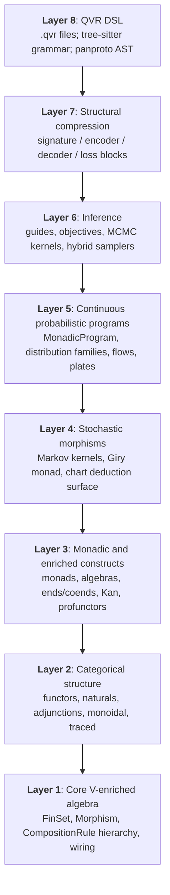
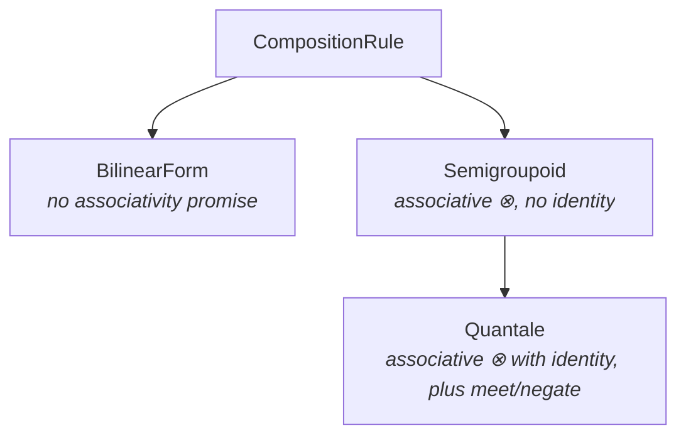

# Quivers

A probabilistic programming language with a categorical implementation.

Quivers compiles a small typed DSL into differentiable PyTorch programs that you train with stochastic variational inference or HMC. The implementation is a stack of typed categorical primitives, organised so that every construct in the user-facing surface has a clean mathematical denotation.

## Architecture at a glance

The library decomposes into eight layers. Each is consumable in isolation; each builds on those below it:



The library's central abstraction is a *morphism between finite sets*, parameterised by a *quantale* (a complete lattice with a monoidal product distributing over joins). Concretely, a morphism `f : A -> B` is a PyTorch tensor of shape `(|A|, |B|)` whose entries take values in the quantale; composition `f >> g` contracts along the shared dimension under the quantale's tensor product and join. Different quantales give different composition semantics: Boolean composes by AND/OR (relational composition), ProductFuzzy by multiplication / noisy-OR, Real by sum-product, Markov by row-stochastic kernel composition, and so on.

The composition surface is a small hierarchy:



On top of this, the library defines stochastic morphisms (Markov kernels in the Kleisli category of the Giry monad, [Giry, 1982](https://doi.org/10.1007/BFb0092872)), continuous conditional distribution families, monadic programs (Kleisli arrows with effects tracked statically), and an inference stack covering variational and MCMC families.

## Capabilities

### Core categorical algebra

Finite sets (`FinSet`), product and coproduct constructions (`ProductSet`), free monoids, and enum sets as objects. Eleven shipped quantales (Boolean, product fuzzy, Łukasiewicz, Gödel, tropical min-plus, max-plus / Viterbi, log-prob, Markov, real, probability, counting) as enrichment algebras. A `CompositionRule` hierarchy generalising beyond quantales to non-associative bilinear forms and identity-less semigroupoids. $\mathcal{V}$-enriched relations as parametrised PyTorch tensors with composition, tensor product, marginalisation, change-of-base, compact-closed surface (`dagger`, `trace`, `cup`, `cap`) where the rule supports it, and operadic n-ary contractions via `EinsumWiring`.

### Categorical structure

Functors, natural transformations, adjunctions, monoidal and traced monoidal categories. Change-of-base functors $\varphi : \mathcal{V} \to \mathcal{W}$ as `QuantaleHomomorphism` instances. Shape-aware `MorphismTransformation` for non-pointwise changes (softmax, L1/L2 normalisation, Bayes inversion). All transformations are first-class values: let-bindable, composable with `>>>`, passable into `change_base`.

### Enriched constructs

Ends, coends, Kan extensions, weighted limits/colimits, profunctors, Yoneda embedding, Day convolution, optics (lenses, prisms, adapters, grates).

### Monadic constructs

Monads, comonads, Kleisli / coKleisli categories, algebras, coalgebras, Eilenberg-Moore categories, distributive laws ([Beck, 1969](https://doi.org/10.1007/BFb0083084)).

### Stochastic morphisms

The FinStoch category of Markov kernels; discretised distribution families (normal, beta, truncated normal, logit-normal, ...); conditioning and mixing; the discrete Giry monad; queries (`prob`, `marginal_prob`, `expectation`).

### Continuous probabilistic programs

30+ parameterised conditional distribution families; continuous spaces (Euclidean, simplex, unit interval, positive reals); sampled composition; normalizing flows (RealNVP affine coupling, [Dinh, Sohl-Dickstein & Bengio, 2017](https://doi.org/10.48550/arXiv.1605.08803); IAF, [Kingma, Salimans, Jozefowicz, Chen, Sutskever & Welling, 2016](https://doi.org/10.48550/arXiv.1606.04934); neural-spline rational-quadratic coupling, [Durkan, Bekasov, Murray & Papamakarios, 2019](https://doi.org/10.48550/arXiv.1906.04032)); discrete-continuous boundaries (`Discretize`, `Embed`).

### Monadic programs

A `program` block compiles to a `MonadicProgram` morphism: a Kleisli arrow in the (discrete or continuous) Giry monad. A single Kleisli-bind syntax (`v <- F(args)`), scored binds (`observe v <- F(args)`), scoped marginalisation blocks for discrete latents (`marginalize v : A <- F(args) in { … }`), plate-draws over a finite-set index, deterministic `let` bindings, and `!`-prefixed effect signatures (`Sample, Score, Marginal, Pure`) tracked statically.

### QVR DSL

A `.qvr` file format whose tree-sitter grammar is registered in [panproto](https://panproto.dev) and whose AST nodes, value types, and resolution lenses are built on [didactic](https://panproto.dev/didactic/) Models. Supports object / morphism declarations, parametric program templates, let bindings, type expressions, grammar-based parsers (PCFG, CCG, Lambek, multimodal type-logical), composition-rule declarations (`quantale`, `semigroupoid`, `bilinear_form`, `composition_rule`) with optional inline bodies, and operadic contractions (`contraction op (...) rule X wiring "spec"`). Each compiled program extracts to a panproto `Schema` for diff/migrate workflows.

### Inference

A six-layer stack on a shared `LatentRegistry`:

- **Guides:** `AutoNormalGuide`, `AutoDeltaGuide`, `AutoMultivariateNormalGuide`, `AutoLowRankMultivariateNormalGuide`, `AutoLaplaceApproximation`, `AutoNormalizingFlow`, `AutoIAFGuide`, `AutoNeuralSplineGuide`, `AutoMixtureGuide`.
- **Objectives × estimators:** `ELBO`, `IWAEBound` ([Burda, Grosse & Salakhutdinov, 2016](https://doi.org/10.48550/arXiv.1509.00519)), `RenyiBound` ([Li & Turner, 2016](https://doi.org/10.48550/arXiv.1602.02311)), `VRIWAEBound` ([Daudel, Douc & Roueff, 2023](https://doi.org/10.48550/arXiv.2210.06226)) × `Reparameterised`, `StickingTheLanding` ([Roeder, Wu & Duvenaud, 2017](https://doi.org/10.48550/arXiv.1703.09194)), `DoublyReparameterised` ([Tucker, Lawson, Gu & Maddison, 2019](https://doi.org/10.48550/arXiv.1810.04152)), `ScoreFunction`.
- **MCMC kernels:** `HMCKernel`, `NUTSKernel` ([Hoffman & Gelman, 2014](https://www.jmlr.org/papers/v15/hoffman14a.html)) with Nesterov dual-averaging step-size adaptation and Welford-online mass-matrix adaptation; R-hat ([Vehtari, Gelman, Simpson, Carpenter & Bürkner, 2021](https://doi.org/10.1214/20-BA1221)), ESS, and divergence diagnostics on `MCMCResult`.
- **Hybrid samplers:** `AutoDAIS` ([Geffner & Domke, 2021](https://doi.org/10.48550/arXiv.2102.07501); [Zhang, Hertrich-Jeromin, Naumann & Yang, 2021](https://doi.org/10.48550/arXiv.2107.10859)), `WarmupThenHMC`.
- **Posterior consumption:** `Predictive` consuming either a `Guide` or an `MCMCResult`.

### Weighted-deduction framework

A single agenda-engine runtime parameterised by item algebra, arity-n rules, semiring, agenda discipline, and priority function subsumes CKY, Earley, Viterbi ([Viterbi, 1967](https://doi.org/10.1109/TIT.1967.1054010)), semi-naïve Datalog, A* parsing, Knuth's algorithm ([Knuth, 1977](https://doi.org/10.1016/0020-0190(77)90002-3)), and MLTT proof search. Surface `deduction { … }` blocks declare the seven canonical parameters; charts are first-class differentiable values supporting `weight(item)`, `enumerate(pattern)`, and `goal_weight()` operations whose gradients flow through the agenda's semiring. Stdlib ships CCG, Lambek, STLC, MLTT, Datalog, Dijkstra, HMM, ViterbiHMM, and EditDistance ready to use.

### Structural compression

A uniform algebraic interface for compressing arbitrary structured objects (sequences, trees, graphs, parse charts, typed lambda terms with binders) to fixed-length vectors and decoding them back under a learned distribution. `signature { … }` declares multi-sorted constructor algebras with typed binders under a de-Bruijn discipline; `encoder { … }` declares F-algebra homomorphisms $T_\Sigma \to \mathrm{Vec}_D$ with sequence-recurrent and attention sugar; `decoder { … }` declares Kleisli coalgebras $\mathrm{Vec}_D \to \mathbf{Kern}(T_\Sigma)$ with `sample` and `log_prob`; `loss { … }` attaches weighted scalar objectives at any program, deduction, encoder, decoder, rule, or chart site. Realises transformers, tree-LSTMs, graph-NNs, autoregressive LMs, variational autoencoders ([Kingma & Welling, 2014](https://doi.org/10.48550/arXiv.1312.6114)), and the vector-inside-outside parser ([Le & Zuidema, 2014](https://doi.org/10.3115/v1/D14-1081)) as instances of one F-algebra / F-coalgebra pattern.

## Quick orientation

A minimal example: define finite sets, compose morphisms, wrap as `nn.Module`.

```python
from quivers import FinSet, morphism, observed, Program
import torch

X = FinSet("X", 3)
Y = FinSet("Y", 4)
Z = FinSet("Z", 2)

f = morphism(X, Y)
g = observed(Y, Z, torch.rand(4, 2))
program = Program(f >> g)
output = program()                  # shape (3, 2)
```

A minimal probabilistic-programming example in the DSL:

```python
from quivers.dsl import loads

source = """
quantale real
object Item : 100

program regression : Item -> Item ! Sample, Score
    sigma  <- HalfNormal(1.0)
    beta_0 <- Normal(0.0, 5.0)
    beta_1 <- Normal(0.0, 2.0)
    x      <- Normal(0.0, 1.0)
    let mu = beta_0 + beta_1 * x
    observe y <- Normal(mu, sigma)
    return y

export regression
"""
program = loads(source)
```

Next stops: [Installation](getting-started/installation.md), [Quickstart](getting-started/quickstart.md), [Architecture](getting-started/architecture.md), or jump straight into the [QVR tutorial](tutorials/qvr/01-first-model.md) or the [Python tutorial](tutorials/python/01-first-quiver.md).
