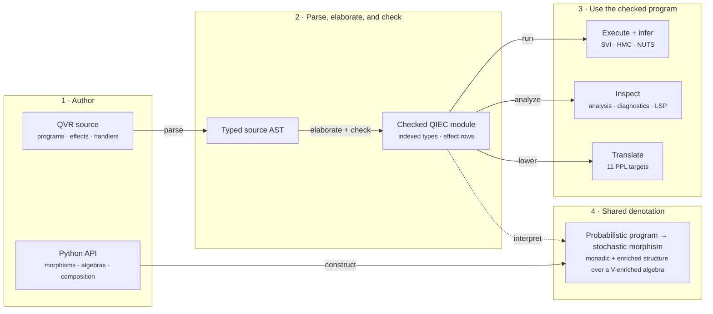

<div class="qv-home" markdown="block">

<section class="qv-hero" markdown="block">
<div class="qv-hero__copy" markdown="block">

# Functional probabilistic programming for PyTorch.

<p class="qv-hero__lede">Each Quivers program is a typed value with an executable PyTorch implementation and a precise mathematical interpretation.</p>

<div class="qv-hero__actions">
  <a href="getting-started/installation/" class="md-button md-button--primary">Install Quivers</a>
  <a href="getting-started/quickstart/" class="md-button">Run the quickstart</a>
</div>

</div>

<div class="qv-hero__code" markdown="block">

```qvr
object Item : FinSet 100

program regression : Item -> Item [effects=[Sample, Score]]
    sample sigma  <- HalfNormal(scale=1.0)
    sample beta_0 <- Normal(loc=0.0, scale=5.0)
    sample beta_1 <- Normal(loc=0.0, scale=2.0)
    let mu = beta_0 + beta_1 * x
    observe y : Item <- Normal(loc=mu, scale=sigma)
    return y

export regression
```

</div>
</section>

<nav class="qv-pathways" aria-label="Choose a documentation path" markdown="block">
<article class="qv-pathway" markdown="block">

## [Fit a model](getting-started/quickstart.md)

Install Quivers, compile a QVR program, and run inference over observed data.

</article>
<article class="qv-pathway" markdown="block">

## [Learn QVR](tutorials/qvr/01-first-model.md)

Work from a first model through indexed data, handlers, deduction, and transpilation.

</article>
<article class="qv-pathway" markdown="block">

## [Read the semantics](semantics/index.md)

Connect each well-typed phrase to its denotation and the assumptions that support it.

</article>
<article class="qv-pathway" markdown="block">

## [Extend the library](getting-started/architecture.md)

Trace the implementation from enriched relations through compilation and inference.

</article>
</nav>

## One language, three levels

The documentation presents each construct at three levels: QVR syntax, mathematical interpretation, and executable implementation. Links between those levels show how a source phrase is parsed, what it denotes, and how it runs.

<div class="qv-crosswalk" markdown="block">
<section class="qv-crosswalk__stage" markdown="block">

### QVR syntax

Programs, effects, indexed families, handlers, deductions, and structural attachments use one typed source language.

[Read the language reference](reference/qvr/index.md)

</section>
<section class="qv-crosswalk__stage" markdown="block">

### Denotation

The semantics interprets programs in enriched categories, stochastic kernels, and effectful computation structures.

[Open the semantics](semantics/index.md)

</section>
<section class="qv-crosswalk__stage" markdown="block">

### Implementation

The compiler lowers checked QVR to the indexed effect core, Python runtimes, and supported probabilistic languages.

[Inspect the API](api/index.md)

</section>
</div>

## What composes

First, a program has a domain, codomain, algebra, and effect signature. The compiler checks these components before execution. Programs sequentially compose with `>>`, parallel-compose with `@`, change base across algebras, and scope finite marginalization over a typed body.

Second, inference, deduction, and structural compression all compile to the same typed core. The compiler can thus combine a Bayesian regression, a CKY parser declared as a `deduction`, and a transformer attached to a `signature` while preserving their distinct types.

Third, the same checked representation supports inspection as well as execution. Quivers provides more than forty distribution families, automatic variational guides, HMC and NUTS, ArviZ integration, mixed-effect formulas, static program analysis, a REPL, a language server, and transpilers for eleven probabilistic programming systems. Each transpiler either emits the reachable computation graph or reports which indexed-core capability it cannot represent.

## Architecture

The map separates four questions: what a user writes, what the compiler checks, what the checked program can do, and which mathematical structure gives those operations their meaning. Read solid arrows as computation and dotted arrows as interpretation.


```mermaid
flowchart LR
    subgraph AUTHOR["1 · Author"]
        direction TB
        QVR["QVR source<br/><small>programs · effects · handlers</small>"]
        PY["Python API<br/><small>morphisms · algebras · composition</small>"]
    end

    subgraph CHECK["2 · Parse, elaborate, and check"]
        direction TB
        AST["Typed source AST"] -->|"elaborate + check"| QIEC["Checked QIEC module<br/><small>indexed types · effect rows</small>"]
    end

    subgraph USE["3 · Use the checked program"]
        direction TB
        RUN["Execute + infer<br/><small>SVI · HMC · NUTS</small>"]
        INSPECT["Inspect<br/><small>analysis · diagnostics · LSP</small>"]
        TARGET["Translate<br/><small>11 PPL targets</small>"]
    end

    subgraph SEM["4 · Shared denotation"]
        FOUNDATION["Probabilistic program → stochastic morphism<br/><small>monadic + enriched structure over a V-enriched algebra</small>"]
    end

    QVR -->|parse| AST
    QIEC -->|run| RUN
    QIEC -->|analyze| INSPECT
    QIEC -->|lower| TARGET
    QIEC -. interpret .-> FOUNDATION
    PY -->|construct| FOUNDATION

    class QVR,PY qv-input
    class AST,QIEC qv-checked
    class RUN,INSPECT,TARGET qv-output
    class FOUNDATION qv-foundation
```

The central abstraction is a morphism between finite sets, parameterized by a composition algebra. A morphism `f : A -> B` is a PyTorch tensor of shape `(|A|, |B|)` whose entries take values in that algebra. Composition `f >> g` contracts along the shared dimension under the algebra's tensor and join operations. Different algebras satisfy different laws; the documentation states those assumptions instead of treating them as properties of every runtime `Algebra`.

## Foundations

The [denotational semantics](semantics/index.md) interprets each well-typed QVR phrase in a $\mathcal{V}$-enriched symmetric monoidal closed category. The implementation draws on enriched category theory ([Kelly, 1982](http://www.tac.mta.ca/tac/reprints/articles/10/tr10abs.html)), categorical approaches to probability ([Giry, 1982](https://doi.org/10.1007/BFb0092872); [Fritz, 2020](https://doi.org/10.1016/j.aim.2020.107239)), and standard methods for SVI and HMC ([Hoffman et al., 2013](https://www.jmlr.org/papers/v14/hoffman13a.html); [Neal, 2011](https://doi.org/10.1201/b10905-6); [Hoffman and Gelman, 2014](https://www.jmlr.org/papers/v15/hoffman14a.html)).

</div>
