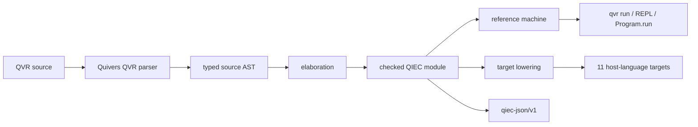

# QVR language reference

This section is the user reference for QVR. It specifies the source
forms you can write, the checked computations they create, and the boundaries
between the reference machine, attached PyTorch modules, and transpile
targets. The [QIEC developer note](../../developer/qiec.md) instead documents
the internal kernel, serialization format, and runtime ABI.

QVR has one compilation model: every executable declaration lowers to a
checked computation in the **Quivers Indexed Effect Core (QIEC)**. A `define`
declaration writes such a computation directly. A probabilistic `program`, a
`deduction`, a schema-backed `parser(...)`, and a structural
`encoder`/`decoder`/`loss` graph elaborate to the same core. This common target
is the **one-core model (OCM)**. It is why `qvr run`, `Program.run`, the REPL,
the language server, and the transpilers report the same types, effect rows,
and diagnostic codes.

## Choose a page

| If you need to… | Read |
| --- | --- |
| declare closed indices, indexed families, constructors, or case analyses | [Types and indexed families](types-and-indexed-families.md) |
| declare an effect, create lexical instances, write rows, or handle requests | [Effects and handlers](effects-and-handlers.md) |
| write `define`, call a computation, recurse, branch, or distinguish pure and effectful binding | [Computations](computations.md) |
| write a model with samples, observations, calls, marginalization, groups, or scans | [Probabilistic programs](probabilistic-programs.md) |
| understand what parsers, deductions, and structural models generate | [Generated computation graphs](generated-computations.md) |
| list and run entries, attach providers, inspect traces, use the LSP, or check a target | [Execution and tooling](execution-and-tooling.md) |

The [compressed grammar](../../semantics/grammar.md#11-qiec-fragment) is the
production-level syntax summary. The pages here add typing rules, operational
behavior, examples, and failure modes.

## A minimal mixed module

The following module contains an indexed family, an authored handler, a pure
computation, and a probabilistic program. It illustrates the OCM without
requiring a custom runtime provider.

<!-- compile: qiec -->
```qvr
index Availability = Observed | Missing

family Measurement(s : Availability) : Type
    constructor Present : Real -> Measurement(Observed)
    constructor Absent : Measurement(Missing)

effect Robust
    shrink : Real -> Real

instance robust : Robust

handler half_weight for Robust : Real -> Real [coverage=total, forwards=none, implementation=authored]
    return x =>
        return x
    shrink(x : Real) resumes 1 =>
        resume(0.5 * x)

define robustify(x : Real) : Real !{} =
    handle robust with half_weight in
        let adjusted <- perform robust.shrink(x)
        return adjusted

object Row : FinSet 8

program observations : Row -> Row
    sample location <- Normal(0.0, 2.0)
    sample scale <- HalfNormal(1.0)
    let centre <- robustify(location)
    observe y : Row <- Normal(centre, scale)
    return y

export observations
```

The surface declarations differ, but `robustify` and `observations` are both
entry points. `observations` performs through the module's canonical
`Random` and `Score` instances; an invocation installs handlers for both. The
call to `robustify` is pure because `half_weight` removes the only effect from
its body.

## Compilation and execution map



Quivers owns and vendors the QVR grammar used by this path. It installs
that native parser into Panproto's registry at process start; Panproto supplies
the generic parse-tree carrier, migration protocol, and non-QVR target
grammars. Thus a Panproto bundle may carry the stable QIEC envelope without
being the source of truth for current QVR parsing. See [Execution and
tooling](execution-and-tooling.md#grammar-ownership-and-panproto) for the
release contract.

## Compatibility identifiers

Three version identifiers describe different boundaries:

| Identifier | Boundary |
| --- | --- |
| `qvr-source/v0.19` | source grammar and elaboration route |
| `qiec-core/v1alpha1` | typed kernel ABI |
| `qiec-json/v1` | deterministic serialized envelope |

The source version may advance without changing the core ABI when new syntax
elaborates to existing terms. Conversely, the serialized format may advance
without changing how `.qvr` files parse. Code that exchanges checked modules
should test the latter two identifiers, while editors and migration tooling
should test the first.

## Support is an explicit boundary

The reference machine executes the kernel and all distribution families.
Some computations also need a process-local provider, such as the neural
attachments created for a structural encoder. A transpile target either emits
the complete reachable computation graph or refuses it with a stable
`qiec:capability:*` diagnostic. It never treats an unsupported body as inert
metadata.

Use [`qvr check --target`](execution-and-tooling.md#check-before-you-run) while
editing, and consult the measured [transpilation support
matrix](../../transpile-support.md) before choosing a deployment target.

## Tutorials and examples

Start with [Indexed data and total functions](../../tutorials/qvr/09-indexed-data.md),
then continue through [Effects and handlers](../../tutorials/qvr/10-effects-and-handlers.md),
[Parsing as an effectful computation](../../tutorials/qvr/11-parsing-and-search.md),
and [Structural autoencoders](../../tutorials/qvr/12-structural-autoencoders.md).
The [Amortized Bayesian Semantics](../../examples/amortized-bayesian-semantics.md)
example combines indexed data, effects, probabilistic programs, and structural
attachments in one statistical model.
