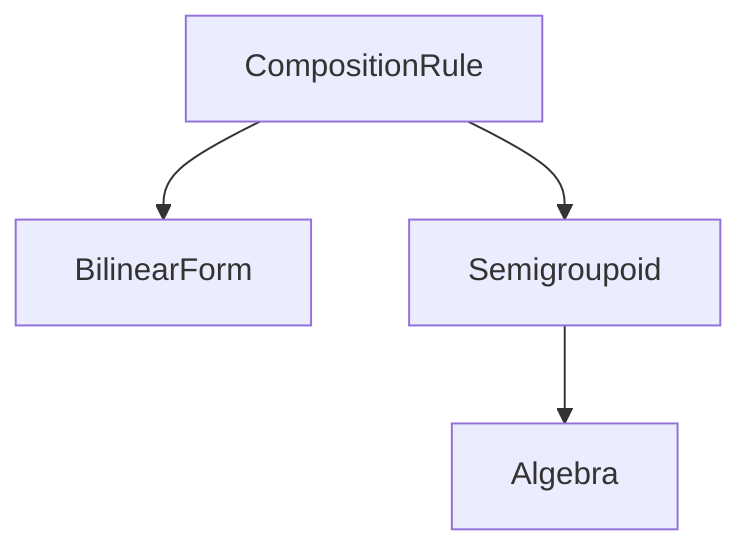

# Composition Rules

An algebra (in the sense of [§ Algebras](algebras.md)) gives the strongest setting for $\mathcal{V}$-enriched composition: it provides a tensor, a join, an identity, and (in the strict-quantale case) the distributive law that makes $\mathcal{V}\text{-}\mathbf{Rel}$ a $\mathcal{V}$-enriched symmetric monoidal closed category. Two strictly weaker settings are useful: one drops the identity (giving a *semigroupoid*); the other drops the associativity promise entirely (giving a *bilinear form*). This page records their denotational structure and the operadic generalization to n-ary contractions.

## 1. The hierarchy

A *composition rule* is the minimal algebraic data required to evaluate the composition kernel

$$
(f \mathbin{>\!>} g)[i, k] \;=\; \bigoplus_{j}\ f[i, j]\, \otimes\, g[j, k].
$$

This requires only a binary $\otimes$ and a join $\bigoplus$ over a finite axis. Neither operation is required to satisfy any algebraic law.

We organize composition rules into a hierarchy of progressively stronger structures.

**Definition (composition rule).** A *composition rule* $\mathcal{R} = (V, \otimes, \bigoplus)$ consists of a carrier set $V$, a binary operation $\otimes : V \times V \to V$, and an indexed-reduction operation $\bigoplus : V^I \to V$ for every finite index set $I$.

**Definition (bilinear form).** A *bilinear form* is a composition rule. The name records that no associativity or unit law is promised: the surface caller is responsible for fixing an association order when chaining compositions.

**Definition (semigroupoid).** A *[semigroupoid](https://en.wikipedia.org/wiki/Semigroupoid)* is a composition rule whose inner tensor is associative, $a \otimes (b \otimes c) = (a \otimes b) \otimes c$. The associativity of $\otimes$ is precisely what makes the induced composition operation $\mathbin{>\!>}$ associative as a partial operation on hom-objects.

**Definition (algebra).** A *algebra* is a semigroupoid additionally equipped with an identity element $\mathbf{1} \in V$ for $\otimes$, a meet $\bigwedge$ paired with the join under a complete-lattice structure, and the distributive law $a \otimes \bigoplus_i b_i = \bigoplus_i (a \otimes b_i)$.

The implementation reflects this hierarchy as a class lattice in which `BilinearForm` and `Semigroupoid` are siblings under `CompositionRule` and `Algebra` extends `Semigroupoid`:


 The eleven shipped algebras of [§ Algebras](algebras.md#1-the-eleven-algebras) are at the strongest level.

## 2. The denotation of `>>` at each level

Let $\mathcal{R} = (V, \otimes, \bigoplus)$ be a composition rule and let $f \in V^{A \times B}$, $g \in V^{B \times C}$ be tensors. The binary composition is

$$
\llbracket f \mathbin{>\!>} g \rrbracket_{\mathcal{R}}\ [a, c] \;=\; \bigoplus_{b \in B}\ f[a, b]\, \otimes\, g[b, c].
$$

This denotation does not require associativity, an identity, or distributivity: it depends only on the existence of $\otimes$ and $\bigoplus$. Consequently `>>` is well-defined at every level of the hierarchy. The algebraic levels manifest as *equational guarantees* on `>>`, not as preconditions for its evaluation:

| Level | Guarantee on `>>` |
|---|---|
| `BilinearForm` | None beyond well-definedness. |
| `Semigroupoid` | Associativity: $f \mathbin{>\!>} (g \mathbin{>\!>} h) = (f \mathbin{>\!>} g) \mathbin{>\!>} h$. |
| `Algebra` | Associativity, identity ($\mathrm{id}_A \mathbin{>\!>} f = f = f \mathbin{>\!>} \mathrm{id}_B$), and distributivity. |

The compact-closed operations of $\mathcal{V}\text{-}\mathbf{Rel}$ (`identity(A)`, `cup(A)`, `cap(A)`, `f.dagger`, `f.trace(A)`) require both an identity element and the meet / negation pair; their denotations consequently exist only at the `Algebra` level. The compiler enforces this statically: in a module declared with `composition X [level=semigroupoid]`, `[level=bilinear_form]`, or `[level=rule]`, the operations above raise a typed `CompileError`.

## 3. User-defined composition rules

The `.qvr` surface admits the declaration of a fresh composition rule via the unified `composition` keyword, the level chosen by a `[level=...]` option, and the rule body supplied as an indented block of entries:

```
composition NAME [level=algebra]
    tensor_op(a, b) = E_⊗
    join(t)         = E_⋁
    unit            = E_1
    zero            = E_0
    negation(a)     = E_¬     # optional
    meet(t)         = E_⋀     # optional

composition NAME [level=semigroupoid]
    tensor_op(a, b) = E_⊗
    join(t)         = E_⋁

composition NAME [level=bilinear_form]
    tensor_op(a, b) = E_⊗
    join(t)         = E_⋁

composition NAME [level=rule]
    tensor_op(a, b) = E_⊗
    join(t)         = E_⋁
```

The `composition` keyword is a top-level *selector* / *definer* statement: with no body and no `[level=...]` option it resolves the named rule from the built-in catalog and registers it as the module's composition rule; with a `[level=...]` option but no body it resolves a built-in rule and verifies it matches the declared algebraic level; with a body it declares the rule's operations inline as shown above. The level travels in the option block, so `composition X [level=algebra]`, `composition X [level=semigroupoid]`, `composition X [level=bilinear_form]`, and `composition X [level=rule]` are the four declared forms.

Each entry's RHS is a let-expression (the same fragment used in `let v = expr` lines elsewhere in the surface, [§ Expressions](expressions.md)). The declaration's denotation is the named composition rule

$$
\llbracket \text{NAME} \rrbracket \;=\; \bigl(V_{\mathrm{tensor}},\ \otimes,\ \bigoplus,\ [\mathbf{1},\ \bot,\ \neg,\ \bigwedge]\bigr),
$$

where $\otimes$ and $\bigoplus$ are interpreted by the body expressions $E_\otimes$ and $E_\bigvee$ under the standard let-arithmetic semantics, and the bracketed components are present only at the `algebra` level.

The keyword choice fixes the *declared level* of the named rule. The compiler verifies that:

1. Every entry required for the declared level is present (`tensor_op` and `join` everywhere; additionally `unit` and `zero` for `algebra`).
2. Function-valued entries are written in the function form `key(params) = body`; value-valued entries are written in the bare form `key = literal`.
3. The implementation class chosen at compile time matches the declared level (`CustomAlgebra`, `CustomSemigroupoid`, `CustomBilinearForm`).

The well-typedness of the declaration is independent of any algebraic law; whether the user-supplied operations actually satisfy the laws their level promises is the user's responsibility. For `CustomSemigroupoid` the constructor performs an associativity smoke check on a fixed pseudo-random sample at build time; for `CustomAlgebra` the constructor checks the identity and absorbing laws against a small set of canned values. Neither check is exhaustive.

## 4. Operadic contractions

The binary composition `>>` is the 2-ary case of a wider operadic structure. An *n-ary contraction* under a composition rule $\mathcal{R} = (V, \otimes, \bigoplus)$ is a morphism

$$
\Phi : V^{X_1} \times \cdots \times V^{X_n} \to V^Y
$$

between tensor spaces over a finite index sets $X_1, \dots, X_n, Y$, parameterized by a *wiring specification* $w$ that designates, for each axis letter $\ell$:

- the inputs $i \in \{1, \dots, n\}$ on which $\ell$ appears (its *occurrence set*), and
- whether $\ell$ survives to the output ($\ell \in Y$) or is contracted ($\ell \notin Y$).

A wiring is *flat* if no axis letter appears twice in any single input and no letter appears twice in the output. The library admits only flat wirings; diagonal / trace contractions are out of scope at this stratum.

**Denotation.** Given a flat wiring $w$ with universe of axis letters $\mathcal{L}$, let $S(\ell) \subseteq \{1, \dots, n\}$ be the occurrence set of $\ell$, $|\ell|$ the cardinality of the axis it indexes, and $\mathcal{L}_c = \mathcal{L} \setminus Y$ the contracted-letter set. The denotation of $\Phi$ on inputs $T_1, \dots, T_n$ is

$$
\llbracket \Phi \rrbracket_w(T_1, \dots, T_n)[\,y\,]
\;=\;
\bigoplus_{\substack{c\, :\, \mathcal{L}_c \to [\![\,|\ell|\,]\!]}}\
\bigotimes_{i = 1}^{n}\ T_i\bigl(\,y\!\restriction_{\,\mathrm{spec}_i}\,,\ c\!\restriction_{\,\mathrm{spec}_i \cap \mathcal{L}_c}\,\bigr),
$$

where $\mathrm{spec}_i \subseteq \mathcal{L}$ is the letter sequence of input $i$ and the joint subscript denotes the index obtained by reading the components of $y$ and $c$ that lie in $\mathrm{spec}_i$.

The contraction algorithm reduces to four steps:

1. *Broadcast.* For each input $T_i$, lift to a tensor over the full universe $\mathcal{L}$ by inserting singleton dimensions for letters not in $\mathrm{spec}_i$.
2. *Fold.* Left-fold the broadcast inputs under $\otimes$, yielding a tensor over $\mathcal{L}$.
3. *Reduce.* Apply $\bigoplus$ over the contracted axes $\mathcal{L}_c$.
4. *Permute.* Reorder the surviving axes into the output letter order.

The binary case $w = (s_1 s_2 \cdots s_k, t_1 t_2 \cdots t_l \to ?)$ recovers the standard $\mathcal{V}$-relational composition when the wiring is $w = (\text{spec}_1\, \text{spec}_2 \to \text{output})$ with a single shared letter; the operadic surface generalizes this without any algebraic strengthening.

The `.qvr` surface for a contraction is

```
contraction NAME ( input_1 : A_1 -> B_1, ..., input_n : A_n -> B_n ) : DOM -> COD
    rule R
    wiring "SPEC"
```

where `R` is a name resolving to a `CompositionRule` in scope and `SPEC` is an einsum-style flat wiring string. The declared morphism `NAME` is callable from any expression site as `NAME(arg_1, ..., arg_n)`; the call site type-checks the argument count and the per-argument numel against the contraction's signature before applying the wiring.

**Categorical content.** The contraction surface is the action of a *colored operad* whose colors are the V-Cat objects and whose operations are flat wirings. The composition rule $\mathcal{R}$ is the enriching algebra: the operad's operation $w$ is realized as the multi-input morphism above. When $w$ is a binary wiring with a single contracted letter, the operadic action reduces to the binary composition of $\mathcal{V}\text{-}\mathbf{Rel}$.

## 5. First-class transformations

A *transformation* is either a [algebra homomorphism](algebras.md#3-base-change) $\varphi : \mathcal{V} \to \mathcal{W}$ (pointwise lax monoidal map) or a *morphism transformation* $\psi$ (shape-aware action that may consult axis information). Both expose a *source* and a *target* algebra and an action on tensors. The DSL surface treats transformations as values in a dedicated *transformation namespace* (disjoint from the morphism namespace) that can be let-bound, composed, and passed to `change_base`.

### 5.1 The transformation sort

A transformation value has a sort

$$
t \;:\; \mathrm{Trans}[\mathcal{V},\, \mathcal{W}],
$$

read as "$t$ is a transformation from $\mathcal{V}$-enriched morphisms to $\mathcal{W}$-enriched morphisms". The source and target are concrete algebra instances; the sort is a tagged pair under the implementation.

### 5.2 Composition

For $t_1 : \mathrm{Trans}[\mathcal{V}, \mathcal{W}]$ and $t_2 : \mathrm{Trans}[\mathcal{W}, \mathcal{X}]$, the *sequential composition* $t_1 \mathbin{>\!>\!>} t_2 : \mathrm{Trans}[\mathcal{V}, \mathcal{X}]$ is the transformation whose action on a morphism $f \in \mathcal{V}\text{-}\mathbf{Rel}$ is

$$
\llbracket t_1 \mathbin{>\!>\!>} t_2 \rrbracket(f) \;=\; \llbracket t_2 \rrbracket\bigl(\,\llbracket t_1 \rrbracket(f)\,\bigr).
$$

The seam check $\mathrm{target}(t_1) = \mathrm{source}(t_2)$ is verified at compose time; a mismatch raises a typed error before any tensor evaluation runs. Sequential composition is associative (a free monoidal product on transformation values, modulo the seam discipline), so chains of length $\ge 3$ flatten unambiguously into a single sequence of base steps.

The implementation realizes the composition as a flattened `TransSeq` whose `apply` method iterates the steps. Single-step transformations need no boxing; they are their own representation.

### 5.3 Constructors

The library ships singleton transformations (no arguments) and parametric constructors (one argument). Each carries a fixed $(\mathrm{source}, \mathrm{target})$ pair:

| Constructor | Argument | Source | Target |
|---|---|---|---|
| `softmax(B)` | object $B$ | $\mathcal{V}_{\mathrm{pf}}$ | $\mathcal{V}_{\mathrm{M}}$ |
| `l1_normalize(B)` | object $B$ | $\mathcal{V}_{\mathbb{R}}$ | $\mathcal{V}_{\mathrm{M}}$ |
| `l2_normalize(B)` | object $B$ | $\mathcal{V}_{\mathbb{R}}$ | $\mathcal{V}_{\mathbb{R}}$ |
| `bayes_invert(p)` | morphism $p$ | $\mathcal{V}_{\mathrm{M}}$ | $\mathcal{V}_{\mathrm{M}}$ |

The named singletons of [§ Algebras § 3](algebras.md#3-base-change) (`expectation`, `log_prob`, `material_implication`, `threshold`, ...) are zero-ary transformation references. Surface form $t = \text{NAME}$ for singletons; $t = \text{NAME}(\text{arg})$ for constructors.

### 5.4 The `change_base` denotation

The change-of-base postfix $f.\mathrm{change\_base}(t)$ has denotation

$$
\llbracket f.\mathrm{change\_base}(t) \rrbracket
\;=\;
\llbracket t \rrbracket\bigl(\llbracket f \rrbracket\bigr)
\;\in\; \mathrm{target}(t)\text{-}\mathbf{Rel}.
$$

When $t$ is a `TransSeq` of base steps $(t_1, \dots, t_k)$, the denotation unfolds as $\llbracket t_k \rrbracket \circ \cdots \circ \llbracket t_1 \rrbracket$ applied to $\llbracket f \rrbracket$. The intermediate morphisms live in the intermediate algebras; only the final morphism is observable.

### 5.5 Well-typedness conditions

The type-checker verifies, at compose time and at change-of-base call time:

- $\mathrm{source}(t_1)$ in `compose_trans(t_1, t_2, \dots)` matches $\mathrm{target}(t_0)$ for each adjacent pair (where the seam check is by algebra class identity, not name).
- $f.\mathrm{change\_base}(t)$ requires $\mathrm{source}(t) = \mathrm{algebra}(f)$.

A mismatch surfaces as a typed compile-time error naming the two clashing algebras. Inside a `program` block the same surface produces a `CompileError` with line / column of the offending expression.

## 6. Relation to the rest of the language

The composition-rule hierarchy and the operadic contraction surface are stratified additions: they extend the language conservatively over the [§ Setting](setting.md). Concretely:

- A module declared with `composition X [level=algebra]` denotes a morphism in $X\text{-}\mathbf{Rel}$ exactly as in [§ Morphisms](morphisms.md). The new strata add no new morphisms at this level.
- A module declared with `composition X [level=semigroupoid]`, `[level=bilinear_form]`, or `[level=rule]` denotes a morphism in the corresponding weaker enriched category, with the compact-closed surface restricted as described in § 2 above.
- The operadic contraction operation `op_apply(a_1, ..., a_n)` denotes the wiring's action on the supplied morphisms; the result lives in the same enriched category and is composable with the rest of the program under `>>` (subject to the surrounding rule's algebraic guarantees).
- First-class transformations refine the existing [§ Algebras § 3](algebras.md#3-base-change) base-change surface: every named singleton there is now a let-bindable value, every parametric constructor produces a let-bindable value, and `>>>` composes them.

The conservativity claim is the formal content of the implementation's class hierarchy: changing a composition's `[level=semigroupoid]` or `[level=bilinear_form]` to `[level=algebra]` for the same rule (when the named rule is in fact at algebra level) gives a strictly stronger module that admits every operation the original did, plus the compact-closed surface.
