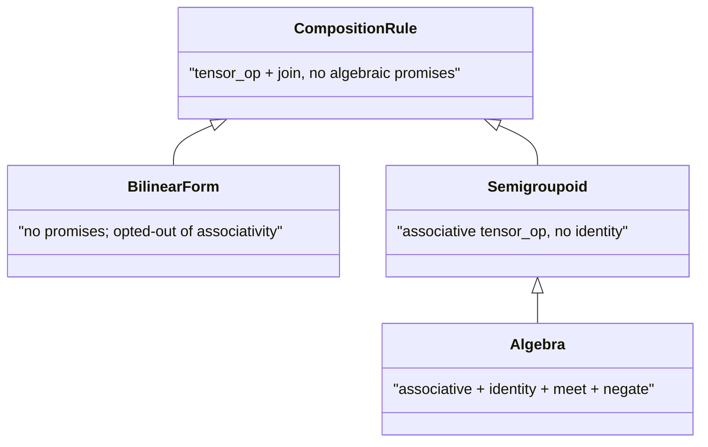

# 7. Composition rules beyond algebras

The default story in the categorical surface is that morphisms compose under a [algebra](https://ncatlab.org/nlab/show/algebra): a complete lattice with a monoidal tensor that distributes over arbitrary joins. The algebra provides every piece the composition `f >> g` needs: a binary product to combine entries, a join to aggregate over the shared dimension, an identity element so `identity(A) >> f == f`, and (for compact-closed structures) a meet and a negation. Algebras are the right setting when the composition is associative, has a unit, and behaves classically.

## Why weaker rules at all?

Most probabilistic models live happily inside one algebra: Markov for probability kernels, LogProb for numerical stability, ProductFuzzy for fuzzy logic. The reason quivers ships weaker rules is that two important construct families don't satisfy the full algebra contract and would otherwise be unrepresentable in the type system:

1. **Fuzzy-logic implication.** Reichenbach's implication, $a \to b = 1 - a + a \cdot b$, is associative under sequential composition but has no element $e$ such that $e \to b = b$ for every $b$. The composition is a [semigroupoid](https://ncatlab.org/nlab/show/semigroupoid). If you model entailment chains under Reichenbach implication and want the type system to flag that `identity(A) >> f` is meaningless, semigroupoids are the right level.
2. **Tensor-network contractions and attention.** A signed dot product `<u, v> = sum_i u_i * v_i` is neither associative as a composition (the product nests but the inner contractions don't commute with rebracketing) nor identity-bearing. Attention scores in transformer-style models behave the same way: softmax-then-multiply is a perfectly good per-row operation but is not an algebra. These live at the [bilinear form](https://en.wikipedia.org/wiki/Bilinear_form) level.

The takeaway: pick the weakest level that your construct satisfies. Library code that needs `identity` or `dagger` reaches for `Algebra`; code that only needs associative composition uses `Semigroupoid`; code that does an arbitrary n-ary tensor contraction uses `CompositionRule`. The compiler rejects calls that require a level above what your rule provides.

Two strictly weaker settings come up regularly enough that the library gives them their own types:

- [Semigroupoids](https://ncatlab.org/nlab/show/semigroupoid): associative composition, no identity. Reichenbach-style implication composition is the canonical example; the composition is associative but no tensor satisfies `f >> id == f` for every `f`.
- [Bilinear forms](https://en.wikipedia.org/wiki/Bilinear_form): a tensor contraction with neither associativity nor identity guarantees. Signed dot product, top-k truncating compositions, and attention-style softmax-then-multiply rules all sit here.

This chapter walks through the [`CompositionRule`](../../api/core/algebras.md) hierarchy, the [operadic](https://ncatlab.org/nlab/show/operad) [`EinsumWiring`](../../api/core/algebras.md) surface for n-ary contractions, and the user-facing DSL constructs (`semigroupoid`, `bilinear_form`, `composition_rule`, `contraction`) that surface them.

## The hierarchy



Every level supplies `tensor_op : (Tensor, Tensor) -> Tensor` and `join : (Tensor, dim) -> Tensor`. Each subsequent level adds promises; library code that needs `unit` reaches for [`Algebra`](../../api/core/algebras.md), code that only needs associativity reaches for [`Semigroupoid`](../../api/core/algebras.md), code that does any n-ary contraction reaches for [`CompositionRule`](../../api/core/algebras.md).

```python
from quivers.core.algebras import (
    CompositionRule, Semigroupoid, BilinearForm, Algebra,
    PRODUCT_FUZZY, REAL,
    material_implication, semigroupoid, bilinear_form,
)
```

All the shipped algebras are subclasses of `Algebra` (and therefore of `Semigroupoid` and `CompositionRule`).

## Building a semigroupoid

`material_implication()` returns a `CustomSemigroupoid` whose `tensor_op` is `a ⊗ b = 1 - a + a * b` (Reichenbach implication) and whose `join` is a product reduction. This composition is associative but has no identity, so the V-Cat operations `identity(A)`, `f.dagger`, `f.trace(A)`, `cup(A)`, `cap(A)` are unavailable: they live on `Algebra`.

```python
import torch
from quivers.core.algebras import material_implication

mi = material_implication()
print(type(mi).__mro__)        # (CustomSemigroupoid, Semigroupoid, CompositionRule, ABC, object)

f = torch.tensor([[0.3, 0.5, 0.2]])
g = torch.tensor([
    [0.6, 0.4],
    [0.1, 0.9],
    [0.7, 0.2],
])
out = mi.compose(f, g, n_contract=1)
print(out.shape)               # torch.Size([1, 2])
```

You can build your own semigroupoid by supplying any associative `tensor_op` and a reduction `join`:

```python
from quivers.core.algebras import semigroupoid

def bounded_sum(a, b):
    return (a + b).clamp(max=1.0)

def max_reduce(t, dim):
    if isinstance(dim, int):
        dim = (dim,)
    result = t
    for d in sorted(dim, reverse=True):
        result = result.max(dim=d).values
    return result

bsm = semigroupoid("BoundedSumMax", bounded_sum, max_reduce)
```

The factory runs an associativity smoke check at construction time on a fixed pseudo-random sample. Pass `verify_associative=False` to skip the check when you know the op is associative but the canned samples hit a numerical edge case.

## Building a bilinear form

A `BilinearForm` is a `CompositionRule` that *opts out* of the associativity promise: the type system records the absence. Use it for compositions like signed-dot, attention-style rules, or top-k truncating contractions whose composition order matters.

```python
from quivers.core.algebras import bilinear_form

def signed_dot(a, b):
    return 0.5 * (a + b)            # not associative

def sum_reduce(t, dim):
    if isinstance(dim, int):
        dim = (dim,)
    return t.sum(dim=dim)

bf = bilinear_form("SignedDot", signed_dot, sum_reduce)

# Three-way composition order matters:
a, b, c = torch.tensor(0.3), torch.tensor(0.5), torch.tensor(0.7)
left  = bf.tensor_op(bf.tensor_op(a, b), c)
right = bf.tensor_op(a, bf.tensor_op(b, c))
assert not torch.allclose(left, right)
```

`bilinear_form(...)` runs no smoke check (it's honest about its non-associativity).

## Algebra-only operations on non-algebra rules

The compact-closed operations require an identity element and live on `Algebra`. Trying to call them on a non-algebra rule raises `AttributeError`:

```python
import pytest
from quivers.core.algebras import material_implication

mi = material_implication()
with pytest.raises(AttributeError):
    mi.unit                                # not an Algebra attribute
with pytest.raises(AttributeError):
    mi.identity_tensor((3,))               # also unavailable
```

The DSL surface raises a typed `CompileError` at parse time if you try `identity(A)`, `cup(A)`, `cap(A)`, `f.dagger`, or `f.trace(A)` inside a module declared with `composition X [level=semigroupoid]` or `[level=bilinear_form]`. The [QVR categorical tutorial](../qvr/07-categorical.md) covers the user surface.

## Operadic n-ary contractions

For ordinary binary composition you do not need `EinsumWiring`. The default is `f >> g`: the algebra's `tensor_op` combines entries, the algebra's `join` reduces the shared index, and the compiler chooses the axes from the morphisms' typed signatures. That covers Markov-kernel composition, fuzzy-logic composition, sum-product contraction, and the rest of the standard repertoire without your having to spell anything out.

Reach for `EinsumWiring` only when you need *n-ary* contractions with more than one reduction axis: contracting three or more inputs at once with a shared reduction set. The canonical example is

$$
\mathrm{out}[s, o] = \bigoplus_{p, q}\Big(\mathrm{arg}_1[s, p] \otimes \mathrm{arg}_2[s, q] \otimes \mathrm{kernel}[p, q, o]\Big).
$$

This is an operadic operation, not a binary composition. [`EinsumWiring`](../../api/core/algebras.md) provides the surface:

```python
from quivers.core.wiring import EinsumWiring, einsum_wiring, contract

wiring = einsum_wiring(PRODUCT_FUZZY, "sp, sq, pqo -> so")
print(wiring.input_arity)       # 3
print(wiring.composition_rule)  # ProductFuzzyAlgebra()

torch.manual_seed(0)
arg1   = torch.rand(4, 3)
arg2   = torch.rand(4, 5)
kernel = torch.rand(3, 5, 2)
out    = wiring.apply(arg1, arg2, kernel)
print(out.shape)                # torch.Size([4, 2])
```

The wiring spec uses einsum syntax: each comma-separated input lists its axis letters, the arrow's right-hand side names the surviving output letters, and any letter appearing in an input but not in the output is contracted under the rule's `join`. If you've used `torch.einsum`, the syntax is the same; the only difference is that `torch.einsum` hardcodes multiply-and-sum, while `EinsumWiring` parameterises both operations: the `tensor_op` replaces multiply, and `join` replaces sum. So `torch.einsum("sp, sq, pqo -> so", a, b, c)` is the special case of `einsum_wiring(REAL, "sp, sq, pqo -> so").apply(a, b, c)`. For the standard binary case, you would still write `f >> g`, never `einsum_wiring(rule, "ab, bc -> ac").apply(f.tensor, g.tensor)`; the latter only earns its keep when arity is three or more. The fold-then-reduce semantics:

1. Broadcast each input to the universe of axis letters (singleton dims for missing letters).
2. Fold all inputs left-to-right under the rule's `tensor_op`.
3. Reduce the contracted axes under the rule's `join`.
4. Permute the surviving axes into the output's letter order.

`EinsumWiring` works against any `CompositionRule` instance, including non-algebra rules:

```python
mi    = material_implication()
wmi   = einsum_wiring(mi, "ij, jk -> ik")
out   = wmi.apply(
    torch.rand(2, 2),
    torch.rand(2, 2),
)
```

## Validation

`EinsumWiring` validates the spec at construction time:

- Each input must be non-empty.
- No input may repeat a letter (`"ii, jk -> ik"` is refused; that would be a trace / diagonal contraction, which this wiring doesn't realize).
- The output must not repeat a letter (`"ij, jk -> iik"` is refused).
- Every output letter must appear in at least one input.

At apply time, the tensor count and per-input dim count are checked. Shape mismatches between inputs surface as the underlying torch broadcast error.

## From the DSL surface

The user surface mirrors the Python API. Inside `.qvr` files:

<!-- compile: false -->
```qvr
composition my_godel [level=algebra]
    tensor_op(a, b) = a * b
    join(t)         = sum(t)
    unit            = 1.0
    zero            = 0.0

composition my_semi [level=semigroupoid]
    tensor_op(a, b) = a * b
    join(t)         = sum(t)

composition my_bf [level=bilinear_form]
    tensor_op(a, b) = (a + b) * 0.5
    join(t)         = sum(t)

composition any_rule_name [level=rule]
```

The `[level=...]` option selects the algebraic level (`algebra`, `semigroupoid`, `bilinear_form`, `rule`). The optional indented body declares the rule's operations inline; without a body, the declaration resolves the named rule from the built-in catalog (`product_fuzzy`, `material_impl`, etc.) and verifies it matches the declared level.

Operadic contractions:

<!-- compile: false -->
```qvr
contraction op_apply (
    arg1 : A -> B,
    arg2 : A -> C,
    kernel : B -> D
) : A -> D
    rule product_fuzzy
    wiring "sp, sq, pqd -> sd"

define combined = op_apply(arg1_morph, arg2_morph, kernel_morph)
```

`contraction NAME ( ... ) : DOM -> COD rule R wiring "SPEC"` declares a named n-ary operadic morphism; the resulting `NAME` is callable from any expression site that accepts a morphism. Each call site type-checks argument count and per-argument numel against the contraction's declared signature, and runs the `EinsumWiring` against the supplied morphism tensors.

## Next

[Tutorial 8](08-analysis-pipelines.md) walks through the analysis-pipeline surface: one-line brms-style `fit("y ~ x + (1|g)", data=df, ...)` regression, the QVR program it compiles to, NUTS sampling, PSIS-LOO model comparison, and ArviZ posterior-predictive checks.

## Further reading

- Use the [QVR tutorial](../qvr/01-first-model.md) if you want to write models in the DSL.
- Read the [guides](../../guides/index.md) for feature-area-specific deep dives.
- The [denotational semantics](../../semantics/index.md) covers the full categorical setting, including the formal denotation of every construct in this chapter.
- The [API reference](../../api/index.md) gives you the typed surface in full.
