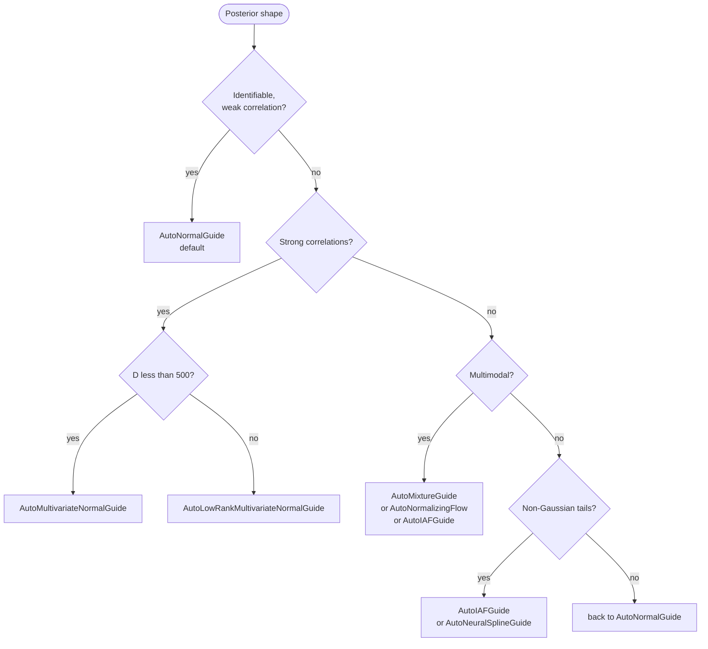

# 6. Choosing an inference algorithm

Quivers ships nine variational guides ([Hoffman, Blei, Wang & Paisley, 2013](https://doi.org/10.5555/2567709.2502622) for the SVI substrate), four objectives, two MCMC kernels (HMC, [Neal, 2011](https://doi.org/10.1201/b10905-6); NUTS, [Hoffman & Gelman, 2014](https://www.jmlr.org/papers/v15/hoffman14a.html)), two hybrid samplers, and four gradient estimators. Some combinations are obviously sensible; some are obvious mistakes; most fall between, and the right call depends on the shape of your posterior. This chapter is a field guide.

The mental model: you pick (a) a *family* (variational, MCMC, hybrid), then (b) a *configuration* within that family, then (c) gradient-estimator and tightness knobs. The choices roughly factor; we'll walk down the tree.

## Step 1: VI, MCMC, or hybrid?

| Posterior shape | First-pass choice |
|---|---|
| Smooth, broadly unimodal, < 1000 latents | Variational inference. |
| Multimodal or pathologically curved | MCMC (NUTS). |
| Hierarchical with funnel-shaped posteriors | NUTS, or VI on the non-centred reparameterisation. |
| High-dim (>1000 latents) and continuous | VI, unless you have a lot of compute. |
| Mixed discrete-continuous with small discrete support | VI with a `marginalize` block (chapter 4); HMC over the continuous remainder. |
| You don't know yet | Start with `AutoNormalGuide` + ELBO. It's cheap; the failure modes are diagnostic. |

VI is fast and scales; MCMC is unbiased and respects curvature. Hybrids try to get both. The cost is real: NUTS on a 600-latent hierarchical model takes minutes per chain; `AutoNormalGuide` on the same model takes seconds. If the VI fit is good enough for your downstream task, ship it.

## Step 2: Which variational guide?



The shipped guides:

| Guide | Family | When |
|---|---|---|
| `AutoNormalGuide` | Diagonal Normal | Default. Cheap, scales, often good enough. |
| `AutoDeltaGuide` | Dirac at MAP | Quick MAP; no posterior uncertainty. |
| `AutoMultivariateNormalGuide` | Full-rank Normal (Cholesky) | Strong posterior correlations; `D ≲ 500`. |
| `AutoLowRankMultivariateNormalGuide` | Low-rank + diagonal | Hierarchical models with localised correlations; specify `rank` (typically 5-20). |
| `AutoLaplaceApproximation` | Gaussian centred at MAP with Hessian inverse | Post-hoc quadratic-around-MAP; cheap upgrade from `AutoDeltaGuide`. |
| `AutoNormalizingFlow` | Composed bijector over Normal base | Multimodal or heavy-tailed posteriors; you supply the flow stack. |
| `AutoIAFGuide` | Inverse autoregressive flow | Flagship NF default; good general-purpose non-Gaussian guide. |
| `AutoNeuralSplineGuide` | Rational-quadratic spline coupling | Sharper than IAF on bounded support. |
| `AutoMixtureGuide` | K-component mixture of guides | Multimodal posteriors; specify `num_components`. |

The Tier-1 through Tier-6 benchmark grid in `tests/benchmarks/` walks these against synthetic posteriors with known answers; the report at `docs/developer/inference-benchmarks.md` is the empirical truth-table for which guide passes which kind of problem.

## Step 3: Which objective?

| Objective | Bound | When |
|---|---|---|
| `ELBO(num_particles=1)` | Reparameterised ELBO | Default. |
| `ELBO(num_particles=K)` | K-sample ELBO | Slightly tighter; rarely worth the cost. |
| `IWAEBound(K)` | Importance-weighted bound | Tighter than ELBO for `K > 1`. |
| `RenyiBound(alpha, K)` | Rényi divergence bound | Interpolates ELBO (α=1) and IWAE (α=0). |
| `VRIWAEBound(alpha, K)` | Variational Rényi-IWAE | Mass-covering vs mode-seeking knob via α; tight via K. |

For most workflows, the default `ELBO()` is the right call. `IWAEBound` matters when the posterior is multimodal and the guide is flow-shaped (the importance weighting tightens the bound; coupling layers exploit it). `RenyiBound` is useful when you specifically want a mass-covering posterior (e.g. for Bayesian-optimisation acquisition functions).

## Step 4: Which gradient estimator?

| Estimator | What it does | When |
|---|---|---|
| `Reparameterised` | Standard pathwise gradient | Default. |
| `StickingTheLanding` | Detaches variational params in `log q` | When `q → p*` and you're getting noisy gradients at convergence. |
| `DoublyReparameterised` | DReG for IWAE | With `IWAEBound(K)` at large K. |
| `ScoreFunction` | REINFORCE | Discrete (non-reparameterisable) latents you can't `marginalize`. |

Pair `IWAEBound(K=16, estimator=DoublyReparameterised())` for the flagship "tight bound, low-variance gradients" combination.

## Calling SVI

```python
from quivers.inference import (
    AutoIAFGuide, IWAEBound, DoublyReparameterised, SVI,
)

guide = AutoIAFGuide(model, observed_names={"y"}, num_flow_blocks=4)
objective = IWAEBound(num_particles=16, estimator=DoublyReparameterised())
optimizer = torch.optim.Adam(
    list(model.parameters()) + list(guide.parameters()), lr=1e-3,
)
svi = SVI(model, guide, optimizer, objective)

for step in range(5000):
    loss = svi.step({"x": x_data}, {"y": y_data})
```

## Calling NUTS

For the times you want unbiased posterior samples:

```python
from quivers.inference import NUTSKernel, MCMC

kernel = NUTSKernel(
    target_accept_prob=0.85,
    max_tree_depth=10,
    mass_matrix="diagonal",
)
mcmc = MCMC(
    kernel,
    num_warmup=1000,
    num_samples=2000,
    num_chains=4,
    initial_params="prior",
)
result = mcmc.run(model, {"x": x_data}, {"y": y_data})
print(result.summary())                  # per-site mean, std, R-hat, ESS
print("divergences:", result.num_divergences)
```

Diagnostics to check before trusting the run:

- R-hat < 1.01 for every site (otherwise: chains haven't mixed; run longer warmup).
- ESS > 100 per chain for every site (otherwise: samples are too correlated; tighten step size).
- Divergences near zero (otherwise: posterior has curvature the integrator missed; bump `target_accept_prob` to 0.95 or reparameterise).

## Hybrid samplers

Two configurations sit between VI and pure MCMC:

- **`WarmupThenHMC(guide, mcmc_kernel)`** trains a variational guide to convergence and uses the resulting posterior mean as the initial point for HMC chains. Useful when HMC's warmup wastes a lot of compute exploring tails the guide already knows are empty.
- **`AutoDAIS(base, num_steps, step_size)`** wraps a base guide with `num_steps` annealed HMC trajectories. It closes the parity gap with the Pyro / NumPyro AutoDAIS on multimodal posteriors where pure VI collapses.

```python
from quivers.inference import AutoDAIS, ELBO

base   = AutoNormalGuide(model, observed_names={"y"})
guide  = AutoDAIS(base, num_steps=8, step_size=0.05)
elbo   = ELBO()
svi    = SVI(model, guide, optimizer, elbo)
```

## Predictive

`Predictive` is the same regardless of which inference you ran:

```python
from quivers.inference import Predictive

# Either of these works
pred = Predictive(model, guide=guide,         num_samples=1000)
pred = Predictive(model, posterior=mcmc_result, num_samples=1000)

posterior_predictive = pred({"x": x_test})    # dict of (num_samples, ...) tensors
```

## Reading the benchmark grid

Whenever you're unsure which guide handles a model shape, look at
`docs/developer/inference-benchmarks.md`. The Tier-1 through Tier-6 grid runs every shipped guide against synthetic posteriors with known answers (conjugate models, hierarchical structures, pathological geometries, multimodal mixtures, latent-variable models, constrained supports), reports the metrics, and gives you an empirical answer. If a guide is missing for your model shape, the failing-cell pattern often suggests the right reparameterisation or a different guide.

## Try this

- Take the eight-schools model from chapter 3 and run every guide on it, comparing posterior `tau` recovery against the NUTS reference.
- Take the GMM from chapter 4 and run `AutoMixtureGuide(num_components=4)` against `AutoNormalGuide`. The mode-recovery difference is dramatic.
- Run `AutoDAIS` on the donut posterior (a non-simply-connected support); compare to `AutoIAFGuide`.

## Next

[Chapter 7](07-categorical.md) (optional reading) peeks under the hood at the categorical machinery: quantales, change-of-base, enriched composition. Useful if you want to extend the library or understand the type-error messages fluently. If you're happy with the DSL surface, you can stop here.
